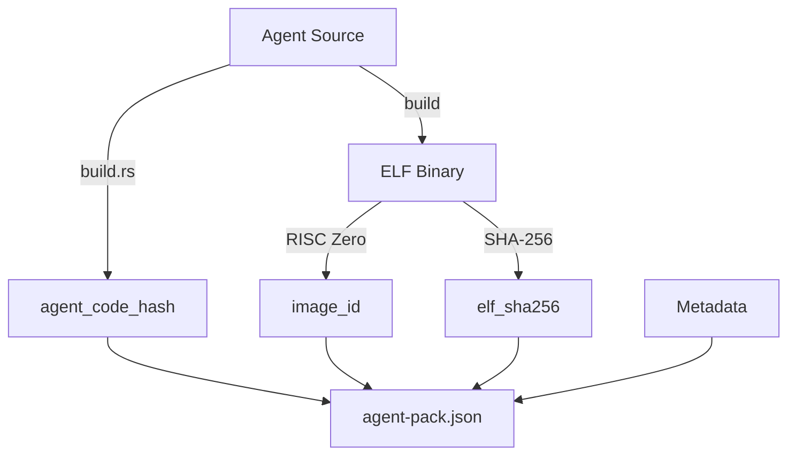
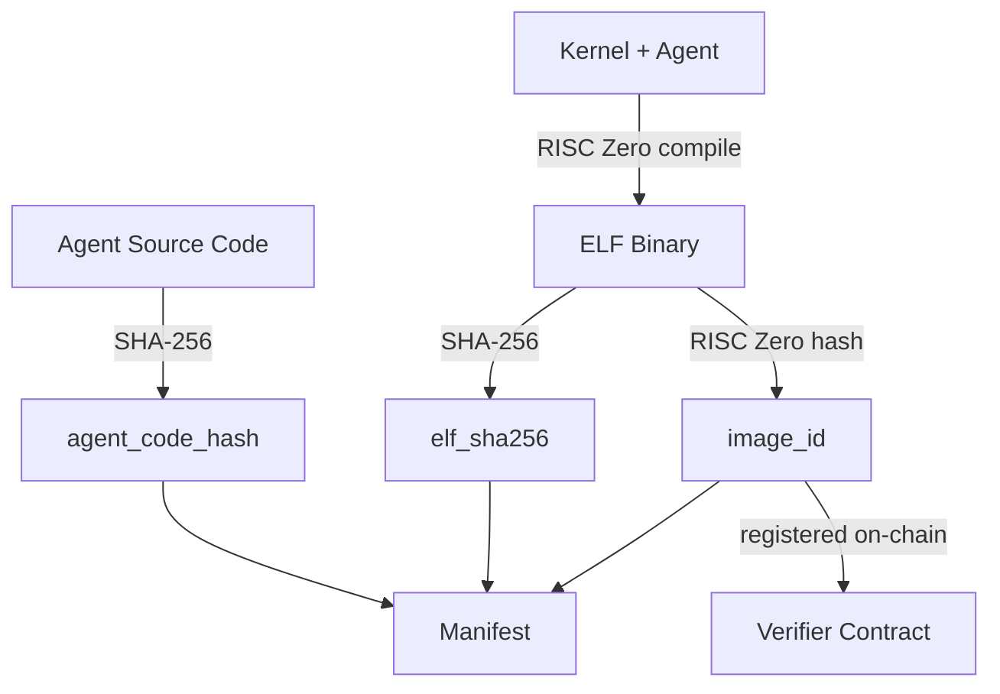

# Agent Pack Format

Agent Pack is a portable bundle format for distributing verifiable agents. It provides a standardized way to package agents with all cryptographic commitments needed for offline verification.

## Overview

An Agent Pack manifest answers the question: *"Is this agent binary authentic, and does it match what was registered on-chain?"*



## Manifest Structure

The manifest is a JSON file containing:

```json
{
  "format_version": "1",
  "agent_name": "yield-agent",
  "agent_version": "1.0.0",
  "agent_id": "0x0000...0001",

  "protocol_version": 1,
  "kernel_version": 1,
  "risc0_version": "1.0.0",
  "rust_toolchain": "1.75.0",

  "agent_code_hash": "0x5aac6b1f...",
  "image_id": "0x5f42241a...",

  "artifacts": {
    "elf_path": "./zkvm-guest",
    "elf_sha256": "0xabcd1234..."
  },

  "build": {
    "cargo_lock_sha256": "0x1234abcd...",
    "build_command": "RISC0_USE_DOCKER=1 cargo build --release -p risc0-methods",
    "reproducible": true
  },

  "inputs": "48 bytes: vault_address (20) + yield_source (20) + amount (8)",
  "actions_profile": "2 CALL actions: deposit to yield source, withdraw with yield",

  "networks": {
    "sepolia": {
      "verifier": "0x1eB41537037fB771CBA8Cd088C7c806936325eB5",
      "registered_image_id": "0x5f42241a..."
    }
  },

  "git": {
    "repository": "https://github.com/tokamak-network/Tokamak-AI-Layer",
    "commit": "abc123..."
  },

  "notes": "Example yield farming agent for demonstration purposes."
}
```

## Field Reference

### Identity Fields

| Field | Type | Description |
|-------|------|-------------|
| `format_version` | string | Always "1" |
| `agent_name` | string | Human-readable name |
| `agent_version` | string | Semantic version |
| `agent_id` | hex string | 32-byte identifier |

### Protocol Compatibility

| Field | Type | Description |
|-------|------|-------------|
| `protocol_version` | number | Kernel protocol version |
| `kernel_version` | number | Kernel semantics version |
| `risc0_version` | string | RISC Zero version |
| `rust_toolchain` | string | Rust compiler version |

### Cryptographic Commitments

| Field | Type | Description |
|-------|------|-------------|
| `agent_code_hash` | hex string | SHA-256 of agent source |
| `image_id` | hex string | RISC Zero imageId |

### Artifacts

| Field | Type | Description |
|-------|------|-------------|
| `artifacts.elf_path` | string | Relative path to ELF |
| `artifacts.elf_sha256` | hex string | SHA-256 of ELF binary |

### Build Information

| Field | Type | Description |
|-------|------|-------------|
| `build.cargo_lock_sha256` | hex string | SHA-256 of Cargo.lock |
| `build.build_command` | string | Exact build command |
| `build.reproducible` | boolean | Docker build used |

### Documentation

| Field | Type | Description |
|-------|------|-------------|
| `inputs` | string | Expected input format |
| `actions_profile` | string | Actions the agent produces |

### Deployment (Optional)

| Field | Type | Description |
|-------|------|-------------|
| `networks` | object | Network deployment info |
| `git` | object | Source repository info |
| `notes` | string | Additional information |

## The Cryptographic Chain



Each step is deterministic. Given the same source and build environment:
- Same source → same `agent_code_hash`
- Same dependencies → same ELF
- Same ELF → same `elf_sha256` and `image_id`

## Creating an Agent Pack

### Using `cargo agent` (recommended)

The fastest way to create and package an agent:

```bash
# Scaffold a new agent
cargo agent new my-yield-agent --template yield

# Build and package
cd my-yield-agent
cargo agent build my-yield-agent
cargo agent pack my-yield-agent --version 1.0.0
```

### Using `agent-pack` directly

#### 1. Initialize Manifest

```bash
agent-pack init \
  --name my-yield-agent \
  --version 1.0.0 \
  --agent-id 0x0000000000000000000000000000000000000000000000000000000000000042
```

Creates `./dist/agent-pack.json` with placeholder values.

#### 2. Build with Reproducible Settings

```bash
RISC0_USE_DOCKER=1 cargo build --release -p risc0-methods
```

#### 3. Compute Hashes

```bash
agent-pack compute \
  --elf target/riscv-guest/riscv32im-risc0-zkvm-elf/release/zkvm-guest \
  --out dist/agent-pack.json \
  --cargo-lock Cargo.lock
```

This updates:
- `artifacts.elf_sha256`
- `image_id` (requires `--features risc0`)
- `build.cargo_lock_sha256`

#### 4. Add Documentation

Edit the manifest to include:
- Input format description
- Actions profile
- Network deployment info
- Git repository info

#### 5. Verify

```bash
agent-pack verify --manifest dist/agent-pack.json
```

## CLI Commands

The `agent-pack` CLI provides commands for managing manifests: `init`, `compute`, `verify`, `scaffold`, `pack`, and `verify-onchain`.

:::note
The `agent-pack scaffold` command is deprecated in favor of `cargo agent new`, which generates the same structure with a simpler interface.
:::

For full usage details, flags, and examples for each command, see the [CLI Reference](/sdk/cli-reference).

## Related

- [Publishing Bundles](/agent-pack/publishing) - Bundle workflow for distribution
- [Verification](/agent-pack/verification) - Verifying Agent Packs
- [Manifest Schema](/agent-pack/manifest-schema) - JSON schema reference
- [RISC0 Build Pipeline](/guest-program/risc0-build-pipeline) - Building artifacts
