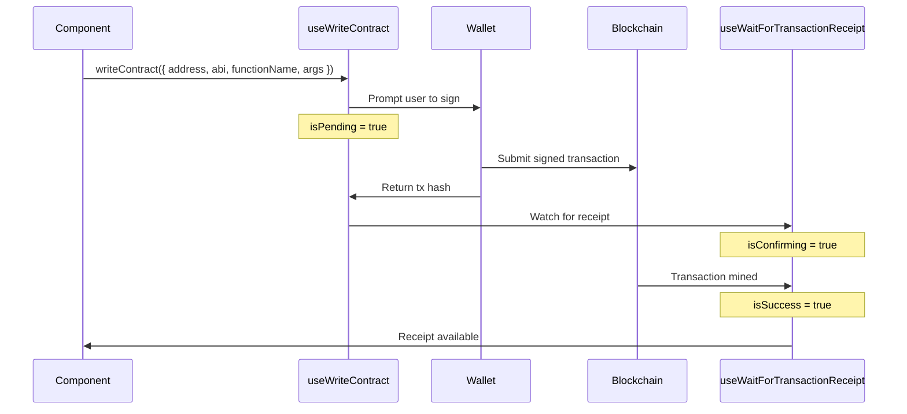

# Contract Integration

The TAL frontend reads and writes to smart contracts using **wagmi v2** hooks backed by **viem**. All contract ABIs are imported from the SDK package, and contract addresses are centralized in a single configuration file.

## Contract Addresses

All deployed contract addresses are defined in `frontend/src/lib/contracts.ts`:

```typescript
import type { Address } from 'viem';

// Thanos Sepolia L2 contracts
export const CONTRACTS = {
  identityRegistry: '0x3f89CD27fD877827E7665A9883b3c0180E22A525' as Address,
  reputationRegistry: '0x0052258E517835081c94c0B685409f2EfC4D502b' as Address,
  validationRegistry: '0x09447147C6E75a60A449f38532F06E19F5F632F3' as Address,
  stakingIntegrationModule: '0xDc9d9A78676C600E7Ca55a8D0c63da9462Acfe30' as Address,
  taskFeeEscrow: '0x43f9E59b6bFCacD70fcba4f3F6234a6a9F064b8C' as Address,
} as const;

// L1 Sepolia contracts
export const L1_CONTRACTS = {
  depositManager: '0x90ffcc7F168DceDBEF1Cb6c6eB00cA73F922956F' as Address,
  seigManager: '0x2320542ae933FbAdf8f5B97cA348c7CeDA90fAd7' as Address,
  layer2Registry: '0xA0a9576b437E52114aDA8b0BC4149F2F5c604581' as Address,
  layer2: '0xCBeF7Cc221c04AD2E68e623613cc5d33b0fE1599' as Address,
  ton: '0xa30fe40285B8f5c0457DbC3B7C8A280373c40044' as Address,
  wton: '0x79E0d92670106c85E9067b56B8F674340dCa0Bbd' as Address,
} as const;

export const CHAIN_ID = 111551119090; // Thanos Sepolia
export const L1_CHAIN_ID = 11155111;  // Sepolia
```

## ABI Imports

ABIs are imported directly from the SDK source (not a published package). The import path traverses up from `frontend/src/hooks/` to the `sdk/` directory:

```typescript
// From a hook file in frontend/src/hooks/
import { TALIdentityRegistryABI } from '../../../sdk/src/abi/TALIdentityRegistry';
import { TALReputationRegistryABI } from '../../../sdk/src/abi/TALReputationRegistry';
import { TALValidationRegistryABI } from '../../../sdk/src/abi/TALValidationRegistry';
import { TaskFeeEscrowABI } from '../../../sdk/src/abi/TaskFeeEscrow';
```

:::info ABI Source
The SDK ABIs in `sdk/src/abi/` are **manually maintained** TypeScript files, not auto-generated from Foundry's `forge build` output. When contract interfaces change, the ABI files must be updated manually to stay in sync.
:::

## Reading Contract Data

### Single Read

Use wagmi's `useReadContract` for individual contract calls:

```typescript
import { useReadContract } from 'wagmi';
import { CONTRACTS } from '@/lib/contracts';
import { TALIdentityRegistryABI } from '../../../sdk/src/abi/TALIdentityRegistry';

export function useAgentCount() {
  const { data, isLoading } = useReadContract({
    address: CONTRACTS.identityRegistry,
    abi: TALIdentityRegistryABI,
    functionName: 'getAgentCount',
  });

  return {
    count: data as bigint | undefined,
    isLoading,
  };
}
```

### Conditional Reads

Pass `query: { enabled }` to defer the call until parameters are available:

```typescript
export function useAgent(agentId: bigint | undefined) {
  const enabled = agentId !== undefined;

  const { data: owner } = useReadContract({
    address: CONTRACTS.identityRegistry,
    abi: TALIdentityRegistryABI,
    functionName: 'ownerOf',
    args: enabled ? [agentId] : undefined,
    query: { enabled },
  });

  // ...
}
```

### Batch Reads (Multicall)

Use `useReadContracts` to batch multiple calls into a single RPC request. This is how the agent list page loads data for up to 50 agents efficiently:

```typescript
import { useReadContracts } from 'wagmi';

export function useAgentList(count: number) {
  const limit = Math.min(count, 50);
  const contracts = [];

  for (let i = 1; i <= limit; i++) {
    contracts.push({
      address: CONTRACTS.identityRegistry,
      abi: TALIdentityRegistryABI,
      functionName: 'ownerOf',
      args: [BigInt(i)],
    });
    contracts.push({
      address: CONTRACTS.identityRegistry,
      abi: TALIdentityRegistryABI,
      functionName: 'agentURI',
      args: [BigInt(i)],
    });
  }

  const { data, isLoading } = useReadContracts({
    contracts: contracts as any,
    query: { enabled: count > 0 },
  });

  // Parse pairs of results...
}
```

The `useAgentRatings` hook in `useReputation.ts` demonstrates a two-phase multicall pattern -- first fetching client lists, then conditionally fetching summaries only for agents that have clients.

## Writing Transactions

### Transaction Lifecycle

Every write hook follows this pattern:



### Write Hook Pattern

```typescript
import { useWriteContract, useWaitForTransactionReceipt } from 'wagmi';

export function useRegisterAgent() {
  const { writeContract, data: hash, isPending, error } = useWriteContract();
  const { data: receipt, isLoading: isConfirming, isSuccess } =
    useWaitForTransactionReceipt({ hash });

  const register = (agentURI: string) => {
    writeContract({
      address: CONTRACTS.identityRegistry,
      abi: TALIdentityRegistryABI,
      functionName: 'register',
      args: [agentURI],
      chainId: CHAIN_ID,
    });
  };

  return { register, hash, isPending, isConfirming, isSuccess, error };
}
```

### Parsing Events from Receipts

After a transaction is confirmed, you can parse emitted events from the receipt logs:

```typescript
// Parse new agent ID from ERC-721 Transfer event
const TRANSFER_TOPIC =
  '0xddf252ad1be2c89b69c2b068fc378daa952ba7f163c4a11628f55a4df523b3ef';

let newAgentId: bigint | undefined;
if (receipt?.logs) {
  const transferLog = receipt.logs.find(
    (log) =>
      log.address.toLowerCase() ===
        CONTRACTS.identityRegistry.toLowerCase() &&
      log.topics[0] === TRANSFER_TOPIC,
  );
  if (transferLog?.topics[3]) {
    newAgentId = BigInt(transferLog.topics[3]);
  }
}
```

### Payable Transactions

For functions that accept ETH/TON value, pass the `value` field:

```typescript
const requestValidation = (params: RequestValidationOnChainParams) => {
  writeContract({
    address: CONTRACTS.validationRegistry,
    abi: TALValidationRegistryABI,
    functionName: 'requestValidation',
    args: [
      params.agentId,
      params.taskHash,
      params.outputHash,
      params.model,
      params.deadline,
    ],
    value: params.bountyWei, // Native TON sent as bounty
    chainId: CHAIN_ID,
  });
};
```

## Cross-Chain Patterns

The staking hooks demonstrate cross-chain contract interaction by specifying `chainId: sepolia.id` for L1 operations:

```typescript
export function useTONBalance(address?: Address) {
  return useReadContract({
    address: L1_CONTRACTS.ton,
    abi: ERC20_ABI,
    functionName: 'balanceOf',
    args: address ? [address] : undefined,
    chainId: sepolia.id, // Force L1 Sepolia
    query: { enabled: !!address },
  });
}
```

This allows the staking page to read L1 balances even when the user's wallet is connected to L2, since wagmi's `useReadContract` can specify any configured chain.

## Error Handling

Each write hook exposes an `error` field from `useWriteContract`. Components display these errors alongside status messages:

```tsx
{txError && (
  <div className="error-banner">
    <strong>Transaction Error:</strong> {txError.message}
  </div>
)}

{isSuccess && txHash && (
  <div className="success-banner">
    <strong>Success!</strong> Transaction:{' '}
    <a href={`https://explorer.thanos-sepolia.tokamak.network/tx/${txHash}`}>
      {txHash.slice(0, 10)}...{txHash.slice(-8)}
    </a>
  </div>
)}
```

## Multi-Step Transaction Flows

The staking page implements a multi-step flow where each step must complete before the next can execute:


The page detects which step is needed by checking allowances and balances, then calls the appropriate write function. A step progress indicator shows the user which step they are on.
