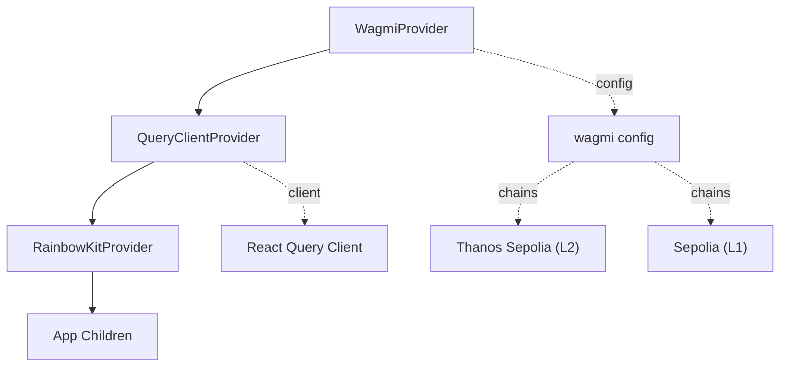
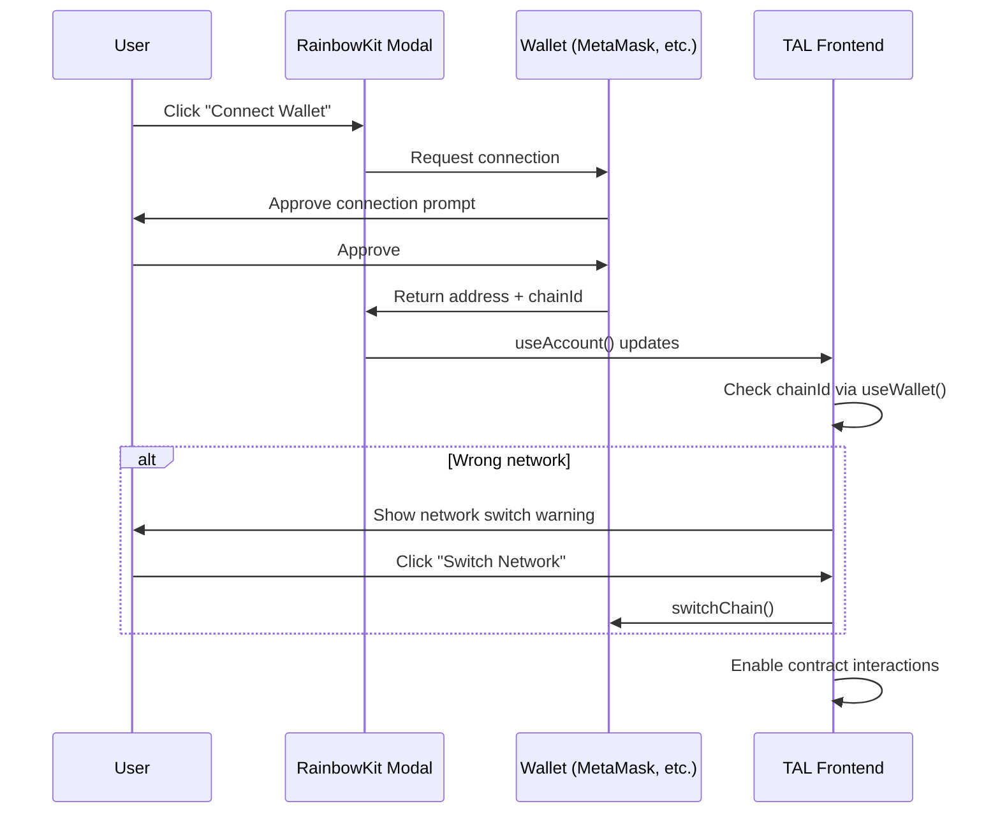

# Wallet & Chains

The TAL frontend uses **RainbowKit** for wallet connection UI and **wagmi v2** for React hooks that interact with Ethereum-compatible chains. The application operates across two networks: **Thanos Sepolia** (L2) for core protocol operations and **Ethereum Sepolia** (L1) for staking.

## Provider Architecture

The provider hierarchy is defined in `frontend/src/app/providers.tsx`:



### Full Provider Setup

```tsx
'use client';

import { QueryClient, QueryClientProvider } from '@tanstack/react-query';
import { WagmiProvider, http } from 'wagmi';
import { sepolia, type Chain } from 'wagmi/chains';
import { RainbowKitProvider, getDefaultConfig } from '@rainbow-me/rainbowkit';
import '@rainbow-me/rainbowkit/styles.css';
import { useState, type ReactNode } from 'react';

const thanosSepolia = {
  id: 111551119090,
  name: 'Thanos Sepolia',
  nativeCurrency: {
    name: 'Tokamak Network Token',
    symbol: 'TON',
    decimals: 18,
  },
  rpcUrls: {
    default: { http: ['https://rpc.thanos-sepolia.tokamak.network'] },
  },
  blockExplorers: {
    default: {
      name: 'Thanos Explorer',
      url: 'https://explorer.thanos-sepolia.tokamak.network',
    },
  },
  testnet: true,
} as const satisfies Chain;

const config = getDefaultConfig({
  appName: 'Tokamak Agent Layer',
  projectId: process.env.NEXT_PUBLIC_WALLET_CONNECT_ID || 'placeholder',
  chains: [thanosSepolia, sepolia],
  transports: {
    [thanosSepolia.id]: http('https://rpc.thanos-sepolia.tokamak.network'),
    [sepolia.id]: http(),
  },
  ssr: true,
});

export function Providers({ children }: { children: ReactNode }) {
  const [queryClient] = useState(
    () =>
      new QueryClient({
        defaultOptions: {
          queries: {
            staleTime: 60 * 1000,
            refetchOnWindowFocus: false,
          },
        },
      }),
  );

  return (
    <WagmiProvider config={config}>
      <QueryClientProvider client={queryClient}>
        <RainbowKitProvider>{children}</RainbowKitProvider>
      </QueryClientProvider>
    </WagmiProvider>
  );
}
```

## Chain Definitions

### Thanos Sepolia (L2) -- Primary Chain

| Property | Value |
|----------|-------|
| Chain ID | `111551119090` |
| Name | Thanos Sepolia |
| Native Currency | TON (18 decimals) |
| RPC URL | `https://rpc.thanos-sepolia.tokamak.network` |
| Block Explorer | `https://explorer.thanos-sepolia.tokamak.network` |
| Testnet | `true` |

Used for: agent registration, reputation feedback, validation requests, task fee escrow.

### Sepolia (L1) -- Staking Chain

| Property | Value |
|----------|-------|
| Chain ID | `11155111` |
| Name | Sepolia |
| Native Currency | ETH (18 decimals) |
| RPC URL | wagmi default Sepolia RPC |
| Block Explorer | `https://sepolia.etherscan.io` |

Used for: TON/WTON token operations, staking deposits and withdrawals via DepositManager.

## Network Switching

The `useWallet` hook (defined in `frontend/src/hooks/useWallet.ts`) provides helpers for detecting and switching networks:

```typescript
import { useAccount, useChainId, useSwitchChain } from 'wagmi';
import { CHAIN_ID, L1_CHAIN_ID } from '@/lib/contracts';

export function useWallet() {
  const { address, isConnected, isConnecting } = useAccount();
  const chainId = useChainId();
  const { switchChain } = useSwitchChain();

  return {
    address,
    isConnected,
    isConnecting,
    isCorrectChain: chainId === CHAIN_ID || chainId === L1_CHAIN_ID,
    isL1: chainId === L1_CHAIN_ID,
    isL2: chainId === CHAIN_ID,
    chainId,
    expectedChainId: CHAIN_ID,
    l1ChainId: L1_CHAIN_ID,
    switchToL1: () => switchChain({ chainId: L1_CHAIN_ID }),
    switchToL2: () => switchChain({ chainId: CHAIN_ID }),
  };
}
```

### Usage in Components

Pages that require a specific network display warnings and provide switch buttons:

```tsx
const { isConnected, isL1, switchToL1 } = useWallet();

// Staking page requires L1
{isConnected && !isL1 && (
  <div className="warning-banner">
    <p>Staking operates on L1 Sepolia. Please switch networks.</p>
    <button onClick={switchToL1}>Switch to L1 Sepolia</button>
  </div>
)}
```

## Wallet Connection Flow



## React Query Configuration

The `QueryClient` is configured with:

| Option | Value | Rationale |
|--------|-------|-----------|
| `staleTime` | 60 seconds | Prevents redundant RPC calls for contract reads within a 1-minute window |
| `refetchOnWindowFocus` | `false` | Avoids unnecessary refetches when switching browser tabs |

:::warning Testnet Configuration
Both chains are configured for testnet use only. The Thanos Sepolia custom chain definition and all L1 contract addresses point to Sepolia. Switching to mainnet requires updating chain definitions, RPC URLs, contract addresses, and block explorer URLs.
:::

:::tip SSR Compatibility
The wagmi config sets `ssr: true` in `getDefaultConfig()`. This ensures server-side rendering works correctly with Next.js 14 by deferring hydration of wallet state.
:::
