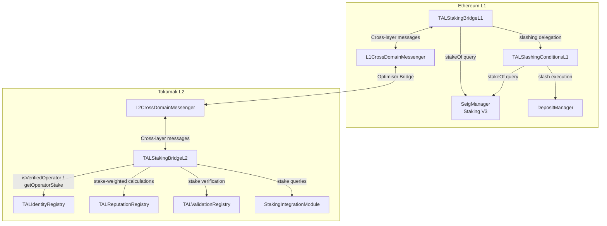
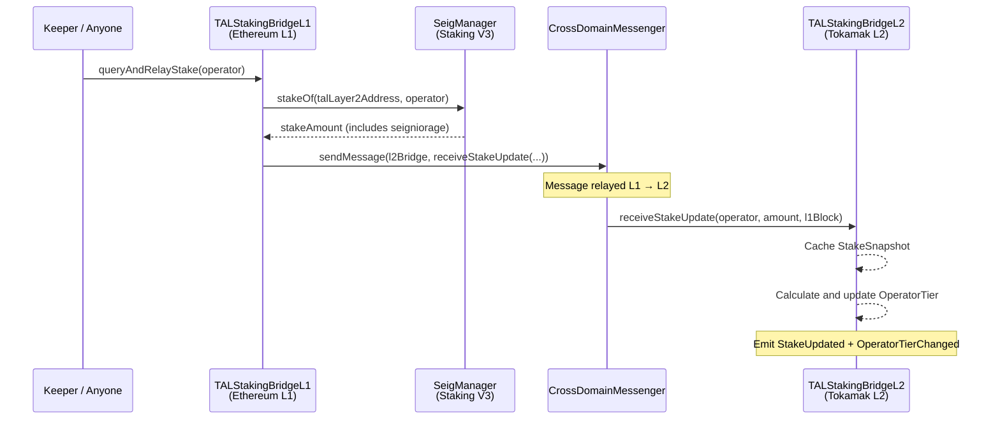
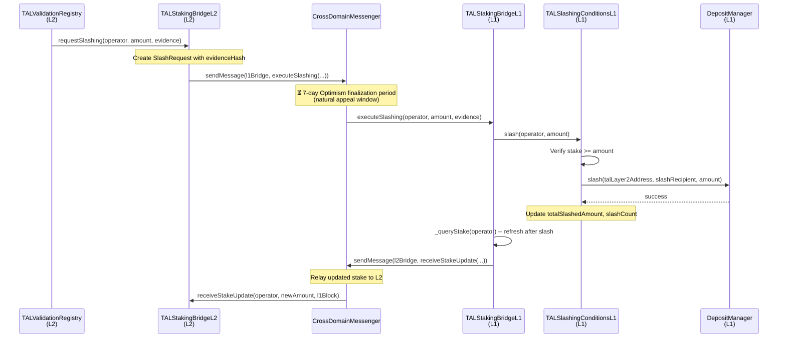

# Cross-Layer Bridge

The TAL cross-layer bridge connects Ethereum L1 staking infrastructure with Tokamak L2 registry contracts. It enables L2 contracts to make trust decisions based on L1 economic security without requiring L2 users to pay L1 gas costs for every stake lookup. The bridge consists of three contracts: `TALStakingBridgeL1` on Ethereum, `TALStakingBridgeL2` on Tokamak L2, and `TALSlashingConditionsL1` for slash execution on L1.

## L1/L2 Architecture Overview



## CrossDomainMessenger Flow

All cross-layer communication uses Optimism's native `CrossDomainMessenger` contracts. Messages sent from L1 to L2 are processed after Optimism includes the L1 transaction in an L2 block. Messages from L2 to L1 require the standard 7-day finalization period before they can be executed on L1.

### Authentication

Both bridge contracts enforce strict sender verification:

```solidity
// TALStakingBridgeL2 -- only accepts messages from L1 bridge
modifier onlyFromL1Bridge() {
    if (msg.sender != l2CrossDomainMessenger) revert UnauthorizedBridgeCaller();
    // In production, also verify:
    // ICrossDomainMessenger(l2CrossDomainMessenger).xDomainMessageSender() == l1BridgeAddress
    _;
}

// TALStakingBridgeL1 -- only accepts messages from L2 bridge
modifier onlyFromL2Bridge() {
    if (msg.sender != l1CrossDomainMessenger) revert UnauthorizedBridgeCaller();
    // In production, also verify:
    // ICrossDomainMessenger(l1CrossDomainMessenger).xDomainMessageSender() == l2BridgeAddress
    _;
}
```

This two-layer check ensures that only the legitimate counterpart bridge can trigger state changes through the messenger.

## Stake Relay: L1 to L2

The primary bridge function relays operator stake snapshots from L1 to L2, enabling L2 contracts to make stake-based trust decisions without cross-chain calls.



### StakeSnapshot Structure

Each operator's stake is cached as a snapshot with provenance metadata:

```solidity
struct StakeSnapshot {
    uint256 amount;            // Staked TON on L1 (includes seigniorage)
    uint256 lastUpdatedL1Block; // L1 block number at query time
    uint256 timestamp;          // L2 block.timestamp when snapshot was received
}
```

### Cache Freshness

L2 contracts can check whether a cached snapshot is still valid:

```solidity
function isCacheFresh(address operator, uint256 maxAge) external view returns (bool) {
    if (operatorStakes[operator].timestamp == 0) return false;
    return (block.timestamp - operatorStakes[operator].timestamp) <= maxAge;
}
```

The default maximum cache age is 4 hours (`DEFAULT_MAX_CACHE_AGE`).

### Batch and Keeper Operations

`TALStakingBridgeL1` supports multiple stake relay patterns:

| Function | Caller | Description |
|----------|--------|-------------|
| `queryAndRelayStake(operator)` | Anyone | Relay a single operator's stake |
| `batchQueryStakes(operators[])` | Anyone | Relay up to 100 operators in one transaction |
| `refreshAllOperators()` | `KEEPER_ROLE` | Relay all registered TAL operators (up to 100) |

:::tip Where in the code?
- `TALStakingBridgeL1`: `contracts/src/bridge/TALStakingBridgeL1.sol` (307 lines)
- `TALStakingBridgeL2`: `contracts/src/bridge/TALStakingBridgeL2.sol` (286 lines)
:::

## Slashing Propagation: L2 to L1

When misbehavior is detected on L2 (e.g., a dispute is upheld against a validator), the slashing flow propagates from L2 to L1:



### Slash Request Structure

```solidity
struct SlashRequest {
    address operator;      // Operator being slashed
    uint256 amount;        // Amount to slash
    bytes32 evidenceHash;  // keccak256 of evidence bytes
    uint256 timestamp;     // When the request was created on L2
    bool executed;         // Whether the slash has been executed on L1
}
```

### Slash Execution on L1

`TALSlashingConditionsL1` executes slashes against Staking V3's `DepositManager`:

```solidity
// Slash via Staking V3 DepositManager
bool success = IDepositManagerV3(depositManager).slash(
    talLayer2Address,   // Layer2 contract address
    slashRecipient,     // Treasury receives slashed funds
    amount              // Amount to slash
);
```

After slashing, `TALStakingBridgeL1` automatically refreshes the operator's stake on L2 so the cache reflects the reduced balance.

:::danger
Once a slash message passes the 7-day finalization window and is executed on L1, the slashed funds are transferred to the treasury and cannot be recovered. There is no restore mechanism in Staking V3.
:::

## Operator Tiers

`TALStakingBridgeL2` automatically classifies operators into three tiers based on their cached L1 stake:

| Tier | Enum | Stake Threshold | Capabilities |
|------|------|----------------|-------------|
| **Unverified** | `UNVERIFIED` | 0 TON | Can register agents. Cannot serve as validators for StakeSecured/Hybrid models. |
| **Verified** | `VERIFIED` | >= 1,000 TON | Can serve as validators. Eligible for StakeSecured validation. Sufficient for operator verification in TALIdentityRegistry. |
| **Premium** | `PREMIUM` | >= 10,000 TON | All Verified capabilities. Priority in batch operations. Higher trust signal for reputation weighting. |

Tier transitions are automatic and emit an `OperatorTierChanged` event:

```solidity
function _calculateTier(uint256 amount) internal pure returns (OperatorTier) {
    if (amount >= PREMIUM_THRESHOLD) return OperatorTier.PREMIUM;   // >= 10,000 TON
    if (amount >= VERIFIED_THRESHOLD) return OperatorTier.VERIFIED; // >= 1,000 TON
    return OperatorTier.UNVERIFIED;
}
```

### Tier Constants

| Constant | Value | Description |
|----------|-------|-------------|
| `VERIFIED_THRESHOLD` | `1,000 ether` | Minimum stake for Verified tier |
| `PREMIUM_THRESHOLD` | `10,000 ether` | Minimum stake for Premium tier |
| `DEFAULT_MAX_CACHE_AGE` | `4 hours` | Default cache freshness window |

## L1 Contract Dependencies

`TALStakingBridgeL1` and `TALSlashingConditionsL1` integrate with Tokamak's existing Staking V3 infrastructure on Ethereum L1:

| Dependency | Interface | Used For |
|-----------|-----------|----------|
| **SeigManager** | `IStakingV3` | `stakeOf(layer2, operator)` -- query operator stake; `updateSeigniorageLayer(layer2)` -- trigger seigniorage distribution |
| **DepositManager** | `IDepositManagerV3` | `slash(layer2, recipient, amount)` -- execute slashing, transferring funds to treasury |
| **L1CrossDomainMessenger** | Optimism standard | `sendMessage(target, data, gasLimit)` -- relay messages to L2 |

### Seigniorage Flow

Seigniorage (staking rewards) in Staking V3 accrues automatically via coinage tokens. The `stakeOf()` return value includes seigniorage growth, so refreshing the stake snapshot on L2 implicitly captures seigniorage accrual:

```solidity
function claimAndBridgeSeigniorage(address operator) external whenNotPaused {
    // Trigger seigniorage update
    IStakingV3(seigManager).updateSeigniorageLayer(talLayer2Address);

    // Query updated stake (now includes latest seigniorage)
    uint256 currentStake = _queryStake(operator);

    // Relay to L2
    _relayStakeToL2(operator, currentStake);
}
```

## Bridge Configuration

### TALStakingBridgeL1 Initialization

```solidity
function initialize(
    address admin_,
    address l1CrossDomainMessenger_,
    address l2BridgeAddress_,
    address seigManager_,
    address slashingConditions_,
    address talLayer2Address_
) external initializer;
```

### TALStakingBridgeL2 Initialization

```solidity
function initialize(
    address admin_,
    address l2CrossDomainMessenger_,
    address l1BridgeAddress_
) external initializer;
```

### TALSlashingConditionsL1 Initialization

```solidity
function initialize(
    address admin_,
    address seigManager_,
    address talLayer2Address_,
    address bridgeL1_,           // Granted SLASHER_ROLE
    address depositManager_,
    address slashRecipient_      // Treasury address
) external initializer;
```

:::warning Bridge Latency and Finality
**L1 to L2** messages are included in the next L2 block that processes the L1 transaction, typically within minutes. However, stake data may be stale by the time it arrives on L2.

**L2 to L1** messages require the full Optimism finalization period (currently 7 days) before they can be executed on L1. This means slashing requests created on L2 will not execute on L1 for at least 7 days. This delay is by design -- it serves as an appeal window during which disputed slashes can be reviewed.

Applications relying on real-time stake data should call `isCacheFresh()` and trigger a `requestStakeRefresh()` if the cache is older than `DEFAULT_MAX_CACHE_AGE` (4 hours). Critical operations should not proceed with stale cache data.
:::

## Access Control Summary

| Contract | Role | Holder | Purpose |
|----------|------|--------|---------|
| TALStakingBridgeL1 | `KEEPER_ROLE` | Automated keeper | `refreshAllOperators()` batch refresh |
| TALStakingBridgeL1 | `DEFAULT_ADMIN_ROLE` | Admin multisig | Register/remove operators, set SeigManager |
| TALStakingBridgeL2 | `VALIDATION_REGISTRY_ROLE` | TALValidationRegistry | `requestSlashing()` -- only the registry can initiate slashes |
| TALSlashingConditionsL1 | `SLASHER_ROLE` | TALStakingBridgeL1 | `slash()` -- only the bridge can execute slashes |

## Next Steps

- [Architecture Overview](/architecture/overview) -- system-wide contract dependency graph
- [Trust Model](/architecture/trust-model) -- slashing conditions, bounty distribution, dispute mechanism
- [Staking Integration](/integration/staking-bridge) -- higher-level staking queries and seigniorage routing
