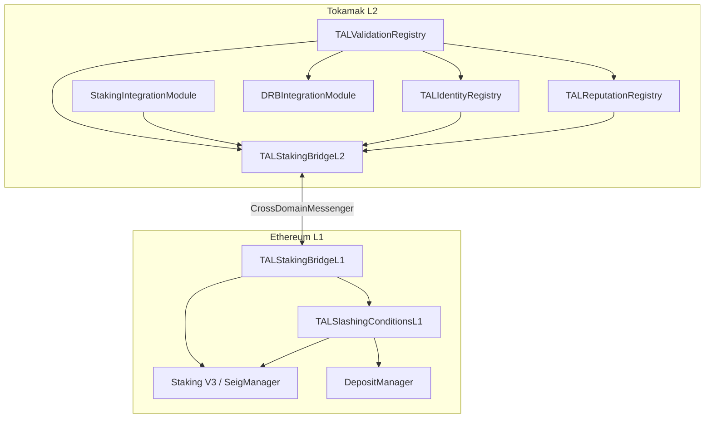

# Architecture Overview

Tokamak AI Layer (TAL) is an ERC-8004 compliant infrastructure layer that provides trustless AI agent discovery, reputation management, and execution verification. The system is deployed across two layers: Ethereum L1 for economic security via TON Staking, and Tokamak L2 (Optimism-based) for low-cost registry operations and validation logic. This split allows TAL to inherit Ethereum's security guarantees for staking and slashing while keeping high-frequency operations like feedback submission and validation affordable on L2.

## L1/L2 Architecture Split

TAL separates concerns between Ethereum L1 and Tokamak L2 to optimize for both security and cost:

**Ethereum L1** handles economic security. Operators stake TON via Staking V3 (SeigManager + DepositManager), and slashing is executed against L1 stake. The 7-day Optimism finalization period acts as a natural appeal window before any slash is finalized.

**Tokamak L2** handles all registry and validation logic. Agent identity NFTs, reputation aggregation, validation requests, TEE attestation, and bounty distribution all execute on L2 where gas costs are orders of magnitude lower. The L2 contracts maintain a cached view of L1 stake data relayed through the CrossDomainMessenger.

## Contract Dependency Graph

:::tip Where in the code?
- `TALValidationRegistry`: [`contracts/src/core/TALValidationRegistry.sol`](/contracts/validation-registry) (1052 lines)
- `TALIdentityRegistry`: [`contracts/src/core/TALIdentityRegistry.sol`](/contracts/identity-registry) (602 lines)
- `TALReputationRegistry`: [`contracts/src/core/TALReputationRegistry.sol`](/contracts/reputation-registry) (687 lines)
- `DRBIntegrationModule`: [`contracts/src/modules/DRBIntegrationModule.sol`](/integration/drb-integration)
- `StakingIntegrationModule`: [`contracts/src/modules/StakingIntegrationModule.sol`](/integration/staking-bridge)
- Bridge contracts: [`contracts/src/bridge/`](/architecture/cross-layer-bridge)
:::

## Trust Tiers

TAL implements four trust tiers, each providing escalating security guarantees for AI agent validation:

| Tier | Enum Value | Description | Security Guarantee |
|------|------------|-------------|-------------------|
| **ReputationOnly** | `0` | Lightweight aggregated feedback scores. Any address can submit a validation. No stake or hardware requirement. | Sybil-resistant via stake-weighted reputation math. Feedback values weighted by `sqrt(stake)` to prevent plutocracy. |
| **StakeSecured** | `1` | DRB-selected validator re-executes agent output. Validator must hold >= 1,000 TON on L1. Minimum bounty: 10 TON. | Economic security through slashable stake. Fraudulent validators lose up to 100% of staked collateral. |
| **TEEAttested** | `2` | Execution verified inside a hardware enclave (SGX, Nitro, TrustZone). TEE provider must be whitelisted. Minimum bounty: 1 TON. | Hardware-backed integrity guarantee. Failed attestation triggers 50% stake slash. |
| **Hybrid** | `3` | Combines StakeSecured and TEEAttested. Both validator selection via DRB and TEE attestation verification are required. | Maximum security: economic + hardware guarantees. Dual verification path. |

:::info
Trust tiers are set per-validation-request, not per-agent. The same agent can be validated at different tiers depending on the requester's security needs and willingness to pay the bounty.
:::

## Data Flows

### Registration Flow

An agent owner builds a registration file using the SDK's `RegistrationBuilder`, uploads metadata to IPFS, and calls `TALIdentityRegistry.register(ipfsURI)`. The contract mints an ERC-721 identity NFT to the owner. Optionally, a ZK identity commitment (Poseidon hash) can be registered for privacy-preserving capability verification.

### Reputation Flow

Clients submit feedback via `TALReputationRegistry.submitFeedback()`, providing a value in the range `[-100, 100]`, tags, and an optional payment proof. Feedback is stored on-chain and aggregated using `ReputationMath.calculateWeightedAverage()`, where each reviewer's weight is `sqrt(stake)`. A Merkle root can be updated off-chain for efficient cross-chain verification.

### Validation Flow

A requester calls `TALValidationRegistry.requestValidation()` with a bounty, specifying the trust tier. For StakeSecured and Hybrid models, a validator is selected via the DRBIntegrationModule (Commit-Reveal2). The selected validator re-executes the task, submits a score and proof, and the bounty is distributed: 10% to the protocol treasury, 9% to the agent owner, and 81% to the validator.

### Cross-Layer Staking Flow

`TALStakingBridgeL1` queries `SeigManager.stakeOf()` on Ethereum L1 and relays the operator's stake amount to `TALStakingBridgeL2` via the Optimism `CrossDomainMessenger`. The L2 bridge caches the snapshot and assigns an operator tier (Unverified, Verified, or Premium). See [Cross-Layer Bridge](/architecture/cross-layer-bridge) for details.

## Design Patterns

All TAL contracts follow consistent design patterns inherited from OpenZeppelin's battle-tested upgradeable library:

| Pattern | Implementation | Purpose |
|---------|---------------|---------|
| **UUPS Proxy** | `UUPSUpgradeable` | All core contracts are upgradeable via the Universal Upgradeable Proxy Standard. Upgrade authority is gated by `UPGRADER_ROLE`. |
| **Role-Based Access Control** | `AccessControlUpgradeable` | Granular permissions via named roles: `UPGRADER_ROLE`, `PAUSER_ROLE`, `TEE_MANAGER_ROLE`, `DRB_ROLE`, `DISPUTE_RESOLVER_ROLE`, `KEEPER_ROLE`, `SLASHER_ROLE`. |
| **Storage Gaps** | `uint256[40] private __gap` | All upgradeable contracts reserve 28-40 storage slots for future state variables without breaking storage layout. |
| **Reentrancy Guard** | `ReentrancyGuard` | Applied to all state-changing external functions that transfer value (feedback submission, bounty distribution, slashing). |
| **Pausable** | `PausableUpgradeable` | Emergency circuit breaker. `PAUSER_ROLE` holders can halt all state-changing operations instantly. |
| **EIP-712 Signatures** | `WALLET_VERIFICATION_TYPEHASH` | Used in `TALIdentityRegistry` for replay-protected wallet verification with domain separation. |

:::warning
The `UPGRADER_ROLE` has significant power. In production, this role should be held by a multisig or timelock contract, not an EOA.
:::

## Deployed Addresses (Thanos Sepolia)

| Contract | Address |
|----------|---------|
| TALIdentityRegistry | `0x3f89CD27fD877827E7665A9883b3c0180E22A525` |
| TALReputationRegistry | `0x0052258E517835081c94c0B685409f2EfC4D502b` |
| TALValidationRegistry | `0x09447147C6E75a60A449f38532F06E19F5F632F3` |
| StakingIntegrationModule | `0xDc9d9A78676C600E7Ca55a8D0c63da9462Acfe30` |

## Next Steps

- [Trust Model](/architecture/trust-model) -- deep dive into stake weighting, slashing, and dispute resolution
- [Cross-Layer Bridge](/architecture/cross-layer-bridge) -- L1/L2 communication, stake relay, and slashing propagation
- [Identity Registry](/contracts/identity-registry) -- ERC-721 agent identities and ZK commitments
- [Validation Registry](/contracts/validation-registry) -- validation request lifecycle and bounty mechanics
