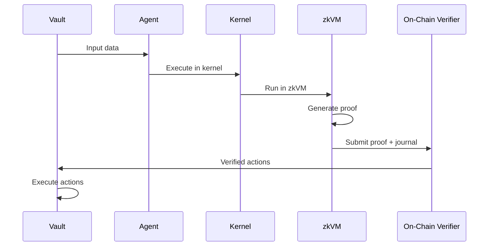

# Architecture Overview

Tokagent lets you deploy autonomous agents that manage capital in on-chain vaults. Every decision an agent makes is proven correct inside a RISC Zero zkVM before any funds move. This page explains how the pieces fit together.

## How It Works

**Agents are programs that make decisions.** You write an agent in Rust. It receives market data, analyzes it, and outputs actions (trades, deposits, withdrawals). The agent never touches funds directly -- it only produces instructions.

**The Execution Kernel proves those decisions.** The kernel wraps your agent in a zkVM, runs it, and generates a cryptographic proof (a "receipt") that the agent executed correctly, with the right inputs, under the right constraints. This proof is a 209-byte journal plus a ~260-byte Groth16 seal.

**On-chain contracts verify and execute.** A vault contract on Ethereum (or HyperEVM, Arbitrum, Optimism) receives the proof, verifies it against the registered agent identity, and atomically executes the proven actions. No trusted intermediary is needed.

## System Diagram

```mermaid
sequenceDiagram
    participant V as Vault
    participant A as Agent
    participant K as Kernel
    participant Z as zkVM
    participant C as On-Chain Verifier

    V->>A: Input data
    A->>K: Execute in kernel
    K->>Z: Run in zkVM
    Z->>Z: Generate proof
    Z->>C: Submit proof + journal
    C->>V: Verified actions
    V->>V: Execute actions
```

## Execution Flow

1. The host gathers inputs (market data, state) and sends them to the zkVM guest.
2. The kernel decodes the input, verifies the agent identity, and calls the agent.
3. The agent returns actions. The kernel enforces constraints on those actions.
4. If constraints pass, the kernel commits a journal with `status = Success`. If they fail, `status = Failure` (still a valid proof, but no actions execute).
5. The prover generates a Groth16 seal. The host submits `(journal, seal, agentOutput)` to the vault.
6. The vault verifies the proof on-chain and executes the actions atomically.

## Key Design Principles

- **Agent-agnostic kernel** -- The kernel has zero knowledge of specific agents. Any Rust function implementing the `AgentEntrypoint` trait can plug in. This keeps the kernel auditable and lets agents evolve independently.
- **Deterministic execution** -- No floats, no randomness, no hash maps, no time-dependent operations. Same inputs always produce the same proof.
- **Two failure modes** -- *Soft failures* (constraint violations) produce a valid proof with `Failure` status. *Hard failures* (wrong version, code hash mismatch) abort proof generation entirely -- no valid proof exists.

## Related

- [Trust Model](/architecture/trust-model) -- Security assumptions and attack vectors
- [Cryptographic Chain](/architecture/cryptographic-chain) -- How hashes link source code to on-chain verification
- [Repository Map](/reference/repo-map) -- Crate and directory structure
