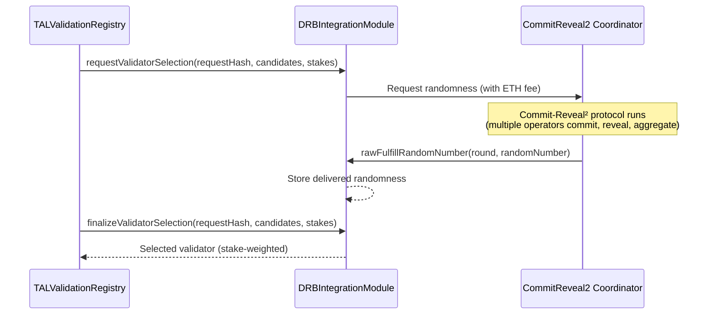
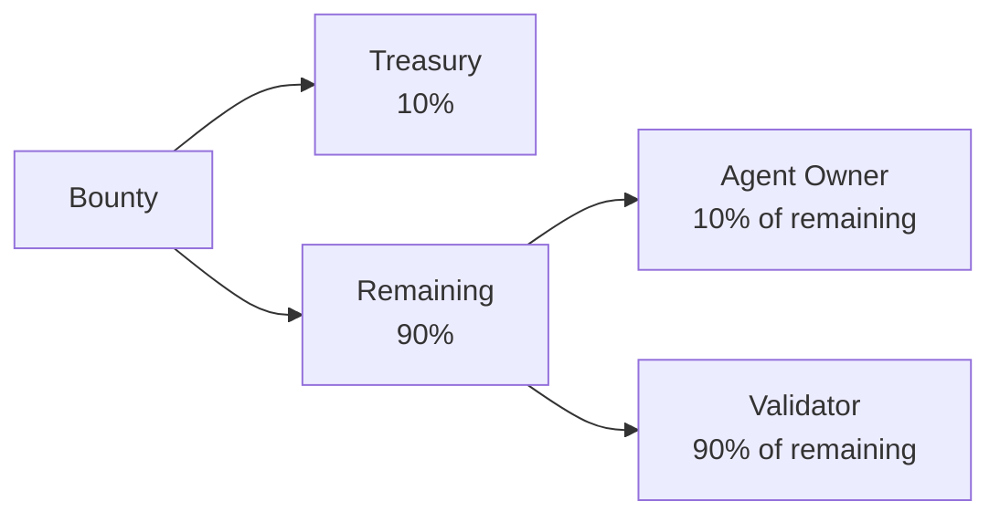
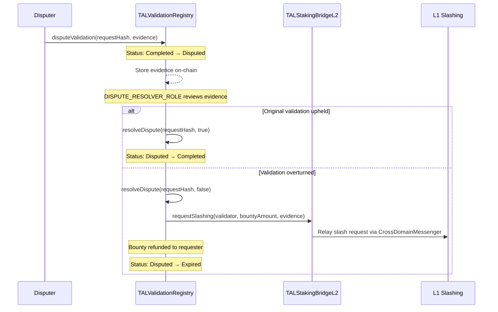

# Trust Model

TAL's trust model is designed around the principle that different use cases require different security guarantees. A low-stakes chatbot lookup needs only reputation feedback, while a DeFi strategy execution requires cryptographic proof of correct computation backed by slashable economic stake. This page covers the security assumptions, mathematical foundations, and enforcement mechanisms behind each trust tier.

## Security Assumptions

TAL's security rests on three independent pillars, any combination of which can be composed per validation request:

1. **Economic security** -- Operators stake TON on Ethereum L1. Misbehavior is punished by slashing, making attacks economically irrational when the stake exceeds the potential gain.
2. **Cryptographic fairness** -- Validator selection uses Tokamak's DRB (Decentralized Random Beacon) with the Commit-Reveal2 protocol, producing randomness that is verifiably unbiasable and unpredictable.
3. **Hardware integrity** -- TEE attestation (Intel SGX, AWS Nitro, ARM TrustZone) provides tamper-proof execution guarantees that are independent of economic incentives.

:::info
No single assumption is relied upon in isolation for high-trust validations. The Hybrid tier combines all three, ensuring that a validator must be economically committed, randomly selected, and hardware-verified.
:::

## Stake-Weighted Trust

### How Staked TON Affects Reputation Weight

Reputation feedback is weighted by the reviewer's L1 stake using a square root formula. This prevents plutocracy (where large stakers dominate) while still giving skin-in-the-game participants more influence than unstaked reviewers.

```solidity
// From contracts/src/libraries/ReputationMath.sol

function calculateWeightedAverage(
    int128[] memory values,
    uint256[] memory stakes
) internal pure returns (int256 weightedAverage) {
    int256 weightedSum = 0;
    uint256 totalWeight = 0;

    for (uint256 i = 0; i < values.length; i++) {
        uint256 weight = sqrt(stakes[i]);
        weightedSum += int256(values[i]) * int256(weight);
        totalWeight += weight;
    }

    if (totalWeight == 0) return 0;
    return (weightedSum * int256(PRECISION)) / int256(totalWeight);
}
```

The `sqrt()` weighting means a reviewer staking 10,000 TON has only 10x the influence of one staking 100 TON (not 100x), making Sybil attacks via stake concentration unprofitable.

### ReputationMath Constants

| Constant | Value | Description |
|----------|-------|-------------|
| `PRECISION` | `1e18` | Fixed-point precision for weighted averages |
| `MAX_SCORE` | `100` | Maximum feedback value |
| `MIN_SCORE` | `-100` | Minimum feedback value |

### Reputation Decay

Feedback loses weight over time via linear decay:

```
decayFactor = 1 - (elapsed / maxAge)
```

When `elapsed >= maxAge`, the feedback has zero weight. This ensures reputation reflects recent behavior, not historical performance that may no longer be relevant.

:::tip Where in the code?
All reputation math functions are in [`contracts/src/libraries/ReputationMath.sol`](/contracts/reputation-registry) (138 lines). The library provides `calculateWeightedAverage()`, `calculateStakeWeight()`, `normalizeScore()`, `aggregateFeedback()`, and `calculateDecay()`.
:::

## DRB Fairness

For StakeSecured and Hybrid validation models, the validator is selected using Tokamak's Decentralized Random Beacon (DRB) via the Commit-Reveal2 protocol.

### Selection Algorithm



The selection uses a cumulative sum approach with stake-based weights:

1. Each candidate's weight equals their staked TON amount (linear, not square root -- unlike reputation weighting, higher stake means higher selection probability for validators).
2. A cumulative weight array is constructed from the candidates.
3. The DRB random number modulo total weight determines the index.
4. The candidate whose cumulative weight range contains that index is selected.

:::warning
If the DRB module is not configured, the contract falls back to `blockhash`-based randomness. This is not secure for production -- validators can manipulate block hashes. The DRB module **must** be set for mainnet deployment.
:::

### DRB Integration Constants

| Constant | Value | Description |
|----------|-------|-------------|
| `DEFAULT_CALLBACK_GAS_LIMIT` | `100,000` | Gas limit for the DRB callback |
| `callbackGasLimit` | Configurable | Actual gas limit used per request |

## TEE Attestation

TEE (Trusted Execution Environment) attestation provides hardware-backed verification that code executed correctly inside a secure enclave.

### Supported Enclave Types

| Enclave | Provider | Description |
|---------|----------|-------------|
| Intel SGX | Intel | Software Guard Extensions -- isolated memory enclaves on x86 processors |
| AWS Nitro | Amazon | Nitro Enclaves -- isolated VMs on AWS EC2 with cryptographic attestation |
| ARM TrustZone | ARM | Hardware isolation on ARM processors, common in mobile/edge devices |

### Provider Management

TEE providers are whitelisted by the `TEE_MANAGER_ROLE` on `TALValidationRegistry`. Each provider has an associated enclave hash for verification:

```solidity
// Only TEE_MANAGER_ROLE can add providers
function setTrustedTEEProvider(address provider) external onlyRole(TEE_MANAGER_ROLE);
function removeTrustedTEEProvider(address provider) external onlyRole(TEE_MANAGER_ROLE);
```

When a TEEAttested or Hybrid validation is submitted, the proof bytes are decoded to extract the attestation provider, enclave hash, and signature. The contract verifies the provider is trusted and the attestation is valid.

## Slashing Conditions

Slashing is TAL's enforcement mechanism. When misbehavior is detected on L2, a slash request is relayed to L1 where it executes against the operator's staked TON via `DepositManager.slash()`.

### Severity Levels

| Condition | Slash % | Trigger | Threshold |
|-----------|---------|---------|-----------|
| **Failed TEE Attestation** | 50% | TEE attestation verification fails for a submitted validation | Automatic on proof failure |
| **Proven Validator Fraud** | 100% | Validator provably submitted false validation results | Dispute resolution upholds challenger |
| **Repeated Low Reputation** | 25% | Operator's aggregate reputation falls below threshold | Reputation score < `-50` |
| **DAO Adjudicated** | Variable (0-100%) | Governance vote determines severity for edge cases | Custom percentage set by governance |

:::danger
Proven fraud results in 100% stake loss. There is no partial forgiveness for deliberate falsification of validation results.
:::

### Slash Calculation

```solidity
// From contracts/src/libraries/SlashingCalculator.sol

function calculateSlashAmount(SlashParams memory params)
    internal pure
    returns (uint256 slashAmount, uint256 percentage)
{
    if (params.operatorStake < MIN_SLASHABLE_STAKE) {
        return (0, 0); // Dust threshold: < 1 TON
    }

    percentage = getSlashPercentage(params.reason, params.customPercentage);
    slashAmount = (params.operatorStake * percentage) / 100;
}
```

### Cumulative Slashing

Multiple offenses are applied sequentially -- each slash reduces the remaining stake before the next is calculated:

```solidity
function calculateCumulativeSlash(
    uint256 stake,
    uint256[] memory percentages
) internal pure returns (uint256 totalSlashed, uint256 remainingStake) {
    remainingStake = stake;
    for (uint256 i = 0; i < percentages.length; i++) {
        uint256 slashAmount = (remainingStake * pct) / 100;
        totalSlashed += slashAmount;
        remainingStake -= slashAmount;
    }
}
```

For example, an operator with 10,000 TON who receives a 50% slash (TEE failure) followed by a 25% slash (low reputation) loses 5,000 + 1,250 = 6,250 TON, retaining 3,750 TON.

### SlashingCalculator Constants

| Constant | Value | Description |
|----------|-------|-------------|
| `SLASH_FAILED_TEE` | `50` | Percentage slashed for failed TEE attestation |
| `SLASH_PROVEN_FRAUD` | `100` | Percentage slashed for proven fraud |
| `SLASH_LOW_REPUTATION` | `25` | Percentage slashed for low reputation |
| `MAX_SLASH_PERCENTAGE` | `100` | Maximum slash percentage cap |
| `MIN_SLASHABLE_STAKE` | `1 ether` | Minimum stake below which slashing is skipped |
| `LOW_REPUTATION_THRESHOLD` | `-50` | Reputation score below which low-rep slashing triggers |

:::tip Where in the code?
Slashing math is in `contracts/src/libraries/SlashingCalculator.sol` (162 lines). Cross-layer slashing execution is in [`contracts/src/bridge/TALSlashingConditionsL1.sol`](/architecture/cross-layer-bridge).
:::

## Bounty Distribution

When a validation is completed, the bounty attached to the request is distributed among three parties:



### Distribution Constants

| Constant | Value (BPS) | Effective % | Recipient |
|----------|-------------|-------------|-----------|
| `PROTOCOL_FEE_BPS` | `1000` | 10% of total bounty | Protocol treasury |
| `AGENT_REWARD_BPS` | `1000` | 10% of remaining (9% of total) | Agent NFT owner |
| Validator (remainder) | -- | Remaining after treasury + agent (81% of total) | Validator who submitted result |

### Concrete Example

For a 10 TON bounty:

1. Treasury receives: 10 * 10% = **1 TON**
2. Remaining: 10 - 1 = **9 TON**
3. Agent owner receives: 9 * 10% = **0.9 TON**
4. Validator receives: 9 - 0.9 = **8.1 TON**

### Minimum Bounty Requirements

| Validation Model | Minimum Bounty |
|-----------------|---------------|
| ReputationOnly | 0 (no bounty required) |
| StakeSecured | 10 TON (`MIN_STAKE_SECURED_BOUNTY`) |
| TEEAttested | 1 TON (`MIN_TEE_BOUNTY`) |
| Hybrid | 10 TON (uses StakeSecured minimum) |

## Dispute Mechanism

Any completed validation can be challenged through the dispute process.

### Who Can Dispute

- The **original requester** who paid for the validation
- The **agent owner** (NFT holder)
- Any **registered validator** (anyone with validation submission history)
- The **selected validator** for the specific request

### Dispute Flow



### Dispute Rules

1. Only **completed** validations can be disputed (not pending or expired).
2. Each validation can have at most **one active dispute** at a time.
3. Evidence bytes **must be non-empty** -- frivolous disputes without evidence are rejected.
4. Resolution requires `DISPUTE_RESOLVER_ROLE`, which should be held by a multisig or governance contract.
5. If the dispute is upheld (validation overturned), the validator is slashed for the full bounty amount and the bounty is refunded to the requester.

:::warning
Dispute resolution is currently centralized via `DISPUTE_RESOLVER_ROLE`. Future governance integration (TALGovernor/TALTimelock) will decentralize this authority.
:::

## Security Considerations

### Front-Running Protection

- Validation requests include a nonce (`_requestNonce++`) and `block.timestamp` in the hash, making request IDs unpredictable.
- DRB randomness is delivered via callback from the CommitReveal2 coordinator, not derived from on-chain state that miners can manipulate.

### Replay Attack Prevention

- `TALIdentityRegistry` uses per-address nonces (`walletNonces`) for EIP-712 wallet verification signatures.
- Slash requests include a monotonically increasing nonce (`slashNonce++`) to prevent replay.
- Validation request hashes include the nonce, timestamp, and sender, ensuring uniqueness.

### Reentrancy Protection

- All state-changing functions that transfer value (bounty distribution, seigniorage claiming, dispute refunds) are protected by OpenZeppelin's `ReentrancyGuard`.
- The `_distributeBounty` function updates state before making external calls (checks-effects-interactions pattern).

### Cross-Layer Security

- L2-to-L1 messages go through Optimism's 7-day finalization period, providing a natural appeal window before slashing executes.
- L1 bridge functions validate that `msg.sender` is the `CrossDomainMessenger` and that `xDomainMessageSender` matches the expected counterpart contract.
- See [Cross-Layer Bridge](/architecture/cross-layer-bridge) for the full security model.
