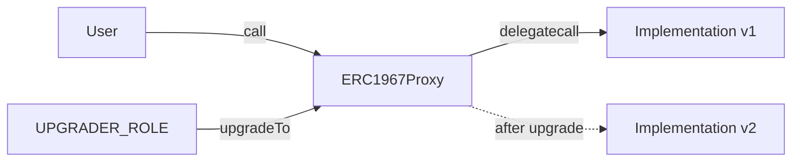
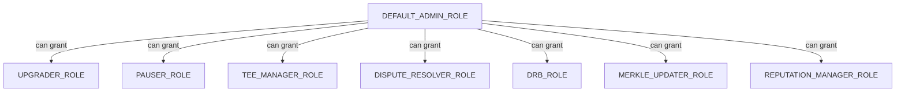

# Deployment & Security

This page covers the security architecture, deployment patterns, and operational details of the Tokamak AI Layer smart contracts. All core registry contracts use battle-tested OpenZeppelin patterns for upgradeability, access control, and emergency response.

## UUPS Proxy Pattern

All core registry contracts (Identity, Reputation, Validation) use the **UUPS (Universal Upgradeable Proxy Standard)** pattern from OpenZeppelin. This means:

1. A lightweight **ERC1967Proxy** holds storage and delegates all calls to an implementation contract
2. The upgrade authorization logic lives in the **implementation** (not the proxy), reducing proxy gas costs
3. Only addresses with `UPGRADER_ROLE` can authorize upgrades via `_authorizeUpgrade`



### Implementation Pattern

Each upgradeable contract follows this structure:

```solidity
contract TALIdentityRegistry is
    ERC721Upgradeable,
    AccessControlUpgradeable,
    UUPSUpgradeable,
    PausableUpgradeable,
    ReentrancyGuard,
    ITALIdentityRegistry
{
    /// @custom:oz-upgrades-unsafe-allow constructor
    constructor() {
        _disableInitializers();  // Prevent initialization of implementation
    }

    function initialize(address admin, ...) public initializer {
        __ERC721_init("TAL Agent Identity", "TALID");
        __AccessControl_init();
        __Pausable_init();
        // Grant roles, set state...
    }

    function _authorizeUpgrade(address newImplementation)
        internal override onlyRole(UPGRADER_ROLE) {}

    // Storage gap for future fields
    uint256[40] private __gap;
}
```

:::danger Upgrade Risks
UUPS upgrades are powerful but carry significant risk. A malicious or buggy upgrade can permanently brick the proxy or drain funds. Always ensure:
- Multi-sig or timelock controls the `UPGRADER_ROLE`
- New implementations are thoroughly tested and audited
- Storage layout compatibility is verified (no slot collisions)
- The `_authorizeUpgrade` function is never removed in new implementations
:::

### Exception: TaskFeeEscrow

The `TaskFeeEscrow` contract is intentionally **non-upgradeable**. It handles user funds directly and benefits from the stronger security guarantee of immutable logic. Its `identityRegistry` reference is set at construction time via an `immutable` variable.

## Role-Based Access Control

All core contracts use OpenZeppelin's `AccessControlUpgradeable` with the following role hierarchy:

| Role | Hash | Used In | Purpose |
|------|------|---------|---------|
| `DEFAULT_ADMIN_ROLE` | `0x00` | All contracts | Grant/revoke other roles, update contract references |
| `UPGRADER_ROLE` | `keccak256("UPGRADER_ROLE")` | Identity, Reputation, Validation | Authorize UUPS proxy upgrades |
| `PAUSER_ROLE` | `keccak256("PAUSER_ROLE")` | Identity, Reputation, Validation | Pause and unpause contracts |
| `TEE_MANAGER_ROLE` | `keccak256("TEE_MANAGER_ROLE")` | Validation | Manage trusted TEE providers and enclave hashes |
| `DISPUTE_RESOLVER_ROLE` | `keccak256("DISPUTE_RESOLVER_ROLE")` | Validation | Resolve validation disputes |
| `DRB_ROLE` | `keccak256("DRB_ROLE")` | Validation | Execute DRB-based validator selection |
| `MERKLE_UPDATER_ROLE` | `keccak256("MERKLE_UPDATER_ROLE")` | Reputation | Update the reputation Merkle root |
| `REPUTATION_MANAGER_ROLE` | `keccak256("REPUTATION_MANAGER_ROLE")` | Reputation | Update reviewer reputation scores |



:::info Role Assignment at Initialization
During `initialize()`, all roles are granted to the `admin` address. In production, roles should be distributed across different addresses (multi-sig, timelock, service accounts) to implement the principle of least privilege.
:::

## Storage Gaps

All upgradeable contracts reserve storage slots for future state variables using the storage gap pattern:

```solidity
/// @dev Reserved storage space for future upgrades
uint256[40] private __gap;
```

This ensures that when new state variables are added in future implementations, they do not collide with storage slots used by derived contracts. The gap size varies:

| Contract | Gap Size | Notes |
|----------|---------|-------|
| TALIdentityRegistry | `uint256[40]` | Standard gap |
| TALReputationRegistry | `uint256[39]` | Slightly reduced (extra state variable `taskFeeEscrow` added) |
| TALValidationRegistry | `uint256[40]` | Standard gap |

## ReentrancyGuard

All state-changing external functions that interact with external contracts or transfer value use OpenZeppelin's `ReentrancyGuard` via the `nonReentrant` modifier. Key protected functions include:

- `TALIdentityRegistry.register()` and `registerWithZKIdentity()`
- `TALReputationRegistry.submitFeedback()` and `submitFeedbackWithPaymentProof()`
- `TALValidationRegistry.requestValidation()` and `submitValidation()`
- `TaskFeeEscrow.payForTask()`, `confirmTask()`, `refundTask()`, `claimFees()`

## Pausable Emergency Mechanism

All core contracts implement `PausableUpgradeable` with `whenNotPaused` guards on critical functions. When paused:

- No new agent registrations
- No feedback submissions
- No new validation requests or submissions
- Read operations (queries, views) remain functional

```solidity
// Pause in an emergency
identityRegistry.pause();   // Requires PAUSER_ROLE

// Resume operations
identityRegistry.unpause(); // Requires PAUSER_ROLE
```

## Deployed Addresses (Thanos Sepolia)

The contracts are deployed on Thanos Sepolia (Chain ID: `111551119090`) behind ERC1967 proxies:

| Contract | Proxy Address | Type |
|----------|--------------|------|
| TALIdentityRegistry | `0x3f89CD27fD877827E7665A9883b3c0180E22A525` | UUPS Proxy |
| TALReputationRegistry | `0x0052258E517835081c94c0B685409f2EfC4D502b` | UUPS Proxy |
| TALValidationRegistry | `0x09447147C6E75a60A449f38532F06E19F5F632F3` | UUPS Proxy |
| StakingIntegrationModule | `0x41FF86643f6d550725177af1ABBF4db9715A74b8` | UUPS Proxy |

:::info Network Configuration
- **Network**: Thanos Sepolia (testnet)
- **Chain ID**: `111551119090`
- **Native Token**: TON (Thanos Sepolia uses TON as native gas token)
- **Standard**: ERC-8004 (Trustless Agents Standard)
:::

## Gas Benchmarks

Gas consumption for key operations, measured from the `GasBenchmarks.t.sol` test suite:

| Operation | Gas Used | Gas Target | Status |
|-----------|---------|------------|--------|
| `register()` | ~143,000 | < 200,000 | PASS |
| `registerWithZKIdentity()` | ~165,000 | < 240,000 | PASS |
| `updateAgentURI()` | ~45,000 | < 100,000 | PASS |
| `submitFeedback()` | ~318,000 | < 350,000 | PASS |
| `submitFeedbackWithPaymentProof()` | ~340,000 | < 455,000 | PASS |
| `revokeFeedback()` | ~28,000 | < 50,000 | PASS |
| `getSummary()` (5 clients) | ~65,000 | < 100,000 | PASS |
| `requestValidation()` (ReputationOnly) | ~277,000 | < 300,000 | PASS |
| `requestValidation()` (StakeSecured) | ~280,000 | < 360,000 | PASS |
| `submitValidation()` | ~120,000 | < 200,000 | PASS |

:::tip Running Benchmarks
```bash
cd contracts && forge test --match-contract GasBenchmarks -vv
```
The `-vv` flag displays `console.log` output showing exact gas figures.
:::

## Security Considerations

### Replay Protection

- **Wallet Verification**: Uses EIP-712 typed data signatures with per-wallet nonces (`walletNonces[wallet]++`) to prevent signature replay.
- **Validation Requests**: Each request gets a unique hash derived from `agentId + sender + taskHash + outputHash + model + deadline + timestamp + nonce`.
- **Task Escrow**: Each `taskRef` can only be paid for once (`TaskAlreadyPaid` error on duplicate).

### Front-Running Mitigation

- **DRB Validator Selection**: Uses Commit-Reveal2 randomness (when DRB module is configured) instead of predictable blockhash-based selection, making validator assignment manipulation impractical.
- **TEE Attestation Freshness**: Attestations must be within 1 hour of the current block timestamp, limiting the window for attestation replay.

### Reentrancy Protection

- `ReentrancyGuard` applied to all state-changing functions that make external calls or transfer value.
- The Checks-Effects-Interactions pattern is followed: state is updated before external calls are made (e.g., in `TaskFeeEscrow.claimFees`, balance is zeroed before the transfer).

### Access Control

- All administrative functions are gated behind role checks.
- The `DEFAULT_ADMIN_ROLE` can grant and revoke all other roles.
- Critical operations (upgrades, pausing) require specific roles rather than generic admin access.

### Upgrade Safety

- `_disableInitializers()` in constructors prevents implementation contracts from being initialized directly.
- Storage gaps (`uint256[40] __gap`) reserve space for future state variables.
- The `UPGRADER_ROLE` should be protected by a timelock or multi-sig in production deployments.

### Self-Feedback Prevention

- The Reputation Registry validates that `ownerOf(agentId) != msg.sender` before accepting feedback, preventing agents from inflating their own reputation.

### Value Handling

- The Validation Registry includes a `receive()` function to accept bounty payments.
- TaskFeeEscrow requires exact fee matching (`msg.value != fee` reverts with `IncorrectFeeAmount`).
- Bounty distribution in ValidationRegistry uses checked transfers with `require(success)` to ensure all parties receive their share.

## Test Coverage

The contract suite includes 384 tests across unit, integration, and benchmark categories:

| Test Suite | Tests | Type |
|-----------|-------|------|
| TALIdentityRegistry.t.sol | 87 | Unit |
| TALReputationRegistry.t.sol | 59 | Unit |
| ReputationMath.t.sol | 57 | Unit |
| DRBIntegrationModule.t.sol | 27 | Unit |
| StakingIntegrationModule.t.sol | 28 | Unit |
| CrossLayerBridge.t.sol | 48 | Integration |
| StakeSecuredValidation.t.sol | 12 | Integration |
| TEEAttestedValidation.t.sol | 20 | Integration |
| GasBenchmarks.t.sol | 11 | Benchmark |
| SDK tests (4 files) | 35 | Unit |

```bash
# Run all contract tests
cd contracts && forge test

# Run with gas report
cd contracts && forge test --gas-report

# Run specific test suite
cd contracts && forge test --match-contract TALIdentityRegistry -vvv
```

## Related Pages

- [Identity Registry](./identity-registry) -- agent registration and identity management
- [Reputation Registry](./reputation-registry) -- feedback and reputation scoring
- [Validation Registry](./validation-registry) -- multi-model task validation
- [Task Fee Escrow](./task-fee-escrow) -- payment escrow for task execution
