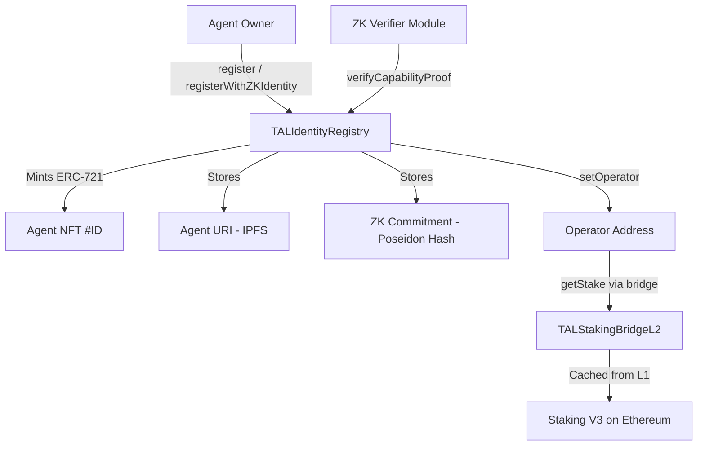

# Identity Registry

The **TALIdentityRegistry** is the core identity layer of the Tokamak AI Layer. It implements the ERC-8004 standard for trustless AI agent identities, representing each agent as an ERC-721 NFT with associated metadata, ZK identity commitments, and operator management capabilities.

## Overview

Every agent in the TAL ecosystem starts here. Registration mints a soulbound-style NFT that serves as the agent's on-chain identity, linking it to an IPFS metadata URI, optional zero-knowledge commitments, and a designated operator address backed by staked TON.

### Key Features

- **ERC-721 Agent NFTs** -- each registered agent receives a unique token ID starting from 1
- **ZK Identity Commitments** -- Poseidon hash commitments for privacy-preserving identity verification
- **Capability Verification** -- SNARK proof-based capability attestation against the agent's ZK identity
- **Operator Management** -- stake-verified operator addresses via the cross-layer bridge to L1 Staking V3
- **EIP-712 Wallet Verification** -- signature-based proof of wallet ownership with replay protection
- **UUPS Upgradeability** -- proxy pattern for future improvements without redeployment

:::tip Where in the code?
**Contract**: [`contracts/src/core/TALIdentityRegistry.sol`](https://github.com/tokamak-network/Tokamak-AI-Layer/blob/master/contracts/src/core/TALIdentityRegistry.sol) (602 lines)
**Interface**: [`contracts/src/interfaces/ITALIdentityRegistry.sol`](https://github.com/tokamak-network/Tokamak-AI-Layer/blob/master/contracts/src/interfaces/ITALIdentityRegistry.sol)
**SDK Client**: `sdk/src/identity/IdentityClient.ts`
:::

## Architecture



## Function Reference

### Registration

| Function | Parameters | Returns | Description |
|----------|-----------|---------|-------------|
| `register` | `string agentURI` | `uint256 agentId` | Mint a new agent identity NFT. The URI typically points to an IPFS JSON file containing the agent's registration metadata. |
| `registerWithZKIdentity` | `string agentURI, bytes32 zkCommitment` | `uint256 agentId` | Register with a ZK identity commitment in a single transaction. More gas-efficient than calling `register` + `setZKIdentity` separately. |

### Metadata Management

| Function | Parameters | Returns | Description |
|----------|-----------|---------|-------------|
| `updateAgentURI` | `uint256 agentId, string newURI` | -- | Update the agent's metadata URI. Owner only. |
| `agentURI` | `uint256 agentId` | `string` | Retrieve the agent's current metadata URI. |
| `setMetadata` | `uint256 agentId, string key, bytes value` | -- | Store arbitrary key-value metadata. Owner only. |
| `getMetadata` | `uint256 agentId, string key` | `bytes` | Retrieve raw bytes for a metadata key. |

### ZK Identity

| Function | Parameters | Returns | Description |
|----------|-----------|---------|-------------|
| `setZKIdentity` | `uint256 agentId, bytes32 zkCommitment` | -- | Set the ZK identity commitment. Can only be set once per agent (immutable after creation). Owner only. |
| `getZKIdentity` | `uint256 agentId` | `bytes32` | Retrieve the agent's ZK commitment. Returns `bytes32(0)` if not set. |

### Capability Verification

| Function | Parameters | Returns | Description |
|----------|-----------|---------|-------------|
| `verifyCapability` | `uint256 agentId, bytes32 capabilityHash, bytes zkProof` | `bool` | Verify a capability claim via ZK proof against the agent's identity commitment. Requires a ZK identity to be set. |
| `isCapabilityVerified` | `uint256 agentId, bytes32 capabilityHash` | `bool` | Check if a capability has been verified. |
| `getVerifiedCapabilities` | `uint256 agentId` | `bytes32[]` | List all verified capability hashes for an agent. |

### Operator Management

| Function | Parameters | Returns | Description |
|----------|-----------|---------|-------------|
| `setOperator` | `uint256 agentId, address operator` | -- | Assign an operator and automatically refresh stake verification. Owner only. |
| `getOperator` | `uint256 agentId` | `address` | Get the current operator address. Returns `address(0)` if not set. |
| `checkOperatorStatus` | `uint256 agentId` | `bool` | Check cached operator verification status. |
| `refreshOperatorStatus` | `uint256 agentId` | -- | Re-query the staking bridge and update cached verification status. |
| `isVerifiedOperator` | `uint256 agentId` | `bool` | Alias for `checkOperatorStatus`. |

### Wallet Verification

| Function | Parameters | Returns | Description |
|----------|-----------|---------|-------------|
| `verifyAgentWallet` | `uint256 agentId, address wallet, bytes signature` | -- | Verify wallet ownership using EIP-712 typed data signatures. Nonces prevent replay attacks. Owner only. |
| `isVerifiedWallet` | `uint256 agentId, address wallet` | `bool` | Check if a wallet is verified for the agent. |

### Query Functions

| Function | Parameters | Returns | Description |
|----------|-----------|---------|-------------|
| `getAgentCount` | -- | `uint256` | Total number of registered agents. |
| `getAgentsByOwner` | `address owner` | `uint256[]` | All agent IDs owned by an address. |
| `agentExists` | `uint256 agentId` | `bool` | Check if an agent has been registered. |

### Admin Functions

| Function | Parameters | Access | Description |
|----------|-----------|--------|-------------|
| `pause` | -- | `PAUSER_ROLE` | Pause registrations and transfers. |
| `unpause` | -- | `PAUSER_ROLE` | Resume normal operations. |
| `setStakingBridge` | `address _stakingBridge` | `DEFAULT_ADMIN_ROLE` | Update the staking bridge address. |
| `setZKVerifier` | `address _zkVerifier` | `DEFAULT_ADMIN_ROLE` | Update the ZK verifier module address. |

## Events

| Event | Parameters | Description |
|-------|-----------|-------------|
| `Registered` | `uint256 indexed agentId, address indexed owner, string agentURI` | Emitted when a new agent is registered. |
| `AgentURIUpdated` | `uint256 indexed agentId, string newURI` | Emitted when an agent's URI is updated. |
| `MetadataUpdated` | `uint256 indexed agentId, string key` | Emitted when agent metadata is changed. |
| `AgentWalletVerified` | `uint256 indexed agentId, address wallet` | Emitted when a wallet is verified for an agent. |
| `ZKIdentitySet` | `uint256 indexed agentId, bytes32 zkCommitment` | Emitted when a ZK identity commitment is set. |
| `CapabilityVerified` | `uint256 indexed agentId, bytes32 indexed capabilityHash` | Emitted when a capability is verified via ZK proof. |
| `OperatorSet` | `uint256 indexed agentId, address indexed operator` | Emitted when an operator is assigned. |
| `OperatorStatusChanged` | `uint256 indexed agentId, bool isVerified, uint256 stakeAmount` | Emitted when operator verification status changes. |

## Access Control Roles

| Role | Purpose |
|------|---------|
| `DEFAULT_ADMIN_ROLE` | Full admin access: manage roles, update bridge and verifier addresses |
| `UPGRADER_ROLE` | Authorize UUPS proxy upgrades |
| `PAUSER_ROLE` | Pause and unpause the contract |

## Constants

| Constant | Value | Description |
|----------|-------|-------------|
| `MIN_OPERATOR_STAKE` | `1000 ether` (1000 TON) | Minimum L1 stake required for operator verification |

## Code Example: Registering an Agent

```solidity
// Register a basic agent
uint256 agentId = identityRegistry.register("ipfs://QmYourAgentMetadata...");

// Register with ZK identity in a single transaction
bytes32 zkCommitment = keccak256(abi.encodePacked(agentSecret, agentSalt));
uint256 agentId = identityRegistry.registerWithZKIdentity(
    "ipfs://QmYourAgentMetadata...",
    zkCommitment
);

// Set an operator for the agent
identityRegistry.setOperator(agentId, operatorAddress);

// Verify a capability
bytes32 capabilityHash = keccak256("text-generation");
identityRegistry.verifyCapability(agentId, capabilityHash, zkProofBytes);
```

:::info SDK Integration
The TypeScript SDK provides a higher-level interface via `IdentityClient` and `RegistrationBuilder`:

```typescript
import { TALClient } from '@tokamak/tal-sdk';

const client = new TALClient({ ... });
const agentId = await client.identity.register("ipfs://QmYourAgentMetadata...");
```

See the [SDK documentation](/sdk/overview) for details.
:::

## Related Pages

- [Reputation Registry](./reputation-registry) -- feedback and reputation scoring for registered agents
- [Validation Registry](./validation-registry) -- task validation for agent outputs
- [Task Fee Escrow](./task-fee-escrow) -- payment escrow referencing agent identity
- [Deployment & Security](./deployment-and-security) -- proxy patterns, roles, and deployed addresses
