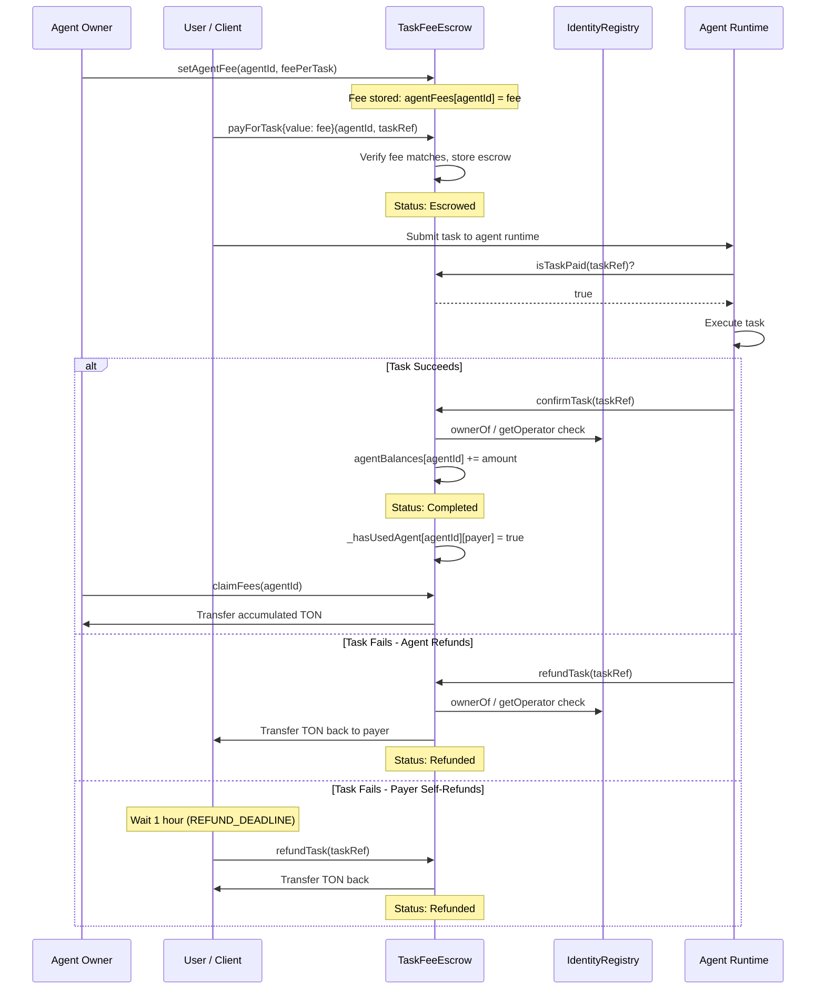

# Task Fee Escrow

The **TaskFeeEscrow** is the payment escrow contract for AI agent task execution on the Tokamak AI Layer. Unlike the core registry contracts, it is **non-upgradeable** and uses native TON (the gas token on Thanos L2) for all payments.

## Overview

The escrow provides a trustless payment mechanism between task clients and AI agents. Funds are held in escrow until the agent owner or operator confirms successful task completion, at which point the funds are credited to the agent's claimable balance. If the task fails, the agent side can issue an immediate refund, or the payer can self-refund after a 1-hour deadline.

### Key Features

- **Native TON Payments** -- uses `msg.value` for gas-efficient transfers on Thanos L2
- **Per-Task Escrow** -- each task has its own escrow record identified by a deterministic `taskRef`
- **Agent Fee Configuration** -- agent owners set their per-task fee via `setAgentFee`
- **Dual Refund Path** -- immediate refund by owner/operator, or payer self-refund after deadline
- **Usage Tracking** -- tracks which users have completed tasks, enabling usage-gated feedback in the Reputation Registry
- **Non-Upgradeable** -- immutable contract logic for maximum payment security

:::tip Where in the code?
**Contract**: [`contracts/src/core/TaskFeeEscrow.sol`](https://github.com/nicejudy/Tokamak-AI-Layer/blob/master/contracts/src/core/TaskFeeEscrow.sol) (189 lines)
**Interface**: [`contracts/src/interfaces/ITaskFeeEscrow.sol`](https://github.com/nicejudy/Tokamak-AI-Layer/blob/master/contracts/src/interfaces/ITaskFeeEscrow.sol)
**SDK ABI**: `sdk/src/abi/TaskFeeEscrow.ts`
:::

## Payment Lifecycle



## Function Reference

### Agent Owner Functions

| Function | Parameters | Returns | Description |
|----------|-----------|---------|-------------|
| `setAgentFee` | `uint256 agentId, uint256 feePerTask` | -- | Set the per-task fee in native TON. Must be > 0. Agent owner only. |
| `claimFees` | `uint256 agentId` | -- | Withdraw all accumulated confirmed fees. Agent owner only. Uses ReentrancyGuard. |

### User Functions

| Function | Parameters | Returns | Description |
|----------|-----------|---------|-------------|
| `payForTask` | `uint256 agentId, bytes32 taskRef` | -- | Pay the task fee via `msg.value`. Must match the agent's configured fee exactly. Payable. |

### Escrow Management

| Function | Parameters | Returns | Description |
|----------|-----------|---------|-------------|
| `confirmTask` | `bytes32 taskRef` | -- | Confirm task completion, moving escrow to `agentBalances`. Agent owner or operator only. |
| `refundTask` | `bytes32 taskRef` | -- | Refund escrowed funds. Owner/operator can refund immediately. Payer can refund after `REFUND_DEADLINE` (1 hour). |

### View Functions

| Function | Parameters | Returns | Description |
|----------|-----------|---------|-------------|
| `isTaskPaid` | `bytes32 taskRef` | `bool` | Returns `true` if status is `Escrowed` or `Completed`. |
| `getAgentFee` | `uint256 agentId` | `uint256` | Current per-task fee. Returns 0 if not set. |
| `getAgentBalance` | `uint256 agentId` | `uint256` | Accumulated unclaimed balance. |
| `getTaskEscrow` | `bytes32 taskRef` | `TaskEscrow` | Full escrow record: payer, agentId, amount, paidAt, status. |
| `hasUsedAgent` | `uint256 agentId, address user` | `bool` | Whether the user has completed at least one task for this agent. |

## Events

| Event | Parameters | Description |
|-------|-----------|-------------|
| `AgentFeeSet` | `uint256 indexed agentId, uint256 feePerTask` | Agent fee configured or updated. |
| `TaskPaid` | `uint256 indexed agentId, address indexed payer, bytes32 indexed taskRef, uint256 amount` | Task fee paid, funds in escrow. |
| `TaskConfirmed` | `bytes32 indexed taskRef, uint256 indexed agentId, uint256 amount` | Task confirmed, funds credited to agent balance. |
| `TaskRefunded` | `bytes32 indexed taskRef, address indexed payer, uint256 amount` | Escrow refunded to payer. |
| `FeesClaimed` | `uint256 indexed agentId, address indexed owner, uint256 amount` | Agent owner withdrew accumulated fees. |

## Data Structures

### TaskStatus Enum

```solidity
enum TaskStatus {
    None,       // 0 - No escrow exists
    Escrowed,   // 1 - Funds held, pending confirmation
    Completed,  // 2 - Confirmed, funds in agentBalances
    Refunded    // 3 - Refunded to payer
}
```

### TaskEscrow Struct

```solidity
struct TaskEscrow {
    address payer;      // The address that paid
    uint256 agentId;    // The agent being paid
    uint256 amount;     // Native TON escrowed
    uint256 paidAt;     // Block timestamp when paid
    TaskStatus status;  // Current escrow status
}
```

## Constants

| Constant | Value | Description |
|----------|-------|-------------|
| `REFUND_DEADLINE` | `1 hours` (3600 seconds) | Time after which the payer can self-refund |

## IIdentityRegistryMinimal Interface

The escrow uses a minimal interface to interact with the Identity Registry, reducing coupling:

```solidity
interface IIdentityRegistryMinimal {
    function ownerOf(uint256 tokenId) external view returns (address);
    function getOperator(uint256 agentId) external view returns (address);
}
```

This interface is used for:
- **`onlyAgentOwner` modifier** -- verifying the caller owns the agent NFT
- **`_isOwnerOrOperator` check** -- allowing both the owner and the designated operator to confirm/refund tasks

:::warning Refund Deadline
The payer can only self-refund after the **1-hour `REFUND_DEADLINE`** has passed since payment. Before that, only the agent owner or operator can initiate a refund. This gives the agent sufficient time to execute the task before the client can reclaim funds.
:::

## Code Example: Full Payment Flow

```solidity
// Step 1: Agent owner sets fee (0.1 TON per task)
taskFeeEscrow.setAgentFee(agentId, 0.1 ether);

// Step 2: User pays for a task
bytes32 taskRef = keccak256(abi.encodePacked(agentId, msg.sender, nonce));
taskFeeEscrow.payForTask{value: 0.1 ether}(agentId, taskRef);

// Step 3: Runtime checks payment
bool paid = taskFeeEscrow.isTaskPaid(taskRef);
require(paid, "Task not paid");

// Step 4a: On success, agent operator confirms
taskFeeEscrow.confirmTask(taskRef);

// Step 4b: On failure, operator refunds immediately
taskFeeEscrow.refundTask(taskRef);

// Step 4c: Or payer self-refunds after 1 hour
// (only if still in Escrowed status)
taskFeeEscrow.refundTask(taskRef);

// Step 5: Agent owner claims accumulated fees
taskFeeEscrow.claimFees(agentId);
```

:::info Usage-Gated Feedback
When the `TaskFeeEscrow` address is set on the `TALReputationRegistry` via `setTaskFeeEscrow`, only users with `hasUsedAgent(agentId, user) == true` can submit feedback. This is set to `true` when `confirmTask` is called, ensuring only actual task consumers can rate agents.
:::

## Security Considerations

- **Non-Upgradeable**: Unlike the core registries, TaskFeeEscrow is deployed as a plain contract (no proxy). This provides stronger payment security guarantees since the logic cannot be changed after deployment.
- **ReentrancyGuard**: Applied to `payForTask`, `confirmTask`, `refundTask`, and `claimFees` to prevent reentrancy attacks during native TON transfers.
- **Exact Fee Matching**: `msg.value` must exactly equal the configured fee -- no overpayment or underpayment is accepted.
- **Immutable Registry Reference**: The `identityRegistry` address is set at construction time and cannot be changed.

## Related Pages

- [Identity Registry](./identity-registry) -- agent ownership and operator verification
- [Reputation Registry](./reputation-registry) -- uses `hasUsedAgent` for feedback gating
- [Deployment & Security](./deployment-and-security) -- security patterns and deployed addresses
