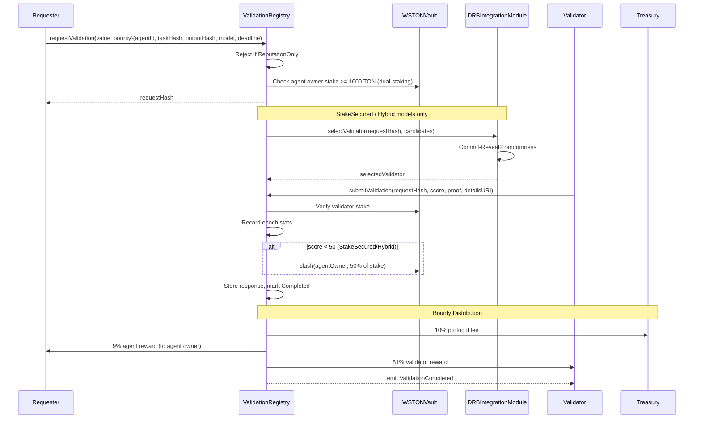
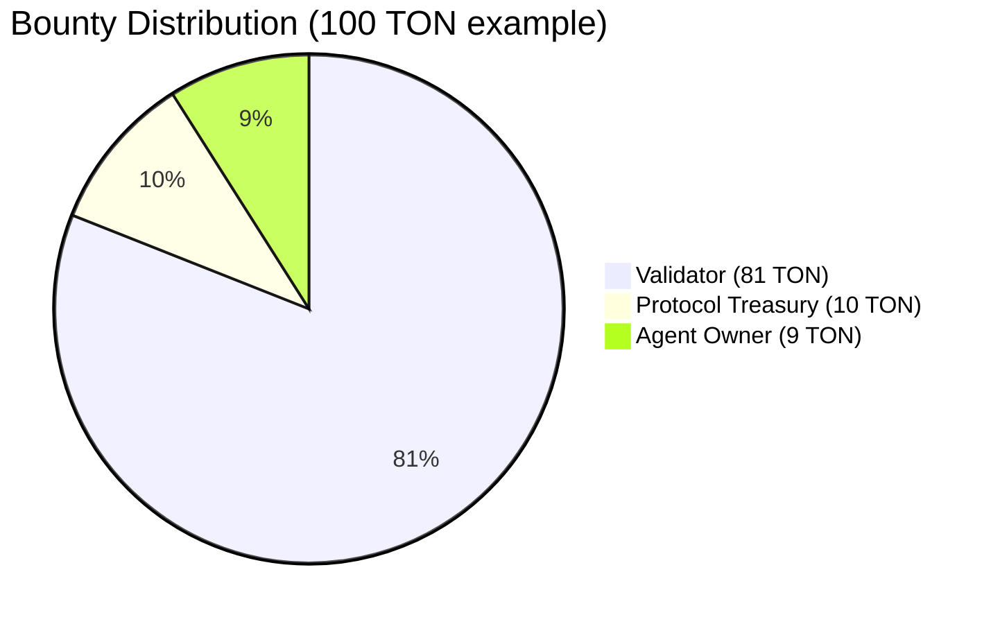

# Validation Registry

The **TALValidationRegistry** is the multi-model validation engine of the Tokamak AI Layer. It implements ERC-8004 compliant task validation with three active trust tiers, DRB-based validator selection, TEE attestation verification, bounty distribution, dispute mechanism, epoch-based statistics, dual-staking requirements, and automated slashing via the WSTONVault.

## Overview

When an AI agent executes a task, how do you know the output is correct? The Validation Registry answers this by providing multiple validation models with escalating security guarantees. Validators are selected fairly using decentralized randomness (Commit-Reveal2), and economic incentives are aligned through bounty distribution and automated slashing.

### Validation Models

| Model | Enum Value | Bounty Required | Security Level | Use Case |
|-------|-----------|-----------------|----------------|----------|
| ~~**ReputationOnly**~~ | `0` | -- | -- | **REJECTED** -- the contract reverts if this model is requested |
| **StakeSecured** | `1` | 10 TON minimum | Medium | Financial operations, data processing |
| **TEEAttested** | `2` | 1 TON minimum | High | Sensitive computations, privacy-critical tasks |
| **Hybrid** | `3` | max(10, 1) TON | Maximum | Critical infrastructure, high-value operations |

:::warning ReputationOnly Removed
As of the V3 upgrade, `ReputationOnly` (model `0`) is explicitly **rejected** by `requestValidation()`. The contract reverts with `ReputationOnlyNoValidationNeeded()`. All validation requests must use StakeSecured, TEEAttested, or Hybrid.
:::

:::tip Where in the code?
**Contract**: [`contracts/src/core/TALValidationRegistry.sol`](https://github.com/tokamak-network/Tokamak-AI-Layer/blob/master/contracts/src/core/TALValidationRegistry.sol) (1,112 lines)
**Interface**: [`contracts/src/interfaces/ITALValidationRegistry.sol`](https://github.com/tokamak-network/Tokamak-AI-Layer/blob/master/contracts/src/interfaces/ITALValidationRegistry.sol)
**SDK Client**: `sdk/src/validation/ValidationClient.ts`
:::

## V3 Features

The validation registry has been upgraded through V2 and V3, adding significant new capabilities while maintaining storage compatibility via the UUPS proxy pattern.

### Epoch-Based Statistics (V2)

Validation outcomes are tracked in 30-day epochs. Each validation submission increments per-agent counters:

- **Total validations** per epoch: `_epochTotalValidations[agentId][epoch]`
- **Failed validations** per epoch (score < 50): `_epochFailedValidations[agentId][epoch]`

```solidity
uint256 public constant EPOCH_DURATION = 30 days;
uint8 public constant FAILURE_SCORE_THRESHOLD = 50;
```

Query epoch stats via:

| Function | Parameters | Returns | Description |
|----------|-----------|---------|-------------|
| `getEpochStats` | `uint256 agentId, uint256 epoch` | `(uint256 total, uint256 failed)` | Validation counts for a specific epoch |
| `currentEpoch` | -- | `uint256` | Current epoch number (`block.timestamp / EPOCH_DURATION`) |

### Dual-Staking Requirement (V3)

For **StakeSecured** and **Hybrid** models, the agent owner must have at least **1,000 TON** locked in the WSTONVault. This ensures agents have economic skin-in-the-game, not just the validator.

```solidity
uint256 public constant MIN_AGENT_OWNER_STAKE = 1000 ether;
```

If the agent owner's locked WSTON is below this threshold, `requestValidation()` reverts with `InsufficientAgentOwnerStake(owner, currentStake, required)`.

### Automated Slashing (V3)

Two automated slashing mechanisms execute via the WSTONVault without requiring manual dispute resolution:

**1. Incorrect Computation Slashing** -- When a validator submits a score below 50 for a StakeSecured or Hybrid validation, 50% of the **agent owner's** locked WSTON is automatically slashed:

```solidity
uint8 public constant INCORRECT_COMPUTATION_THRESHOLD = 50;
uint256 public constant SLASH_INCORRECT_COMPUTATION_PCT = 50;
```

**2. Missed Deadline Slashing** -- When a StakeSecured/Hybrid validation expires without submission, anyone can call `slashForMissedDeadline(requestHash)` to slash 10% of the **selected validator's operator** stake and refund the bounty to the requester:

```solidity
uint256 public constant SLASH_MISSED_DEADLINE_PCT = 10;
```

This function is **permissionless** -- any address can trigger it after the deadline passes.

### WSTONVault Integration (V3)

The validation registry uses the [WSTONVault](./wston-vault) for all stake verification and slashing operations on L2:

- **Validator stake verification**: `WSTONVault.isVerifiedOperator(validator)` -- validators must have locked WSTON above the VERIFIED threshold
- **Dual-staking check**: `WSTONVault.getLockedBalance(owner)` -- agent owners must meet `MIN_AGENT_OWNER_STAKE`
- **Automated slashing**: `WSTONVault.slash(operator, amount)` -- seizes locked WSTON and sends it to the treasury

## Validation Lifecycle



## Bounty Distribution

When a validation is completed with a bounty, funds are distributed as follows:



The exact calculation:

1. **Protocol fee**: `bounty * protocolFeeBps / 10000` = 10% to treasury
2. **Remaining**: `bounty - protocolFee` = 90 TON
3. **Agent reward**: `remaining * AGENT_REWARD_BPS / 10000` = 10% of remaining = 9 TON
4. **Validator reward**: `remaining - agentReward` = 81 TON

## Function Reference

### Core Validation

| Function | Parameters | Returns | Description |
|----------|-----------|---------|-------------|
| `requestValidation` | `uint256 agentId, bytes32 taskHash, bytes32 outputHash, ValidationModel model, uint256 deadline` | `bytes32 requestHash` | Create a validation request. Reverts for ReputationOnly. Enforces dual-staking for StakeSecured/Hybrid. Send TON as `msg.value` for bounty. Payable. |
| `submitValidation` | `bytes32 requestHash, uint8 score, bytes proof, string detailsURI` | -- | Submit validation result. Score must be 0-100. Records epoch stats. Triggers automated slashing if score < 50. |
| `getValidation` | `bytes32 requestHash` | `(ValidationRequest, ValidationResponse)` | Retrieve request and response data. |
| `getAgentValidations` | `uint256 agentId` | `bytes32[]` | All validation request hashes for an agent. |

### Epoch Stats

| Function | Parameters | Returns | Description |
|----------|-----------|---------|-------------|
| `getEpochStats` | `uint256 agentId, uint256 epoch` | `(uint256 total, uint256 failed)` | Validation counts for a specific epoch. |
| `currentEpoch` | -- | `uint256` | Current epoch number. |

### Automated Slashing

| Function | Parameters | Returns | Description |
|----------|-----------|---------|-------------|
| `slashForMissedDeadline` | `bytes32 requestHash` | -- | Permissionless. Slashes 10% of validator operator stake for expired StakeSecured/Hybrid validations and refunds the bounty to the requester. |

### Validator Selection

| Function | Parameters | Returns | Description |
|----------|-----------|---------|-------------|
| `selectValidator` | `bytes32 requestHash, address[] candidates` | `address` | Select a validator via DRB randomness. Restricted to `DRB_ROLE`. |
| `getSelectedValidator` | `bytes32 requestHash` | `address` | Get the validator selected for a request. Returns `address(0)` if none. |
| `finalizeValidatorSelection` | `bytes32 requestHash, address[] candidates, uint256[] stakes` | -- | Finalize DRB-based selection after Commit-Reveal2 callback delivers randomness. |

### TEE Attestation Management

| Function | Parameters | Returns | Description |
|----------|-----------|---------|-------------|
| `setTrustedTEEProvider` | `address provider` | -- | Whitelist a TEE attestation provider. `TEE_MANAGER_ROLE` only. |
| `removeTrustedTEEProvider` | `address provider` | -- | Remove a provider from the whitelist. `TEE_MANAGER_ROLE` only. |
| `isTrustedTEEProvider` | `address provider` | `bool` | Check if a provider is trusted. |
| `getTrustedTEEProviders` | -- | `address[]` | List all trusted TEE providers. |
| `setTEEEnclaveHash` | `address provider, bytes32 enclaveHash` | -- | Set expected enclave hash for a provider. `TEE_MANAGER_ROLE` only. |

### Dispute Handling

| Function | Parameters | Returns | Description |
|----------|-----------|---------|-------------|
| `disputeValidation` | `bytes32 requestHash, bytes evidence` | -- | Dispute a completed validation. Authorized for requester, agent owner, or registered validators. |
| `resolveDispute` | `bytes32 requestHash, bool upholdOriginal` | -- | Resolve a dispute. `DISPUTE_RESOLVER_ROLE` only. If overturned, validator is slashed and bounty refunded. Records a dispute failure in epoch stats. |
| `isDisputed` | `bytes32 requestHash` | `bool` | Check if a validation is under dispute. |

### Query Functions

| Function | Parameters | Returns | Description |
|----------|-----------|---------|-------------|
| `getValidationsByRequester` | `address requester` | `bytes32[]` | All validation requests initiated by an address. |
| `getValidationsByValidator` | `address validator` | `bytes32[]` | All validations handled by a validator. |
| `getPendingValidationCount` | `uint256 agentId` | `uint256` | Number of pending validations for an agent. |
| `getTreasury` | -- | `address` | Current treasury address. |

### Admin Functions

| Function | Parameters | Access | Description |
|----------|-----------|--------|-------------|
| `pause` / `unpause` | -- | `PAUSER_ROLE` | Emergency pause/unpause. |
| `setTreasury` | `address` | `DEFAULT_ADMIN_ROLE` | Update treasury address. |
| `setIdentityRegistry` | `address` | `DEFAULT_ADMIN_ROLE` | Update identity registry reference. |
| `setReputationRegistry` | `address` | `DEFAULT_ADMIN_ROLE` | Update reputation registry reference. |
| `setWSTONVault` | `address` | `DEFAULT_ADMIN_ROLE` | Update WSTONVault reference. |
| `setDRBModule` | `address` | `DEFAULT_ADMIN_ROLE` | Update DRB integration module address. |
| `updateValidationParameters` | `uint256 minStakeSecuredBounty, uint256 minTEEBounty, uint256 protocolFeeBps` | `DEFAULT_ADMIN_ROLE` | Update economic parameters. |

## Events

| Event | Parameters | Description |
|-------|-----------|-------------|
| `ValidationRequested` | `bytes32 indexed requestHash, uint256 indexed agentId, ValidationModel model` | New validation request created. |
| `ValidationCompleted` | `bytes32 indexed requestHash, address indexed validator, uint8 score` | Validation result submitted. |
| `ValidationDisputed` | `bytes32 indexed requestHash, address indexed disputer` | Dispute initiated. |
| `ValidatorSelected` | `bytes32 indexed requestHash, address indexed validator, uint256 randomSeed` | Validator selected via DRB. |
| `BountyDistributed` | `bytes32 indexed requestHash, address indexed validator, uint256 validatorAmount, uint256 agentAmount, uint256 treasuryAmount` | Bounty split distributed. |
| `TEEProviderUpdated` | `address indexed provider, bool trusted` | TEE provider whitelist changed. |
| `ValidationParametersUpdated` | `uint256 minStakeSecuredBounty, uint256 minTEEBounty, uint256 protocolFeeBps` | Economic parameters updated. |
| `ValidationStatsUpdated` | `uint256 indexed agentId, uint256 epoch, uint256 totalInEpoch, uint256 failedInEpoch` | Epoch stats updated after validation. |
| `AgentSlashed` | `uint256 indexed agentId, bytes32 indexed requestHash, uint256 slashAmount, uint256 slashPercentage` | Agent owner slashed for incorrect computation. |
| `OperatorSlashedForDeadline` | `bytes32 indexed requestHash, address indexed operator` | Validator operator slashed for missed deadline. |

## Access Control Roles

| Role | Purpose |
|------|---------|
| `DEFAULT_ADMIN_ROLE` | Full admin access: manage roles, update references, change parameters |
| `UPGRADER_ROLE` | Authorize UUPS proxy upgrades |
| `PAUSER_ROLE` | Pause and unpause the contract |
| `TEE_MANAGER_ROLE` | Manage trusted TEE providers and enclave hashes |
| `DISPUTE_RESOLVER_ROLE` | Resolve validation disputes |
| `DRB_ROLE` | Execute validator selection via DRB |

## Constants

| Constant | Value | Description |
|----------|-------|-------------|
| `MIN_STAKE_SECURED_BOUNTY` | `10 ether` (10 TON) | Default minimum bounty for StakeSecured |
| `MIN_TEE_BOUNTY` | `1 ether` (1 TON) | Default minimum bounty for TEEAttested |
| `PROTOCOL_FEE_BPS` | `1000` (10%) | Protocol fee taken from bounty |
| `AGENT_REWARD_BPS` | `1000` (10%) | Agent's share of remaining bounty |
| `VALIDATOR_REWARD_BPS` | `8000` (80%) | Validator's share of remaining bounty |
| `MAX_SCORE` | `100` | Maximum validation score |
| `BPS_DENOMINATOR` | `10000` | Basis points denominator |
| `EPOCH_DURATION` | `30 days` | Duration of each stats epoch |
| `FAILURE_SCORE_THRESHOLD` | `50` | Score below which a validation counts as "failed" |
| `MIN_AGENT_OWNER_STAKE` | `1000 ether` (1,000 TON) | Minimum agent owner stake for dual-staking |
| `MIN_OPERATOR_STAKE_V3` | `1000 ether` (1,000 TON) | Minimum operator stake for validators |
| `INCORRECT_COMPUTATION_THRESHOLD` | `50` | Score below which incorrect computation slashing triggers |
| `SLASH_INCORRECT_COMPUTATION_PCT` | `50` | Percentage of agent owner stake slashed for incorrect computation |
| `SLASH_MISSED_DEADLINE_PCT` | `10` | Percentage of validator stake slashed for missed deadline |

## Storage Layout

The contract uses UUPS proxy pattern with versioned storage gaps:

```solidity
// V1 state variables (identityRegistry, reputationRegistry, drbModule, treasury, mappings...)
uint256[40] internal __gap;        // V1 gap

// V2 additions: epoch-based stats
mapping(uint256 => mapping(uint256 => uint256)) internal _epochTotalValidations;
mapping(uint256 => mapping(uint256 => uint256)) internal _epochFailedValidations;
uint256[38] private __gapV2;       // V2 gap

// V3 additions: deadline slashing + WSTONVault
mapping(bytes32 => bool) internal _deadlineSlashExecuted;
address public wstonVault;
uint256[36] private __gapV3;       // V3 gap
```

## TEE Attestation Verification

For `TEEAttested` and `Hybrid` models, the proof must contain a valid TEE attestation:

```solidity
// Attestation proof structure (ABI-encoded):
(
    bytes32 enclaveHash,    // Must match registered hash for provider
    address teeSigner,      // Must be a trusted TEE provider
    uint256 timestamp,      // Must be within 1 hour of current time
    bytes signature         // 65-byte ECDSA signature over (enclaveHash, taskHash, outputHash, requestHash, timestamp)
)
```

The verification checks:
1. TEE provider is whitelisted
2. Enclave hash matches the registered hash for the provider
3. Attestation is fresh (within 1 hour)
4. Signature recovers to the TEE provider address

## Code Example: Requesting a Validation

```solidity
// Request a StakeSecured validation with 10 TON bounty
// (ReputationOnly is REJECTED -- do not use model 0)
bytes32 requestHash = validationRegistry.requestValidation{value: 10 ether}(
    agentId,
    keccak256(abi.encodePacked(taskInput)),
    keccak256(abi.encodePacked(taskOutput)),
    IERC8004ValidationRegistry.ValidationModel.StakeSecured,
    block.timestamp + 1 days
);

// Submit a validation result
validationRegistry.submitValidation(
    requestHash,
    85,                         // score out of 100
    hex"",                      // proof (empty for StakeSecured)
    "ipfs://QmValidationReport" // detailed report URI
);

// Permissionless deadline slashing (anyone can call after deadline)
validationRegistry.slashForMissedDeadline(expiredRequestHash);
```

:::danger Automated Slashing
Two slashing paths execute automatically without manual dispute resolution:
1. **Incorrect computation** (score < 50): 50% of agent owner's WSTON is slashed immediately on `submitValidation()`
2. **Missed deadline**: Anyone can call `slashForMissedDeadline()` to slash 10% of the validator's WSTON and refund the bounty

Both operate through the [WSTONVault](./wston-vault) contract on L2.
:::

## Related Pages

- [WSTONVault](./wston-vault) -- L2 WSTON locking, operator tiers, and slashing execution
- [Identity Registry](./identity-registry) -- agent existence is validated before accepting requests
- [Reputation Registry](./reputation-registry) -- validation results can trigger reputation updates
- [Task Fee Escrow](./task-fee-escrow) -- payment layer for task execution
- [Deployment & Security](./deployment-and-security) -- proxy patterns, roles, and deployed addresses
