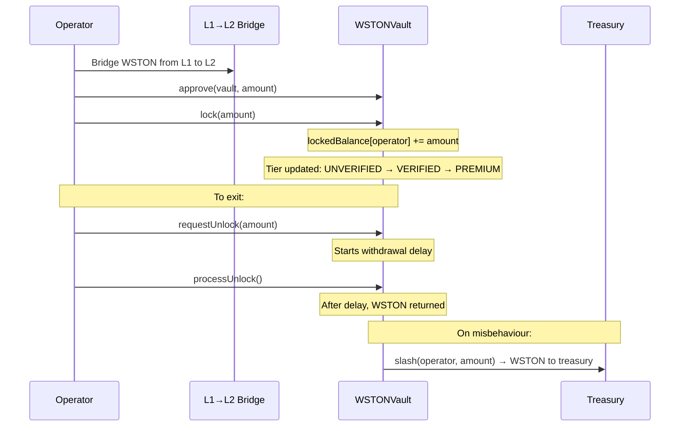

# WSTON Vault

The **WSTONVault** is an L2 vault for locking bridged WSTON tokens with slashing support. Operators lock WSTON on Thanos Sepolia L2 to back agent validations. The vault assigns operator tiers based on locked amounts and enables slashing by authorized contracts (ValidationRegistry, StakingIntegrationModule).

:::tip Where in the code?
**Contract**: [`contracts/src/core/WSTONVault.sol`](https://github.com/tokamak-network/Tokamak-AI-Layer/blob/master/contracts/src/core/WSTONVault.sol) (280 lines)
**Tests**: `contracts/test/unit/WSTONVault.t.sol` (44 tests)
**Frontend hook**: `frontend/src/hooks/useVault.ts`
:::

## Overview

Unlike the core registries, WSTONVault is intentionally **non-upgradeable** -- it handles user funds directly and benefits from immutable logic. The WSTON token is set at construction time via an `immutable` variable.

### Operator Flow



## Operator Tiers

Locked WSTON determines an operator's tier, which affects eligibility for validator selection and validation requests:

| Tier | Locked WSTON | Constant | Description |
|------|-------------|----------|-------------|
| **UNVERIFIED** | < 1,000 | -- | Cannot serve as validator for StakeSecured/Hybrid |
| **VERIFIED** | >= 1,000 | `VERIFIED_THRESHOLD` | Eligible for validator selection and dual-staking |
| **PREMIUM** | >= 10,000 | `PREMIUM_THRESHOLD` | Highest trust tier |

```solidity
uint256 public constant VERIFIED_THRESHOLD = 1000 ether;  // 1000 WSTON
uint256 public constant PREMIUM_THRESHOLD = 10000 ether;   // 10000 WSTON
```

## Function Reference

### Core Functions

| Function | Parameters | Description |
|----------|-----------|-------------|
| `lock` | `uint256 amount` | Lock WSTON in the vault. Caller must have approved the vault. Amount must be >= `minLockAmount`. |
| `requestUnlock` | `uint256 amount` | Request to unlock WSTON. Starts the withdrawal delay countdown. Reduces `lockedBalance` immediately. |
| `processUnlock` | -- | Process all ready withdrawal requests. Transfers WSTON back to the caller. Reverts if no requests are ready. |

### Slashing

| Function | Parameters | Access | Description |
|----------|-----------|--------|-------------|
| `slash` | `address operator, uint256 amount` | `SLASH_ROLE` | Slash an operator's locked WSTON. Sends slashed tokens to the treasury. Reverts if amount exceeds balance. |

### View Functions

| Function | Parameters | Returns | Description |
|----------|-----------|---------|-------------|
| `getLockedBalance` | `address operator` | `uint256` | Locked WSTON balance for an operator. |
| `isVerifiedOperator` | `address operator` | `bool` | Whether operator meets VERIFIED threshold (>= 1,000 WSTON). |
| `getOperatorTier` | `address operator` | `OperatorTier` | Current tier: UNVERIFIED, VERIFIED, or PREMIUM. |
| `getWithdrawalRequestCount` | `address operator` | `uint256` | Number of pending withdrawal requests. |
| `getWithdrawalRequest` | `address operator, uint256 index` | `(uint256 amount, uint256 unlockBlock)` | Details of a specific withdrawal request. |
| `getReadyAmount` | `address operator` | `uint256` | Total amount ready for `processUnlock`. |

### Admin Functions

| Function | Parameters | Access | Description |
|----------|-----------|--------|-------------|
| `setTreasury` | `address` | `DEFAULT_ADMIN_ROLE` | Update the treasury address. |
| `setWithdrawalDelay` | `uint256` | `DEFAULT_ADMIN_ROLE` | Update the block delay for withdrawals. |
| `setMinLockAmount` | `uint256` | `DEFAULT_ADMIN_ROLE` | Update minimum lock amount. |

## Events

| Event | Parameters | Description |
|-------|-----------|-------------|
| `Locked` | `address indexed operator, uint256 amount` | WSTON locked in vault. |
| `UnlockRequested` | `address indexed operator, uint256 amount, uint256 unlockBlock` | Withdrawal request created. |
| `UnlockProcessed` | `address indexed operator, uint256 totalAmount` | Ready withdrawals processed. |
| `Slashed` | `address indexed operator, uint256 amount, address indexed treasury` | Operator slashed, WSTON sent to treasury. |
| `TreasuryUpdated` | `address indexed oldTreasury, address indexed newTreasury` | Treasury address changed. |
| `WithdrawalDelayUpdated` | `uint256 oldDelay, uint256 newDelay` | Withdrawal delay changed. |
| `MinLockAmountUpdated` | `uint256 oldMin, uint256 newMin` | Minimum lock amount changed. |

## Access Control

| Role | Purpose |
|------|---------|
| `DEFAULT_ADMIN_ROLE` | Manage admin settings (treasury, delay, min lock), grant/revoke SLASH_ROLE |
| `SLASH_ROLE` | Execute slashing against operator locked balances |

The `SLASH_ROLE` is granted to contracts that need slashing authority: `TALValidationRegistry` (for automated slashing) and `StakingIntegrationModule`.

## Withdrawal Delay

When an operator calls `requestUnlock(amount)`, the locked balance is reduced immediately but the WSTON is not returned until after `withdrawalDelay` blocks have passed. This prevents operators from front-running a pending slash by withdrawing their stake.

The delay is configurable by the admin. Multiple withdrawal requests can be queued simultaneously, and `processUnlock()` processes all requests whose unlock block has been reached.

## Security Design

- **Non-upgradeable**: Immutable logic for stronger fund safety guarantees
- **ReentrancyGuard**: All state-changing functions protected against reentrancy
- **SafeERC20**: All token transfers use OpenZeppelin's SafeERC20 to handle non-standard ERC20 implementations
- **Immediate balance reduction**: `requestUnlock()` reduces `lockedBalance` immediately, preventing the operator from appearing staked during the delay period

## Deployed Address

| Contract | Network | Address |
|----------|---------|---------|
| WSTONVault | Thanos Sepolia L2 | [`0x6aa6a7B9e51B636417025403053855B788107C27`](https://explorer.thanos-sepolia.tokamak.network/address/0x6aa6a7B9e51B636417025403053855B788107C27) |
| WSTON (L2 Bridged) | Thanos Sepolia L2 | [`0x4d7b29213c9ad19a2aaa01e3ccf6f209636a786f`](https://explorer.thanos-sepolia.tokamak.network/address/0x4d7b29213c9ad19a2aaa01e3ccf6f209636a786f) |

## Related Pages

- [Validation Registry](./validation-registry) -- uses WSTONVault for dual-staking checks and automated slashing
- [Deployment & Security](./deployment-and-security) -- security patterns and deployed addresses
- [Cross-Layer Bridge](/architecture/cross-layer-bridge) -- L1/L2 WSTON bridging
