# Zero to Proof in 15 Minutes

This guide takes you from zero to a working agent producing ZK proofs on the Tokamak Execution Kernel. By the end, you will have scaffolded an agent, run it through the kernel, and generated a cryptographic proof of correct execution.

## Prerequisites (2 min)

Install the required toolchains. If you already have Rust and Foundry, skip to [Create Your First Agent](#create-your-first-agent-1-min).

```bash
# Install Rust
curl --proto '=https' --tlsv1.2 -sSf https://sh.rustup.rs | sh
source "$HOME/.cargo/env"

# Install RISC Zero toolchain (for ZK proof generation)
curl -L https://risczero.com/install | bash && rzup install

# Install Foundry (for smart contract interaction)
curl -L https://foundry.paradigm.xyz | bash && foundryup
```

Install the `tal` CLI:

```bash
# Option 1: Prebuilt binary (fastest — no Rust required)
curl -sSL https://raw.githubusercontent.com/tokamak-network/Tokamak-AI-Layer/master/install-tal.sh | sh

# Option 2: From crates.io (requires Rust)
cargo install tal-cli

# Option 3: From source (requires Rust + cloned repo)
git clone https://github.com/tokamak-network/Tokamak-AI-Layer.git
cd Tokamak-AI-Layer
cargo install --path crates/tal-cli
```

Validate everything is working:

```bash
tal doctor
```

This checks Rust, RISC Zero, Foundry, and Node.js in one command. If anything is missing, run `tal doctor --install` to auto-install.

:::tip Hardware
Development and testing works on any modern machine (8GB+ RAM). Proof generation is CPU-intensive and benefits from 8+ cores and 32GB+ RAM. You can develop and test without generating proofs -- only the final build step requires the RISC Zero toolchain.
:::

## Create Your First Agent (1 min)

```bash
# Scaffold a yield farming agent from the built-in template
tal init my-first-agent --template yield
```

This creates a complete project structure:

```
crates/agents/my-first-agent/
├── agent/                   # Core agent logic
│   ├── Cargo.toml           # Dependencies: kernel-sdk, kernel-core
│   ├── build.rs             # Computes AGENT_CODE_HASH at build time
│   └── src/lib.rs           # agent_main() — your decision logic
├── risc0-methods/           # zkVM guest compilation
│   ├── Cargo.toml
│   ├── build.rs
│   └── zkvm-guest/          # Entry point for zkVM execution
├── .env.example             # Testnet defaults (chain 998)
├── README.md
└── dist/
    └── agent-pack.json      # Agent manifest for deployment
```

Other available templates:

```bash
tal init my-trader --template perp-trader   # Perpetual futures trading (includes host/)
tal init my-agent  --template minimal       # Bare-bones starting point
```

## Understand the Code (5 min)

Open `crates/agents/my-first-agent/agent/src/lib.rs`. Here is the annotated yield agent:

```rust
#![no_std]                    // Agents run inside a zkVM — no OS, no stdlib
#![deny(unsafe_code)]         // Safety: no unsafe allowed

extern crate alloc;
use alloc::{vec, vec::Vec};
use kernel_sdk::prelude::*;       // AgentContext, AgentOutput, AgentEntrypoint, etc.
use kernel_sdk::actions::CallBuilder;  // Fluent builder for on-chain actions

// ── Input declaration ────────────────────────────────────────────────
// The agent_input! macro generates a struct with automatic
// fixed-size decoding. Each field is read sequentially from
// the raw byte slice provided by the kernel.

kernel_sdk::agent_input! {
    struct YieldInput {
        vault_address: [u8; 20],       // 20 bytes — the vault holding funds
        mock_yield_address: [u8; 20],  // 20 bytes — yield source contract
        transfer_amount: u64,          // 8 bytes  — amount in wei (LE)
    }
}
// Total: 48 bytes. Inputs larger or smaller are rejected.

// ── Agent entry point ────────────────────────────────────────────────
// This is the function the kernel calls. It receives:
//   - ctx: execution context (agent_id, nonce, code hash, etc.)
//   - opaque_inputs: raw bytes from the host (market data, parameters)
// It must return AgentOutput containing zero or more actions.

pub extern "Rust" fn agent_main(
    _ctx: &AgentContext,
    opaque_inputs: &[u8],
) -> AgentOutput {
    // Parse input — returns None if size doesn't match
    let input = match YieldInput::decode(opaque_inputs) {
        Some(i) => i,
        None => return AgentOutput { actions: Vec::new() },
    };

    // Action 1: Deposit ETH to the yield source
    let deposit = CallBuilder::new(input.mock_yield_address)
        .value(input.transfer_amount as u128) // ETH value to send
        .build();                             // Empty calldata = plain transfer

    // Action 2: Withdraw yield back to vault
    let withdraw = CallBuilder::new(input.mock_yield_address)
        .selector(0x51cff8d9)                 // withdraw(address)
        .param_address(&input.vault_address)  // Pass vault as recipient
        .build();

    AgentOutput {
        actions: vec![deposit, withdraw],
    }
}

// ── Kernel binding ───────────────────────────────────────────────────
// Compile-time check: agent_main must match the AgentEntrypoint signature
const _: AgentEntrypoint = agent_main;

// Generates the kernel wrappers that the zkVM guest calls
kernel_sdk::agent_entrypoint!(agent_main);
```

### How It All Fits Together

```mermaid
flowchart LR
    A["Host<br/><i>fetch market data</i>"] --> B["KernelInputV1<br/><i>serialize inputs</i>"]
    B --> C["zkVM Guest<br/><i>deterministic execution</i>"]
    C --> D["agent_main()<br/><i>your logic runs here</i>"]
    D --> E["Actions<br/><i>deposits, trades, transfers</i>"]
    E --> F["Constraints<br/><i>safety checks (unskippable)</i>"]
    F --> G["KernelJournalV1 + Proof<br/><i>209 bytes + ZK proof</i>"]
    G --> H["On-chain Vault<br/><i>verify proof, execute actions</i>"]
```



**Key concepts:**

| Concept | What it does |
|---------|-------------|
| `agent_input!` | Generates zero-copy struct decoding from raw bytes. No serde, no allocations. |
| `CallBuilder` | Fluent API for building ABI-encoded `CALL` actions. Handles value, selector, and parameter encoding. |
| `agent_entrypoint!` | Macro that generates `kernel_main` — the actual zkVM entry point that wraps your `agent_main` with input decoding, code hash verification, and constraint enforcement. |
| `AgentContext` | Read-only context: protocol version, agent ID, code hash, execution nonce, input root hash. |
| `AgentOutput` | Your return value: a list of `Action` structs the vault will execute on-chain. |
| `AGENT_CODE_HASH` | SHA-256 of `src/lib.rs || 0x00 || Cargo.toml`. Computed by `build.rs`, verified inside the zkVM to bind proofs to your exact code. |

## Test Locally (1 min)

Run your agent's unit tests without any zkVM or proof generation:

```bash
# Run agent unit tests (instant — 2-5 seconds)
tal test --local
```

This tests input parsing, action construction, and code hash consistency.

To verify your agent is fully deterministic (same input always produces same output):

```bash
# Run twice and compare outputs
tal test --local --determinism-check
```

:::note Why determinism matters
The zkVM generates proofs of execution. If your agent is non-deterministic (e.g., uses randomness or system time), the proof would be for a different execution than what actually ran. The kernel SDK enforces this: `#![no_std]`, no I/O, no randomness, no unsafe code.
:::

## Build the Proof (8 min)

This step compiles your agent into a zkVM guest binary and generates the `IMAGE_ID` — a unique fingerprint of your compiled agent that gets registered on-chain.

```bash
# Build agent + zkVM ELF binary
tal build --elf
```

Under the hood, this:

1. Cleans stale riscv-guest artifacts (avoids the `cargo clean -p` footgun)
2. Compiles your agent + kernel runtime into a RISC-V ELF binary
3. Produces `IMAGE_ID` and `AGENT_CODE_HASH`

| Artifact | Location | Purpose |
|----------|----------|---------|
| `zkvm-guest.bin` | `target/riscv-guest/.../release/zkvm-guest.bin` | The processed binary for proof generation |
| `IMAGE_ID` | Embedded as a Rust constant in `risc0-methods` | Unique hash of the guest binary, used for on-chain verification |
| `AGENT_CODE_HASH` | Printed during build | SHA-256 binding your source code to the proof |

For reproducible builds (required for production — ensures identical `IMAGE_ID` across machines):

```bash
RISC0_USE_DOCKER=1 tal build --elf
```

:::warning
Proof generation is CPU-intensive. Expect 8-10 minutes on a modern machine. For development iteration, use `tal test --local` (instant) and only generate proofs when you are ready to deploy.
:::

## Deploy (3 min)

With your agent built and tested, deploy to HyperEVM testnet:

### Step 1: Configure environment

```bash
cp .env.example .env
# Edit .env with your private key and RPC URL
```

The `.env.example` generated by `tal init` includes testnet defaults (chain 998).

### Step 2: Validate configuration

```bash
tal doctor
```

### Step 3: Deploy

```bash
# Deploy to testnet — registers agent + deploys vault automatically
tal deploy --testnet
```

`tal deploy` handles the full pipeline:
1. Reads `IMAGE_ID` and `AGENT_CODE_HASH` from `dist/agent-pack.json`
2. Registers your agent in the on-chain AgentRegistry (skips if already registered)
3. Deploys a vault via VaultFactory (detects stale imageId, auto-increments salt)
4. Prints deployment summary with all addresses

### Step 4: Monitor

```bash
tal monitor --vault <VAULT_ADDRESS> --chain 998
```

### Testnet Tokens

To get testnet tokens for HyperEVM testnet (chain 998):

1. Get testnet HYPE from `https://app.hyperliquid-testnet.xyz/drip`
2. Bridge to HyperEVM: send HYPE to `0x2222222222222222222222222222222222222222`
3. Wait 10 seconds, then deploy

### Contract Addresses

See [Permissionless System](/onchain/permissionless-system) for deployed contract addresses on all chains.

## What's Next?

Now that you have a working agent, explore these topics:

| Topic | Description |
|-------|-------------|
| [Writing an Agent](/sdk/writing-an-agent) | Full guide to agent logic, input parsing, and action construction |
| [`agent_input!` Macro](/sdk/agent-input-macro) | Declarative input parsing with compile-time size checks |
| [CallBuilder & ERC20 Helpers](/sdk/call-builder) | Fluent action builder, ERC20 approve/transfer shortcuts |
| [Constraints](/sdk/constraints-and-commitments) | Position limits, leverage bounds, cooldown periods |
| [Testing](/sdk/testing) | TestHarness, ContextBuilder, and snapshot testing |
| [Deployment Guide](/sdk/deploy-guide) | Full `tal deploy` reference with step-by-step details |
| [Monitoring](/sdk/monitoring) | Live dashboard for deployed agents |
| [Agent Pack](/agent-pack/format) | Bundle and publish your agent for deployment |
| [Architecture Overview](/architecture/overview) | Full system design and security model |
| [On-Chain Verification](/onchain/verifier-overview) | How proofs are verified and actions executed on-chain |
| [Hyperliquid Integration](/onchain/hyperliquid-integration) | Perpetual futures trading via CoreWriter precompile |
| [Optimistic Execution](/onchain/security-considerations) | Execute immediately with deferred proofs (WSTON-bonded) |

## Troubleshooting -- Top 8 Footguns

These are the most common issues developers hit when building on the Execution Kernel. Each one can cost hours of debugging if you are not aware of it.

### 1. Use `.bin`, NOT the raw ELF

When bundling or deploying your agent, you must use the **processed binary** (`zkvm-guest.bin`), not the raw ELF file (`zkvm-guest`).

```bash
# Correct — use the .bin file
cp target/riscv-guest/.../release/zkvm-guest.bin bundle/guest.elf

# Wrong — raw ELF causes "Malformed ProgramBinary" at proof time
cp target/riscv-guest/.../release/zkvm-guest bundle/guest.elf
```

The raw ELF is ~893KB while the processed `.bin` is ~926KB. If you see `Malformed ProgramBinary` during proof generation, this is almost certainly the cause.

:::tip
`tal build --elf` handles this correctly and warns about the `.bin` requirement.
:::

### 2. Force ELF rebuild with `rm -rf`, not `cargo clean -p`

After modifying agent source code, `cargo clean -p` does **not** clean the RISC-V guest target. You must manually delete the build directory:

```bash
# This does NOT work
cargo clean -p my-first-agent-risc0-methods

# This works
rm -rf target/riscv-guest/my-first-agent-risc0-methods
cargo build -p my-first-agent-risc0-methods --release
```

:::tip
`tal build --elf` handles this automatically — it cleans the stale target before building.
:::

### 3. Vault `trustedImageId` is immutable

The `IMAGE_ID` is pinned at vault creation and cannot be updated. If you rebuild your agent (changing the `IMAGE_ID`), you must deploy a **new vault**. The old vault will only accept proofs from the old agent binary.

This is a security feature: depositors can audit exactly which code their vault runs.

:::tip
`tal deploy` detects stale imageId automatically and deploys a new vault with an incremented salt.
:::

### 4. HyperEVM has a 3M block gas limit

On HyperEVM (chain 999), the block gas limit is 3,000,000. Standard `forge script` adds a ~1.3x gas safety margin that pushes transactions over the limit.

```bash
# Wrong — forge script exceeds block gas limit
forge script Deploy.s.sol --broadcast

# Correct — use forge create with explicit gas limit
forge create --private-key $PK --legacy --gas-limit 3000000 --broadcast \
    src/MyContract.sol:MyContract --constructor-args arg1 arg2
```

Also note: HyperEVM does **not** support EIP-1559. Always use `--legacy` for deployments.

:::tip
`tal deploy` handles gas limits and legacy transactions automatically.
:::

### 5. CoreWriter actions are async intents, not immediate state changes

On Hyperliquid, CoreWriter precompile calls are **queued** and processed after a delay (a few seconds) for anti-frontrunning. They never revert on failure -- they are silently rejected.

```
Deposit + limit order in same tx → order rejected (deposit hasn't settled)
```

**Workaround:** Pre-deposit margin in a separate transaction, wait ~5 seconds, then place orders.

### 6. HYPE gas required on HyperCore

All CoreWriter actions (orders, transfers) require HYPE on HyperCore for gas. Without it, every action is silently rejected -- no revert, no error, no logs.

```bash
# Bridge HYPE to HyperCore by sending to the bridge address
cast send 0x2222222222222222222222222222222222222222 \
    --value 0.01ether \
    --private-key $PK --rpc-url $HYPER_RPC --legacy
```

Fund with 0.01+ HYPE and wait 10 seconds after bridging before executing any CoreWriter actions.

### 7. Limit prices must be within the oracle price band

HyperCore rejects limit orders with prices outside the oracle price band (~5-10% from mark). Using `MAX_UINT64` as a "market order" price does **not** work -- the order is silently dropped.

```
Mark price: $100,000
Valid buy:  $105,000 (within 5% band)
Invalid:    $999,999 (outside band, silently rejected)
```

Use the agent-computed limit price based on current mark price (e.g., `mark * 1.05` for buys).

### 8. Set leverage before the first trade via REST API

HyperCore requires `leverage > 0` before processing limit orders. When no position exists, leverage defaults to 0 in the precompile. CoreWriter has **no** `updateLeverage` action.

**Workaround:** Open the first position via the Hyperliquid REST API (using an API wallet), which sets leverage. After that, CoreWriter orders work normally.

---

:::tip Still stuck?
Check the [FAQ](/getting-started/faq) or open an issue on [GitHub](https://github.com/tokamak-network/Tokamak-AI-Layer/issues).
:::
