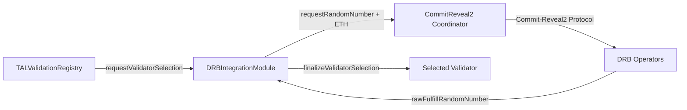
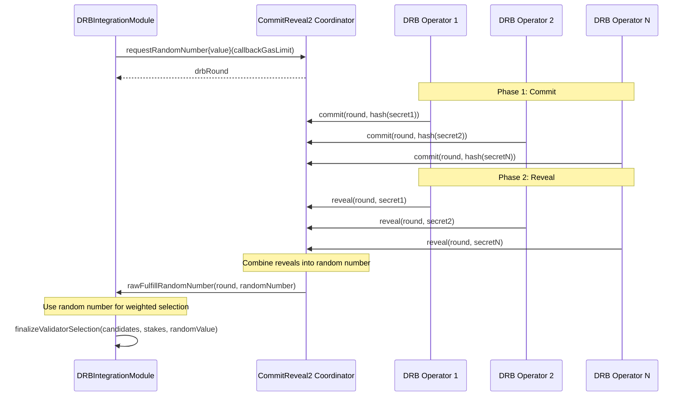
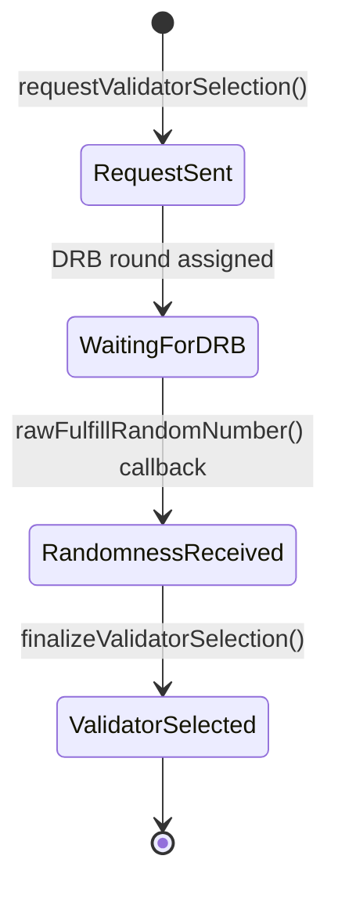

# DRB Integration

The `DRBIntegrationModule` wraps Tokamak's **DRB Commit-Reveal2** protocol to provide fair, verifiable random validator selection for the TAL validation system. It ensures no party can predict or manipulate which validator is assigned to verify an agent's output.

## Overview

DRB (Distributed Random Beacon) produces verifiable random numbers through a multi-operator commit-reveal protocol. TAL uses these random numbers to select validators from a stake-weighted candidate pool, ensuring that higher-staked operators have proportionally higher selection probability.



## Commit-Reveal2 Protocol

The Commit-Reveal2 protocol operates in two phases to generate verifiable randomness:



**Phase 1 -- Commit:** Each DRB operator submits a hash of their secret value. This locks in their contribution without revealing it.

**Phase 2 -- Reveal:** Operators reveal their secrets. The coordinator verifies each reveal matches the committed hash, then combines all reveals to produce the final random number.

## Validator Selection Algorithm

The selection uses a **cumulative sum approach** with stake-based weights:

1. Sum all candidate stakes to compute `totalWeight`
2. Calculate `threshold = randomValue % totalWeight`
3. Iterate through candidates, accumulating weights
4. Select the first candidate whose cumulative weight exceeds the threshold

```solidity
// Simplified selection logic
uint256 threshold = randomValue % totalWeight;
uint256 cumulative = 0;

for (uint256 i = 0; i < candidates.length; i++) {
    cumulative += weights[i];
    if (threshold < cumulative) {
        return candidates[i];  // Selected!
    }
}
```

This gives each candidate a selection probability proportional to their stake:

| Candidate | Stake | Probability |
|-----------|-------|-------------|
| Operator A | 5,000 TON | 5,000 / 16,000 = 31.25% |
| Operator B | 10,000 TON | 10,000 / 16,000 = 62.50% |
| Operator C | 1,000 TON | 1,000 / 16,000 = 6.25% |

:::info Randomness Guarantees
The DRB protocol guarantees that no single operator can predict or bias the random output, as long as at least one operator is honest. The random number is derived from all participants' secrets, making it infeasible to manipulate without controlling all DRB operators.
:::

## Async Callback Flow

The selection process is **asynchronous** because DRB randomness generation requires multiple transactions across the commit and reveal phases:



1. `requestValidatorSelection()` -- Sends ETH fee to CommitReveal2 and gets a DRB round number
2. DRB operators run the commit-reveal protocol (off-chain coordination)
3. `rawFulfillRandomNumber()` -- Coordinator calls back with the random number
4. `finalizeValidatorSelection()` -- Uses the random number to select from the candidate list

## Function Reference

### Core Functions

| Function | Parameters | Returns | Description |
|----------|-----------|---------|-------------|
| `requestValidatorSelection` | `requestHash: bytes32, candidates: address[], stakes: uint256[]` | `uint256 drbRound` | Initiate DRB randomness request (payable, VALIDATOR_SELECTOR_ROLE) |
| `rawFulfillRandomNumber` | `round: uint256, randomNumber: uint256` | -- | DRB callback (coordinator only) |
| `finalizeValidatorSelection` | `requestHash: bytes32, candidates: address[], stakes: uint256[]` | `address selected` | Complete selection after randomness arrives (VALIDATOR_SELECTOR_ROLE) |
| `selectFromWeightedList` | `candidates: address[], weights: uint256[], randomValue: uint256` | `address selected` | Pure weighted selection (no state changes) |

### View Functions

| Function | Parameters | Returns | Description |
|----------|-----------|---------|-------------|
| `isRandomnessReceived` | `round: uint256` | `bool` | Check if a DRB round has delivered randomness |
| `getSelectedValidator` | `requestHash: bytes32` | `address` | Get the selected validator for a request |
| `estimateRequestFee` | `callbackGasLimit: uint32` | `uint256` | Estimate the ETH fee for a DRB request |
| `getDRBRound` | `requestHash: bytes32` | `uint256` | Get the DRB round number for a request |

### Admin Functions

| Function | Parameters | Description |
|----------|-----------|-------------|
| `setCoordinator` | `coordinator_: address` | Update CommitReveal2 coordinator address (DEFAULT_ADMIN_ROLE) |
| `setCallbackGasLimit` | `callbackGasLimit_: uint32` | Update callback gas limit (DEFAULT_ADMIN_ROLE) |

## Fee Estimation

Before requesting validator selection, estimate the required fee:

```typescript
import { createPublicClient, http, parseEther, defineChain } from 'viem';

const thanosSepolia = defineChain({
  id: 111551119090,
  name: 'Thanos Sepolia',
  nativeCurrency: { name: 'TON', symbol: 'TON', decimals: 18 },
  rpcUrls: { default: { http: ['https://rpc.thanos-sepolia.tokamak.network'] } },
});

const publicClient = createPublicClient({
  chain: thanosSepolia,
  transport: http('https://rpc.thanos-sepolia.tokamak.network'),
});

// Estimate the DRB request fee
const fee = await publicClient.readContract({
  address: DRB_MODULE_ADDRESS,
  abi: DRBIntegrationModuleABI,
  functionName: 'estimateRequestFee',
  args: [100_000], // callbackGasLimit
});

console.log(`Estimated fee: ${fee} wei`);
```

:::tip Excess Fee Refund
If you send more ETH than the estimated fee, the excess is automatically refunded to the caller. It is safe to slightly overpay to account for gas price fluctuations.
:::

## Configuration

| Parameter | Default | Description |
|-----------|---------|-------------|
| `callbackGasLimit` | 100,000 gas | Gas limit for the DRB callback transaction |
| `coordinator` | Set at initialization | CommitReveal2 coordinator contract address |

## Next Steps

- [Staking Bridge](./staking-bridge) -- How operator stakes back the validation system
- [Reputation & Validation](../sdk/reputation-and-validation) -- Request validations from the SDK
- [IPFS & Metadata](./ipfs-and-metadata) -- Store validation details on IPFS
