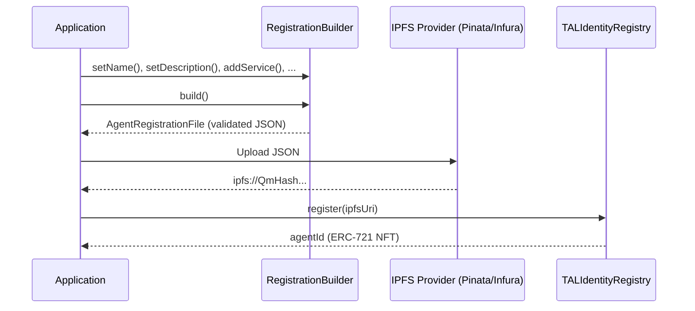

# IPFS & Metadata

TAL stores agent registration files and extended feedback data on IPFS, with only content hashes and URIs stored on-chain. This keeps gas costs low while maintaining verifiability through content addressing.

## Upload Flow



## ERC-8004 Metadata Schema

The registration file follows the [ERC-8004](https://eips.ethereum.org/EIPS/eip-8004) standard. Here is a complete example:

```json
{
  "type": "https://eips.ethereum.org/EIPS/eip-8004#registration-v1",
  "name": "Tokamak DeFi Optimizer",
  "description": "AI agent that optimizes DeFi yield strategies across Tokamak L2 protocols",
  "image": "https://example.com/agent-avatar.png",
  "active": true,
  "services": {
    "A2A": "https://agent.example.com/.well-known/agent.json",
    "MCP": "https://agent.example.com/mcp/v1",
    "OASF": "https://agent.example.com/openapi.yaml",
    "ENS": "defi-optimizer.eth",
    "DID": "did:ethr:0x1234567890abcdef1234567890abcdef12345678",
    "web": "https://agent.example.com"
  },
  "supportedTrust": ["reputation", "crypto-economic", "tee-attestation"],
  "x402Support": true,
  "registrations": [
    {
      "agentId": "1",
      "agentRegistry": "0x3f89CD27fD877827E7665A9883b3c0180E22A525",
      "chainId": 111551119090
    }
  ],
  "tal": {
    "capabilities": [
      {
        "id": "yield-optimization",
        "name": "Yield Optimization",
        "description": "Finds optimal yield farming strategies for a given token",
        "inputSchema": {
          "type": "object",
          "properties": {
            "token": { "type": "string" },
            "amount": { "type": "string" },
            "riskTolerance": { "type": "string", "enum": ["low", "medium", "high"] }
          },
          "required": ["token", "amount"]
        },
        "outputSchema": {
          "type": "object",
          "properties": {
            "strategy": { "type": "string" },
            "estimatedApy": { "type": "number" },
            "protocol": { "type": "string" }
          }
        }
      }
    ],
    "operator": {
      "address": "0xAbCdEf1234567890AbCdEf1234567890AbCdEf12",
      "organization": "Tokamak Labs",
      "website": "https://tokamak.network"
    },
    "teeConfig": {
      "provider": "nitro",
      "enclaveHash": "0xabc123def456...",
      "attestationEndpoint": "https://agent.example.com/attestation"
    },
    "pricing": {
      "currency": "TON",
      "perRequest": "0.1",
      "perToken": "0.001",
      "subscription": {
        "monthly": "50",
        "yearly": "500"
      }
    }
  }
}
```

### Required Fields

| Field | Type | Description |
|-------|------|-------------|
| `type` | `string` | Must be `https://eips.ethereum.org/EIPS/eip-8004#registration-v1` |
| `name` | `string` | Agent display name |
| `description` | `string` | Agent description |
| `active` | `boolean` | Whether the agent is active |

### Optional Fields

| Field | Type | Description |
|-------|------|-------------|
| `image` | `string` | Avatar or logo URL |
| `services` | `object` | Service endpoint map (A2A, MCP, OASF, ENS, DID, web, email) |
| `supportedTrust` | `string[]` | Trust models: `reputation`, `crypto-economic`, `tee-attestation` |
| `x402Support` | `boolean` | Whether the agent supports x402 payments |
| `registrations` | `array` | Cross-registry registrations |
| `tal` | `object` | TAL-specific metadata (capabilities, operator, TEE config, pricing) |

## Uploading to IPFS

### Using the RegistrationBuilder

The SDK's `RegistrationBuilder` includes built-in IPFS upload support for Pinata and Infura:

```typescript
import { TALClient } from '@tokamak/tal-sdk';

const tal = new TALClient({
  rpcUrl: 'https://rpc.thanos-sepolia.tokamak.network',
  walletClient,
});

const builder = tal.createRegistrationBuilder();

builder
  .setName('My AI Agent')
  .setDescription('An agent that processes documents')
  .addService('A2A', 'https://agent.example.com/a2a')
  .setSupportedTrust(['reputation']);

// Upload to Pinata
const ipfsUri = await builder.uploadToIPFS({
  pinataApiKey: 'your-api-key',
  pinataSecretKey: 'your-secret-key',
});

console.log(ipfsUri); // ipfs://QmXyz...

// Or upload to Infura
const ipfsUri2 = await builder.uploadToIPFS({
  infuraProjectId: 'your-project-id',
  infuraProjectSecret: 'your-project-secret',
});
```

### Using the Frontend API Route

The TAL frontend provides a server-side IPFS upload endpoint at `/api/ipfs`:

```typescript
const registrationData = {
  type: 'https://eips.ethereum.org/EIPS/eip-8004#registration-v1',
  name: 'My AI Agent',
  description: 'An agent that processes documents',
  active: true,
  services: {
    A2A: 'https://agent.example.com/a2a',
  },
};

const response = await fetch('/api/ipfs', {
  method: 'POST',
  headers: { 'Content-Type': 'application/json' },
  body: JSON.stringify(registrationData),
});

const { ipfsUri, cid } = await response.json();
console.log(ipfsUri); // ipfs://QmXyz...
console.log(cid);     // QmXyz...
```

The API route validates the payload (requires a non-empty `name` field), enforces a 1MB size limit, and uses server-side Pinata credentials configured via `PINATA_API_KEY` and `PINATA_SECRET_KEY` environment variables.

### Direct Pinata Upload

```typescript
async function uploadToPinata(
  content: object,
  apiKey: string,
  secretKey: string,
): Promise<string> {
  const response = await fetch(
    'https://api.pinata.cloud/pinning/pinJSONToIPFS',
    {
      method: 'POST',
      headers: {
        'Content-Type': 'application/json',
        pinata_api_key: apiKey,
        pinata_secret_api_key: secretKey,
      },
      body: JSON.stringify({
        pinataContent: content,
        pinataMetadata: { name: 'TAL Agent Registration' },
      }),
    },
  );

  if (!response.ok) {
    throw new Error(`Pinata upload failed: ${response.statusText}`);
  }

  const data = await response.json();
  return `ipfs://${data.IpfsHash}`;
}
```

## Multi-Gateway Fetching

IPFS content is fetched through gateways. Since individual gateways can be unreliable, use a fallback pattern:

```typescript
const IPFS_GATEWAYS = [
  'https://gateway.pinata.cloud/ipfs/',
  'https://ipfs.io/ipfs/',
  'https://cloudflare-ipfs.com/ipfs/',
  'https://dweb.link/ipfs/',
];

async function fetchFromIPFS(ipfsUri: string): Promise<any> {
  // Extract CID from ipfs:// URI
  const cid = ipfsUri.replace('ipfs://', '');

  for (const gateway of IPFS_GATEWAYS) {
    try {
      const response = await fetch(`${gateway}${cid}`, {
        signal: AbortSignal.timeout(10_000), // 10s timeout per gateway
      });

      if (response.ok) {
        return await response.json();
      }
    } catch {
      // Try next gateway
      continue;
    }
  }

  throw new Error(`Failed to fetch ${ipfsUri} from all gateways`);
}

// Usage
const registration = await fetchFromIPFS('ipfs://QmXyz...');
console.log(registration.name);
```

### SDK Gateway Configuration

The `TALClient` uses a configurable IPFS gateway for fetching registration files:

```typescript
const tal = new TALClient({
  rpcUrl: 'https://rpc.thanos-sepolia.tokamak.network',
  ipfsGateway: 'https://gateway.pinata.cloud/ipfs/', // Custom gateway
});

// getAgent() automatically fetches and parses the registration file
const agent = await tal.getAgent(1n);
console.log(agent.registration?.name); // Parsed from IPFS
```

The default gateway is `https://ipfs.io/ipfs/`. Override it with `ipfsGateway` in the client config if you have a preferred or private gateway.

:::warning IPFS Pinning and Persistence
IPFS does **not guarantee persistence**. If no node is pinning your content, it will eventually be garbage collected and become unavailable. Always ensure your registration files are pinned with a reliable pinning service (Pinata, Infura, Filebase, etc.) or run your own IPFS node with pinning enabled.

For production deployments, consider using multiple pinning services for redundancy.
:::

## Extended Feedback Data

Detailed feedback data is also stored on IPFS, linked from on-chain feedback entries via the `feedbackURI` field:

```typescript
import type { ExtendedFeedbackData } from '@tokamak/tal-sdk';

const feedbackData: ExtendedFeedbackData = {
  version: '1.0',
  onChainRef: {
    agentId: '1',
    feedbackIndex: 0,
    txHash: '0xabc123...',
  },
  details: {
    taskDescription: 'Summarize quarterly financial report',
    inputSummary: '45-page PDF financial report for Q3 2025',
    outputSummary: '2-page executive summary with key metrics',
    ratings: {
      accuracy: 92,
      speed: 88,
      reliability: 95,
      costEfficiency: 80,
    },
    review: 'Excellent summarization quality with accurate metric extraction.',
    attachments: [
      {
        type: 'document',
        uri: 'ipfs://QmOutputDocument...',
        description: 'Generated summary document',
      },
    ],
  },
  timestamp: Math.floor(Date.now() / 1000),
};

// Upload to IPFS
const feedbackUri = await uploadToPinata(
  feedbackData,
  process.env.PINATA_API_KEY!,
  process.env.PINATA_SECRET_KEY!,
);

// Submit feedback with the URI
await tal.submitFeedback(1n, {
  value: 9200,
  valueDecimals: 2,
  tag1: 'accuracy',
  tag2: 'reliability',
  feedbackURI: feedbackUri,
});
```

## Next Steps

- [Identity Client](../sdk/identity-client) -- Full registration workflow with the builder pattern
- [Reputation & Validation](../sdk/reputation-and-validation) -- Submit feedback with IPFS-linked details
- [Types Reference](../sdk/types-reference) -- `AgentRegistrationFile` and `ExtendedFeedbackData` type definitions
