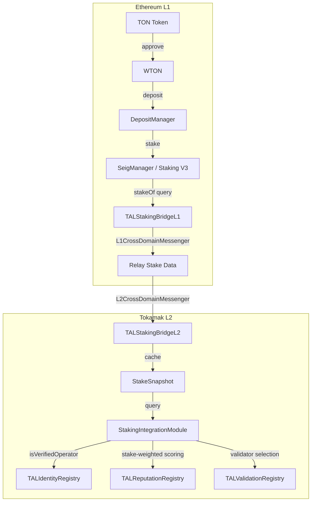
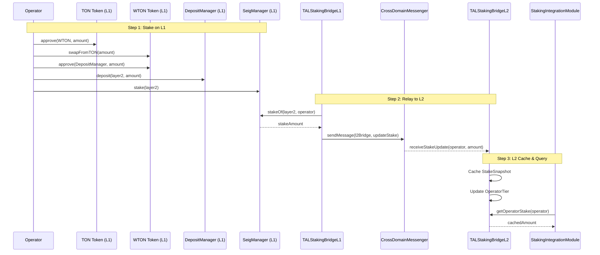

# Staking Bridge

The TAL Staking Bridge provides **cross-layer economic security** by bridging TON Staking V3 data from Ethereum L1 to Tokamak L2. Operator stakes on L1 back the validation and slashing mechanisms on L2, creating a trustless economic security layer.

## Architecture Overview



## Staking Flow

The full staking flow involves multiple steps across L1 and L2:



## L1 Bridge: TALStakingBridgeL1

The L1 bridge contract queries the SeigManager for operator stake amounts and relays them to L2.

### Key Functions

| Function | Parameters | Description |
|----------|-----------|-------------|
| `queryAndRelayStake` | `operator: address` | Query a single operator's stake and relay to L2 |
| `batchQueryStakes` | `operators: address[]` | Batch query and relay for multiple operators |
| `refreshAllOperators` | -- | Refresh all registered TAL operators (KEEPER_ROLE) |
| `registerOperator` | `operator: address` | Register an operator for batch refresh |
| `removeOperator` | `operator: address` | Remove an operator from the registry |

### Roles

| Role | Purpose |
|------|---------|
| `DEFAULT_ADMIN_ROLE` | Full contract administration |
| `UPGRADER_ROLE` | Authorize UUPS upgrades |
| `PAUSER_ROLE` | Emergency pause/unpause |
| `KEEPER_ROLE` | Execute `refreshAllOperators` batch updates |

:::info Batch Size Limit
The `batchQueryStakes` and `refreshAllOperators` functions enforce a maximum batch size of **100 operators** per call to prevent gas limit issues.
:::

## L2 Bridge: TALStakingBridgeL2

The L2 bridge caches stake snapshots received from L1 and exposes them for TAL registry contracts.

### Operator Tiers

Operators are classified into tiers based on their cached stake amount:

| Tier | Minimum Stake | Description |
|------|--------------|-------------|
| `UNVERIFIED` | 0 TON | No stake or below minimum |
| `VERIFIED` | 1,000 TON | Meets minimum operator stake |
| `PREMIUM` | 10,000 TON | Premium tier with higher trust |

### StakeSnapshot Structure

Each operator's cached data includes:

```solidity
struct StakeSnapshot {
    uint256 amount;             // Cached stake amount
    uint256 lastUpdatedL1Block; // L1 block when stake was queried
    uint256 timestamp;          // L2 timestamp when cache was updated
}
```

### Cache Freshness

The L2 bridge enforces a default maximum cache age of **4 hours**. Registries can check the `timestamp` field to determine if the cached data is fresh enough for their use case.

## StakingIntegrationModule

The `StakingIntegrationModule` wraps the L2 bridge for use by TAL registries, adding TAL-specific logic for slashing and seigniorage routing.

### Key Functions

| Function | Parameters | Returns | Description |
|----------|-----------|---------|-------------|
| `getStake` | `operator: address` | `uint256` | Get operator's cached stake |
| `isVerifiedOperator` | `operator: address` | `bool` | Check if operator meets minimum stake |
| `getOperatorStatus` | `operator: address` | `(uint256, bool, uint256, uint256)` | Full status: stake, verified, slash count, last slash time |

### Slashing Conditions

The module tracks slashing conditions per agent and slash history per operator:

| Condition | Slash Percentage |
|-----------|-----------------|
| Failed TEE Attestation | 50% |
| Proven Fraud | 100% |
| Repeated Low Reputation | 25% |

```solidity
struct OperatorSlashRecord {
    uint256 totalSlashed;    // Total amount slashed
    uint256 slashCount;      // Number of slashes
    uint256 lastSlashTime;   // Timestamp of last slash
}
```

## Frontend Integration

Here is how to check operator stake status from a frontend application:

```typescript
import { createPublicClient, http, defineChain } from 'viem';
import { StakingIntegrationModuleABI } from '@tokamak/tal-sdk';

const thanosSepolia = defineChain({
  id: 111551119090,
  name: 'Thanos Sepolia',
  nativeCurrency: { name: 'TON', symbol: 'TON', decimals: 18 },
  rpcUrls: { default: { http: ['https://rpc.thanos-sepolia.tokamak.network'] } },
});

const publicClient = createPublicClient({
  chain: thanosSepolia,
  transport: http('https://rpc.thanos-sepolia.tokamak.network'),
});

const STAKING_MODULE = '0xDc9d9A78676C600E7Ca55a8D0c63da9462Acfe30';

// Check if operator is verified
const isVerified = await publicClient.readContract({
  address: STAKING_MODULE,
  abi: StakingIntegrationModuleABI,
  functionName: 'isVerifiedOperator',
  args: ['0xOperatorAddress'],
});

// Get full operator status
const [stake, verified, slashCount, lastSlash] = await publicClient.readContract({
  address: STAKING_MODULE,
  abi: StakingIntegrationModuleABI,
  functionName: 'getOperatorStatus',
  args: ['0xOperatorAddress'],
});

console.log(`Stake: ${stake} wei`);
console.log(`Verified: ${verified}`);
console.log(`Slash count: ${slashCount}`);
```

:::warning Stale Cache Data
L2 stake data is a **cached snapshot** of L1 state. There is an inherent delay between L1 staking actions and L2 cache updates. Always check the `lastUpdatedL1Block` field if freshness is critical for your use case.
:::

## Next Steps

- [DRB Integration](./drb-integration) -- How randomness is used for validator selection
- [SDK Overview](../sdk/overview) -- Use the TypeScript SDK to query staking data
- [Reputation & Validation](../sdk/reputation-and-validation) -- How stake-weighted reputation works
