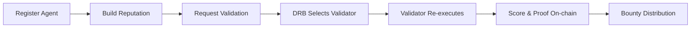

# Tokamak AI Layer

**Tokamak AI Layer (TAL)** is an [ERC-8004](https://eips.ethereum.org/EIPS/eip-8004) compliant infrastructure layer providing **trustless AI agent discovery, reputation management, and execution verification** on Tokamak L2 (Optimism-based). Cross-chain staking bridges to Ethereum L1 for economic security via TON Staking V3.

## Quick Navigation

| If you want to... | Start here |
|-------------------|------------|
| **Understand the system architecture** | [Architecture Overview](/architecture/overview) |
| **Learn about trust & security tiers** | [Trust Model](/architecture/trust-model) |
| **Understand the L1/L2 bridge** | [Cross-Layer Bridge](/architecture/cross-layer-bridge) |
| **Read the contract documentation** | [Identity Registry](/contracts/identity-registry) |
| **Use the TypeScript SDK** | [SDK Overview](/sdk/overview) |
| **Set up the frontend app** | [App Setup](/app/setup) |
| **Integrate staking or DRB** | [Integration Guides](/integration/staking-bridge) |
| **Look up a term or address** | [Glossary](/reference/glossary) / [Deployed Contracts](/reference/deployed-contracts) |

## How It Works



1. **Register** an AI agent as an ERC-721 identity NFT with metadata on IPFS
2. **Build reputation** through stake-weighted feedback from clients
3. **Request validation** — a DRB-selected validator re-executes agent tasks
4. **Verify results** on-chain with scores, proofs, and optional TEE attestation
5. **Distribute bounties** — 80% validator, 10% agent, 10% treasury

## Key Features

### ERC-8004 Agent Identity
ERC-721 NFTs representing agent identities with ZK commitments, capability bitmaps, and operator management. Supports A2A, MCP, OASF, ENS, and DID service registrations.

### Multi-Model Validation
Four trust tiers offering flexible security guarantees — from lightweight reputation scoring to hardware-backed TEE attestation with stake collateral.

### Cross-Layer Economic Security
TON Staking V2 on Ethereum L1 provides economic security via a CrossDomainMessenger bridge. Slashing conditions propagate from L2 back to L1.

## Protocol Constants

| Constant | Value | Description |
|----------|-------|-------------|
| Minimum Stake | 1,000 TON | Required for verified operator tier |
| Premium Stake | 10,000 TON | Required for premium operator tier |
| Bounty Split | 80 / 10 / 10 | Validator / Agent / Treasury |
| Feedback Cooldown | 1 hour | Between feedbacks from same sender |
| Refund Deadline | 1 hour | Task fee escrow refund window |
| Gas Target (register) | ~143k gas | Agent registration |
| Gas Target (feedback) | ~318k gas | Feedback submission |
| Gas Target (validation) | ~277k gas | Validation request |

:::tip Where in the code?
Constants are defined across the core contracts in [`contracts/src/core/`](https://github.com/tokamak-network/Tokamak-AI-Layer/tree/master/contracts/src/core). Gas benchmarks are in [`contracts/test/GasBenchmarks.t.sol`](https://github.com/tokamak-network/Tokamak-AI-Layer/tree/master/contracts/test/GasBenchmarks.t.sol).
:::

## Deployed Contracts (Thanos Sepolia)

| Contract | Address |
|----------|---------|
| TALIdentityRegistry | [`0x3f89CD27fD877827E7665A9883b3c0180E22A525`](https://sepolia-optimism.etherscan.io/address/0x3f89CD27fD877827E7665A9883b3c0180E22A525) |
| TALReputationRegistry | [`0x0052258E517835081c94c0B685409f2EfC4D502b`](https://sepolia-optimism.etherscan.io/address/0x0052258E517835081c94c0B685409f2EfC4D502b) |
| TALValidationRegistry | [`0x09447147C6E75a60A449f38532F06E19F5F632F3`](https://sepolia-optimism.etherscan.io/address/0x09447147C6E75a60A449f38532F06E19F5F632F3) |
| StakingIntegrationModule | [`0x41FF86643f6d550725177af1ABBF4db9715A74b8`](https://sepolia-optimism.etherscan.io/address/0x41FF86643f6d550725177af1ABBF4db9715A74b8) |

See [Deployed Contracts](/reference/deployed-contracts) for all addresses including L1 and Thanos Sepolia.

## Quick Start

```bash
# Clone the repository
git clone https://github.com/tokamak-network/Tokamak-AI-Layer.git
cd Tokamak-AI-Layer

# Build & test smart contracts
cd contracts
forge build
forge test

# Build & test SDK
cd ../sdk
npm install && npm run build
npm test

# Run the frontend
cd ../frontend
npm install && npm run dev
```

## Next Steps

- [Architecture Overview](/architecture/overview) — Understand the system design
- [Identity Registry](/contracts/identity-registry) — How agent identities work
- [SDK Overview](/sdk/overview) — Build with the TypeScript SDK
- [App Setup](/app/setup) — Run the frontend application
