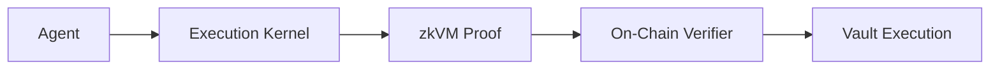

# Execution Kernel

The Execution Kernel is a **consensus-critical, deterministic agent execution framework** for RISC Zero zkVM. It enables verifiable DeFi ML agents that make capital allocation decisions with cryptographic proof of correct execution.

## Quick Navigation

| If you want to... | Start here |
|-------------------|------------|
| **Build an agent in 5 minutes** | [Quickstart](/quickstart) |
| **Understand how it works** | [Architecture Overview](/architecture/overview) |
| **Write a full agent** | [Writing an Agent](/sdk/writing-an-agent) |
| **Set up your dev environment** | [Prerequisites](/getting-started/prerequisites) |
| **Deploy an agent on-chain** | [Deployment Guide](/sdk/deploy-guide) |
| **Monitor a deployed agent** | [Monitoring](/sdk/monitoring) |
| **Integrate with smart contracts** | [On-Chain Verification](/onchain/verifier-overview) |
| **Understand the binary formats** | [Input Format](/kernel/input-format) |
| **Package an agent for deployment** | [Agent Pack Format](/agent-pack/format) |
| **Audit or review the codebase** | [Repository Map](/reference/repo-map) |

## What is the Execution Kernel?

The Execution Kernel defines what constitutes a **valid agent execution** through zero-knowledge proofs. Capital is held in on-chain vaults that delegate decision-making to agents—programs that analyze market conditions and produce actions like deposits, withdrawals, or trades.


```mermaid
flowchart LR
    A[Agent] --> B[Execution Kernel]
    B --> C[zkVM Proof]
    C --> D[On-Chain Verifier]
    D --> E[Vault Execution]
```

The kernel acts as a **verifiable sandbox**: an agent runs inside the kernel, which runs inside a zkVM. The zkVM produces a proof that:

- The agent executed correctly according to its own code
- The kernel enforced all protocol constraints
- The resulting actions are exactly what the agent decided

## Key Features

### Cryptographic Commitments

Every execution produces a journal containing:

- **Input commitment**: SHA-256 hash of all inputs
- **Action commitment**: SHA-256 hash of all outputs
- **Execution status**: Success or Failure

### Constraint Enforcement

The constraint engine validates agent outputs against safety rules:
- Position size limits
- Leverage bounds
- Asset whitelists
- Cooldown periods

## Quick Start

```bash
# Install the tal CLI (no repo clone needed)
curl -sSL https://raw.githubusercontent.com/tokamak-network/Tokamak-AI-Layer/master/install-tal.sh | sh

# Or via crates.io (requires Rust)
cargo install tal-cli

# Validate your environment
tal doctor

# Scaffold a new agent
tal init my-agent --template yield

# Test locally (instant — no zkVM needed)
tal test --local

# Build with zkVM ELF
tal build --elf

# Deploy to testnet
tal deploy --testnet

# Monitor your vault
tal monitor --vault <ADDRESS> --chain 998
```

## Protocol Constants

| Constant | Value | Description |
|----------|-------|-------------|
| `PROTOCOL_VERSION` | 1 | Wire format version |
| `KERNEL_VERSION` | 1 | Kernel semantics version |
| `MAX_AGENT_INPUT_BYTES` | 64,000 | Maximum input size |
| `MAX_AGENT_OUTPUT_BYTES` | 64,000 | Maximum output size |
| `MAX_ACTIONS_PER_OUTPUT` | 64 | Maximum actions per execution |
| `MAX_ACTION_PAYLOAD_BYTES` | 16,384 | Maximum payload per action |
| `HASH_FUNCTION` | SHA-256 | Commitment hash function |

:::tip Where in the code?
These constants are defined in [`kernel-core/src/lib.rs`](https://github.com/tokamak-network/Tokamak-AI-Layer/blob/master/crates/protocol/kernel-core/src/lib.rs) and [`kernel-core/src/types.rs`](https://github.com/tokamak-network/Tokamak-AI-Layer/blob/master/crates/protocol/kernel-core/src/types.rs).
:::

## On-Chain Deployments

### Ethereum Mainnet

| Contract | Address |
|----------|---------|
| AgentRegistry | [`0x2BF56f889Ab5E535C3194bB2B356f10D6fa2FBEc`](https://etherscan.io/address/0x2BF56f889Ab5E535C3194bB2B356f10D6fa2FBEc) |
| VaultFactory | [`0x47E6EfFf516E8b899092ebEEF92fddCE579e9d39`](https://etherscan.io/address/0x47E6EfFf516E8b899092ebEEF92fddCE579e9d39) |
| KernelExecutionVerifier | [`0x5c0F88e27FADAb50EA82572950a616b4Cf4fd8B3`](https://etherscan.io/address/0x5c0F88e27FADAb50EA82572950a616b4Cf4fd8B3) |
| RISC Zero Verifier Router | [`0x8EaB2D97Dfce405A1692a21b3ff3A172d593D319`](https://etherscan.io/address/0x8EaB2D97Dfce405A1692a21b3ff3A172d593D319) |

### HyperEVM Mainnet (Chain ID: 999)

| Contract | Address |
|----------|---------|
| AgentRegistry | `0x47E6EfFf516E8b899092ebEEF92fddCE579e9d39` |
| VaultFactory | `0xd27A7470a34903b7e215EA8d07d9cd2d21238F83` |
| KernelExecutionVerifier | `0xD1478689f829c4B4F882eB8Ef7914C7874ddC707` |
| RISC Zero Verifier Router | `0x9f8d4D1f7AAf06aab1640abd565A731399862Bc8` |

See [Hyperliquid Integration](/onchain/hyperliquid-integration) for details on the HyperEVM adapter contracts.

### Arbitrum One (Chain ID: 42161)

| Contract | Address |
|----------|---------|
| AgentRegistry | [`0xa6b363872aC1AA91Bc6a270958A06230c10aa473`](https://arbiscan.io/address/0xa6b363872aC1AA91Bc6a270958A06230c10aa473) |
| VaultFactory | [`0x7b0E7eDf494acF2E90fBc9Fc97b8C412606B0611`](https://arbiscan.io/address/0x7b0E7eDf494acF2E90fBc9Fc97b8C412606B0611) |
| KernelExecutionVerifier | [`0x936782d6bB65C75dFeC03228d1a5cb5d38C59318`](https://arbiscan.io/address/0x936782d6bB65C75dFeC03228d1a5cb5d38C59318) |

### Optimism (Chain ID: 10)

| Contract | Address |
|----------|---------|
| AgentRegistry | [`0xa6b363872aC1AA91Bc6a270958A06230c10aa473`](https://optimistic.etherscan.io/address/0xa6b363872aC1AA91Bc6a270958A06230c10aa473) |
| VaultFactory | [`0x7b0E7eDf494acF2E90fBc9Fc97b8C412606B0611`](https://optimistic.etherscan.io/address/0x7b0E7eDf494acF2E90fBc9Fc97b8C412606B0611) |
| KernelExecutionVerifier | [`0x936782d6bB65C75dFeC03228d1a5cb5d38C59318`](https://optimistic.etherscan.io/address/0x936782d6bB65C75dFeC03228d1a5cb5d38C59318) |

### HyperEVM Testnet (Chain ID: 998)

| Contract | Address |
|----------|---------|
| AgentRegistry | `0x09447147C6E75a60A449f38532F06E19F5F632F3` |
| VaultFactory | `0x4c36bCA87f21E16f5af8A6d7Df2D86a5aD13049F` |
| KernelExecutionVerifier | `0x0052258E517835081c94c0B685409f2EfC4D502b` |

### Ethereum Sepolia (Testnet)

| Contract | Address |
|----------|---------|
| AgentRegistry | [`0xED27f8fbB7D576f02D516d01593eEfBaAfe4b168`](https://sepolia.etherscan.io/address/0xED27f8fbB7D576f02D516d01593eEfBaAfe4b168) |
| VaultFactory | [`0x580e55fDE87fFC1cF1B6a446d6DBf8068EB07b8C`](https://sepolia.etherscan.io/address/0x580e55fDE87fFC1cF1B6a446d6DBf8068EB07b8C) |
| KernelExecutionVerifier | [`0x1eB41537037fB771CBA8Cd088C7c806936325eB5`](https://sepolia.etherscan.io/address/0x1eB41537037fB771CBA8Cd088C7c806936325eB5) |
| RISC Zero Verifier Router | [`0x925d8331ddc0a1F0d96E68CF073DFE1d92b69187`](https://sepolia.etherscan.io/address/0x925d8331ddc0a1F0d96E68CF073DFE1d92b69187) |

Each agent is identified by its **imageId** — a unique hash of the compiled zkVM guest binary that identifies exactly which code will run. The imageId is registered on-chain so that proofs can only be verified against known, auditable agent binaries.

The system is **fully permissionless**: anyone can register agents via `AgentRegistry` and deploy vaults via `VaultFactory`. See [Permissionless System](/onchain/permissionless-system) for details.

## Related

- [Quickstart](/quickstart) - Build an agent in 5 minutes
- [Architecture Overview](/architecture/overview) - Understand the system design
- [Prerequisites](/getting-started/prerequisites) - Set up your development environment
- [Writing an Agent](/sdk/writing-an-agent) - Full agent development guide
- [Deployment Guide](/sdk/deploy-guide) - Deploy agents on-chain with `tal deploy`
- [Monitoring](/sdk/monitoring) - Live dashboard for deployed agents
- [Cryptographic Chain](/architecture/cryptographic-chain) - How imageId and commitments work
