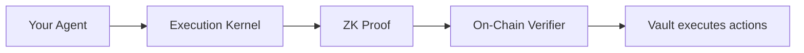

# Tokagent

Tokagent lets you build **verifiable DeFi agents** -- programs that manage on-chain capital with cryptographic proof that every decision was computed correctly. Agents run inside a zero-knowledge virtual machine, and their outputs are verified on-chain before any funds move.

## Why Tokagent?

- **Trustless capital management** -- Vaults delegate decisions to agents. Zero-knowledge proofs guarantee the agent ran exactly the code depositors approved.
- **Build in Rust, deploy on any EVM chain** -- Write agent logic in Rust, test locally in seconds, and deploy to Ethereum, Arbitrum, Optimism, or Hyperliquid.
- **Safety constraints built in** -- Position limits, leverage bounds, and cooldown periods are enforced inside the proof. They cannot be bypassed.

## Install

```bash
# Prebuilt binary (fastest -- no Rust required)
curl -sSL https://raw.githubusercontent.com/tokamak-network/Tokamak-AI-Layer/master/install-tal.sh | sh

# Or via crates.io (requires Rust)
cargo install tal-cli

# Check your setup
tal doctor
```

Then head to the [5-Minute Quickstart](/quickstart) to build and deploy your first agent.

## How it works


```mermaid
flowchart LR
    A[Your Agent] --> B[Execution Kernel]
    B --> C[ZK Proof]
    C --> D[On-Chain Verifier]
    D --> E[Vault executes actions]
```

Your agent runs inside the Execution Kernel, which runs inside a zkVM. The zkVM produces a proof that the agent executed correctly. The on-chain verifier checks the proof and, if valid, the vault executes the agent's actions (deposits, withdrawals, trades). For a deeper explanation, see [Architecture Overview](/architecture/overview).

## On-Chain Deployments

### Ethereum Mainnet

| Contract | Address |
|----------|---------|
| AgentRegistry | [`0x2BF56f889Ab5E535C3194bB2B356f10D6fa2FBEc`](https://etherscan.io/address/0x2BF56f889Ab5E535C3194bB2B356f10D6fa2FBEc) |
| VaultFactory | [`0x47E6EfFf516E8b899092ebEEF92fddCE579e9d39`](https://etherscan.io/address/0x47E6EfFf516E8b899092ebEEF92fddCE579e9d39) |
| KernelExecutionVerifier | [`0x5c0F88e27FADAb50EA82572950a616b4Cf4fd8B3`](https://etherscan.io/address/0x5c0F88e27FADAb50EA82572950a616b4Cf4fd8B3) |
| RISC Zero Verifier Router | [`0x8EaB2D97Dfce405A1692a21b3ff3A172d593D319`](https://etherscan.io/address/0x8EaB2D97Dfce405A1692a21b3ff3A172d593D319) |

### HyperEVM Mainnet (Chain ID: 999)

| Contract | Address |
|----------|---------|
| AgentRegistry | `0x47E6EfFf516E8b899092ebEEF92fddCE579e9d39` |
| VaultFactory | `0xd27A7470a34903b7e215EA8d07d9cd2d21238F83` |
| KernelExecutionVerifier | `0xD1478689f829c4B4F882eB8Ef7914C7874ddC707` |
| RISC Zero Verifier Router | `0x9f8d4D1f7AAf06aab1640abd565A731399862Bc8` |

### Arbitrum One (Chain ID: 42161)

| Contract | Address |
|----------|---------|
| AgentRegistry | [`0xa6b363872aC1AA91Bc6a270958A06230c10aa473`](https://arbiscan.io/address/0xa6b363872aC1AA91Bc6a270958A06230c10aa473) |
| VaultFactory | [`0x7b0E7eDf494acF2E90fBc9Fc97b8C412606B0611`](https://arbiscan.io/address/0x7b0E7eDf494acF2E90fBc9Fc97b8C412606B0611) |
| KernelExecutionVerifier | [`0x936782d6bB65C75dFeC03228d1a5cb5d38C59318`](https://arbiscan.io/address/0x936782d6bB65C75dFeC03228d1a5cb5d38C59318) |

### Optimism (Chain ID: 10)

| Contract | Address |
|----------|---------|
| AgentRegistry | [`0xa6b363872aC1AA91Bc6a270958A06230c10aa473`](https://optimistic.etherscan.io/address/0xa6b363872aC1AA91Bc6a270958A06230c10aa473) |
| VaultFactory | [`0x7b0E7eDf494acF2E90fBc9Fc97b8C412606B0611`](https://optimistic.etherscan.io/address/0x7b0E7eDf494acF2E90fBc9Fc97b8C412606B0611) |
| KernelExecutionVerifier | [`0x936782d6bB65C75dFeC03228d1a5cb5d38C59318`](https://optimistic.etherscan.io/address/0x936782d6bB65C75dFeC03228d1a5cb5d38C59318) |

### HyperEVM Testnet (Chain ID: 998)

| Contract | Address |
|----------|---------|
| AgentRegistry | `0x09447147C6E75a60A449f38532F06E19F5F632F3` |
| VaultFactory | `0x4c36bCA87f21E16f5af8A6d7Df2D86a5aD13049F` |
| KernelExecutionVerifier | `0x0052258E517835081c94c0B685409f2EfC4D502b` |

### Ethereum Sepolia (Testnet)

| Contract | Address |
|----------|---------|
| AgentRegistry | [`0xED27f8fbB7D576f02D516d01593eEfBaAfe4b168`](https://sepolia.etherscan.io/address/0xED27f8fbB7D576f02D516d01593eEfBaAfe4b168) |
| VaultFactory | [`0x580e55fDE87fFC1cF1B6a446d6DBf8068EB07b8C`](https://sepolia.etherscan.io/address/0x580e55fDE87fFC1cF1B6a446d6DBf8068EB07b8C) |
| KernelExecutionVerifier | [`0x1eB41537037fB771CBA8Cd088C7c806936325eB5`](https://sepolia.etherscan.io/address/0x1eB41537037fB771CBA8Cd088C7c806936325eB5) |
| RISC Zero Verifier Router | [`0x925d8331ddc0a1F0d96E68CF073DFE1d92b69187`](https://sepolia.etherscan.io/address/0x925d8331ddc0a1F0d96E68CF073DFE1d92b69187) |

## Next steps

- [5-Minute Quickstart](/quickstart) -- Build and deploy your first agent
- [Architecture Overview](/architecture/overview) -- Understand how the system works
- [Writing an Agent](/sdk/writing-an-agent) -- Full agent development guide
- [FAQ](/getting-started/faq) -- Common questions answered
