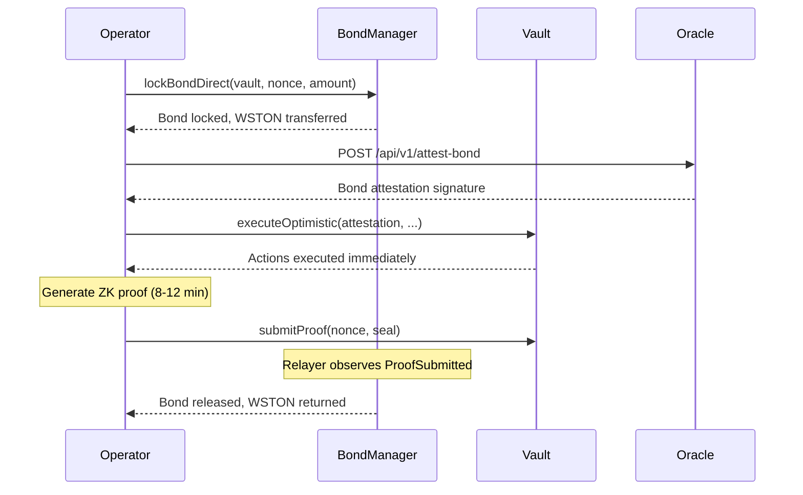

# WSTON Bond Manager

The `WSTONBondManager` manages WSTON (Wrapped Staked TON) bonds for optimistic execution operators. Operators stake WSTON as collateral for optimistic executions, and bonds are slashed if proofs are not submitted within the challenge window.

## Overview

Optimistic execution enables immediate action execution without waiting for ZK proof generation. To prevent abuse, operators must lock WSTON bonds that can be slashed if the proof is invalid or late.



## Bond Lifecycle

| Status | Description |
|--------|-------------|
| **Empty** | No bond exists for this operator-vault-nonce |
| **Locked** | WSTON transferred to BondManager, awaiting proof |
| **Released** | Proof submitted successfully, WSTON returned to operator |
| **Slashed** | Challenge window expired without proof, WSTON distributed |

## Slash Distribution

When a bond is slashed, the WSTON is distributed as follows:

| Recipient | Share | Description |
|-----------|-------|-------------|
| **Finder** | 10% | Address that triggered the slash (incentivizes monitoring) |
| **Depositors** | 80% | Sent to the vault contract (compensates affected depositors) |
| **Treasury** | 10% | Protocol treasury |

For self-slashes (operator triggers their own slash), the finder fee is zero and the depositor share increases to 90%.

## Batch Bond Locking

Operators running multiple concurrent executions can use `lockBondBatch` to lock bonds for several vaults/nonces in a single transaction, reducing L1 gas costs by approximately 80%.

```solidity
address[] memory vaults = new address[](3);
uint64[] memory nonces = new uint64[](3);
uint256[] memory amounts = new uint256[](3);

// Fill arrays...

bondManager.lockBondBatch(vaults, nonces, amounts);
```

## Bond Expiry Safety Valve

If a bond remains locked for more than 30 days (e.g., due to relayer failure or vault revocation), the operator can reclaim it:

```solidity
bondManager.reclaimExpiredBond(vault, nonce);
```

This prevents permanent fund lockup from any access control or relay failure.

## Querying Bond Information

```solidity
// Get detailed bond info
(uint256 amount, uint256 lockedAt, uint8 status) = bondManager.getBondInfo(operator, vault, nonce);

// Get operator's active bond count for a vault
(uint256 activeCount, uint256 totalLocked) = bondManager.getOperatorBondCount(operator, vault, 0, 100);

// Get operator's total bonded amount across all vaults
uint256 total = bondManager.totalBonded(operator);
```

## Deployed Contracts

| Contract | Chain | Address |
|----------|-------|---------|
| WSTONBondManager (v2) | Ethereum (1) | `0x46a92cDC8530fd1C4D46891625a718458856Bc14` |
| WSTON Proxy | Ethereum (1) | `0x26C8F112769fb3A3A8de267CfFf60E9f317445e5` |

## Security Considerations

- Bond slashing does **not** distinguish between fraud and network delays — late proofs are slashed regardless of cause
- Cross-chain slashes (HyperEVM → Ethereum) send 100% to treasury, which redistributes off-chain
- The trusted relayer is a single point of failure for bond release/slash — if down, operators must wait for the 30-day expiry to reclaim
- Operators should maintain sufficient WSTON balance for concurrent executions (`maxPending` × `minBond`)
