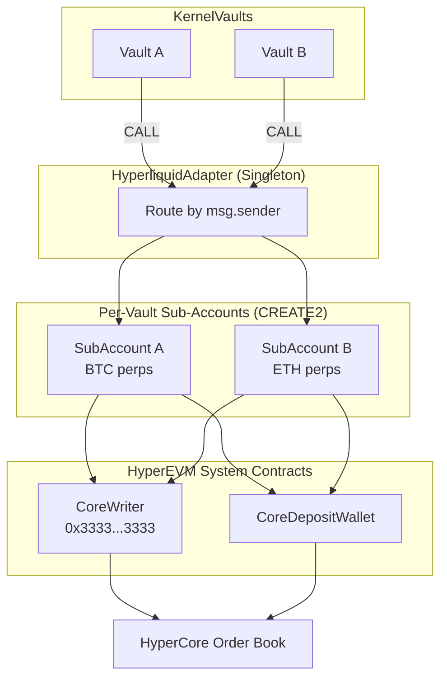

# Hyperliquid Integration

Trade perpetual futures on Hyperliquid with zkVM-verified agents. The `HyperliquidAdapter` routes vault actions to Hyperliquid's HyperCore order book through per-vault sub-accounts.

## Quick Start with `tal`

```bash
# Deploy a Hyperliquid perp agent (registers vault + adapter in one step)
tal deploy --hyperliquid \
  --agent-id $AGENT_ID \
  --asset USDC \
  --perp-asset 0 \
  --chain hyperevm
```

For manual setup or advanced configuration, see the detailed steps below.

## How It Works

Hyperliquid has two layers:
- **HyperCore** -- The off-chain order book (REST API at `api.hyperliquid.xyz`)
- **HyperEVM** -- An EVM execution layer (Chain ID **999**)

The adapter bridges them: your vault makes EVM CALL actions, and the adapter routes those to HyperCore via system contracts. Each vault gets its own `TradingSubAccount` (deployed via CREATE2) for **position isolation**.



## Deployed Contracts (HyperEVM Mainnet)

| Contract | Address |
|----------|---------|
| HyperliquidAdapter | `0x0Cb59d461a366d2377ebc7eD7E50F960bEa67dc9` |
| USDC (HyperEVM) | `0xb88339CB7199b77E23DB6E890353E22632Ba630f` |
| CoreWriter (System) | `0x3333333333333333333333333333333333333333` |
| Perp Position Precompile | `0x0000000000000000000000000000000000000800` |

## Trading Functions

| Function | Description |
|----------|-------------|
| `openPosition(isBuy, marginAmount, orderSize, limitPrice)` | Open a perp position. Pulls USDC, deposits to HyperCore, places GTC limit order. |
| `closePositionAtPrice(px)` | Close full position at agent-computed price within oracle band. **Recommended for agents.** |
| `closePosition()` | Close at extreme prices. Admin use only -- HyperCore silently rejects out-of-band orders. |
| `withdrawToVault()` | Withdraw all USDC from sub-account back to vault. Call after settlement. |
| `depositMargin(amount)` | Seed sub-account with USDC margin without placing an order. |

:::warning
Order execution is **asynchronous**. `CoreWriter.sendRawAction()` does not revert on HyperCore-level failures -- an order may be rejected after the EVM transaction finalizes.
:::

## Manual Setup Flow

### 1. Register Vault with Adapter

```bash
cast send $ADAPTER \
    "registerVault(address,uint32)" \
    $VAULT_ADDRESS 0 \
    --rpc-url https://rpc.hyperliquid.xyz/evm \
    --private-key $PRIVATE_KEY \
    --legacy
```

### 2. Fund Sub-Account with HYPE

CoreWriter actions require HYPE for gas. Without it, actions are **silently rejected**.

```bash
cast send $ADAPTER \
    "fundSubAccountHype(address)" $VAULT_ADDRESS \
    --value 10000000000000000 \
    --rpc-url https://rpc.hyperliquid.xyz/evm \
    --private-key $PRIVATE_KEY \
    --legacy
```

:::tip
The perp-trader host auto-funds HYPE via `--min-hype` and `--hype-topup` flags.
:::

### 3. Run the Agent

```bash
cargo run -p perp-trader-host --features full -- \
    --vault $VAULT_ADDRESS \
    --rpc https://rpc.hyperliquid.xyz/evm \
    --pk env:PRIVATE_KEY \
    --oracle-key env:ORACLE_KEY \
    --bundle ./crates/agents/perp-trader/bundle \
    --hl-url https://api.hyperliquid.xyz \
    --sub-account $SUB_ACCOUNT \
    --adapter-address $ADAPTER \
    --usdc-address $USDC \
    --min-hype 5000000000000000 \
    --hype-topup 10000000000000000
```

### 4. Close and Recover Funds

After the agent closes a position, HyperCore settles asynchronously (a few seconds). Then recover funds:

```bash
# 1. Move USDC from perp margin to spot
cast send $ADAPTER "depositSubBalanceAdmin(address,uint256)" $VAULT 18000000 \
    --rpc-url ... --private-key ... --legacy

# 2. HyperCore spot-to-EVM transfer (handled internally)

# 3. Withdraw USDC from sub-account to vault
cast send $ADAPTER "withdrawToVaultAdmin(address)" $VAULT \
    --rpc-url ... --private-key ... --legacy
```

:::warning
Do not bundle `withdrawToVault()` with the close action. Settlement is async -- USDC is not available in the same transaction.
:::

## Key Gotchas

- **Seed trade bootstrapping** -- When no position exists, `leverage=0` from the precompile causes orders to be silently dropped. The host auto-detects this and places the first trade via REST API. Configure with `--api-wallet-key` and `--seed-leverage`.
- **HyperEVM gas** -- No EIP-1559 support. Always use `--legacy` with forge/cast. Block gas limit is 3M.
- **USDC bridging** -- Bridge native USDC from Arbitrum One to Hyperliquid via `0x2df1c51e09aecf9cacb7bc98cb1742757f163df7` (min 5 USDC, ~1 minute).

## Security

- Only the vault owner can call `registerVault()`
- Only registered vaults can call trading functions
- Only the adapter can call `TradingSubAccount` execution functions
- All state-changing functions use `ReentrancyGuard`

## Related

- [Verifier Overview](/onchain/verifier-overview) -- Contract addresses
- [Permissionless System](/onchain/permissionless-system) -- Agent registration and vault deployment
- [Security Considerations](/onchain/security-considerations) -- Trust model and attack vectors
