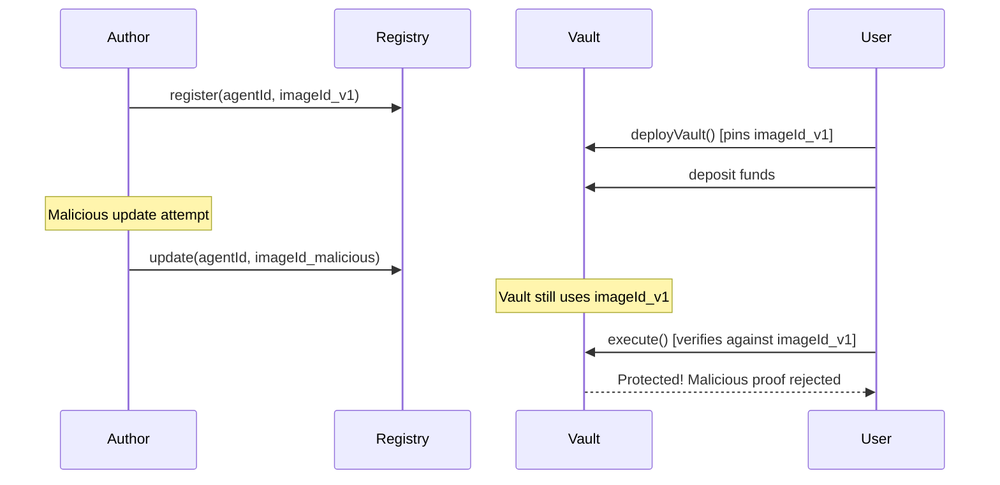

# Permissionless Agent Lifecycle

Anyone can register an agent, deploy a vault, and run it -- no approval needed. This page walks through the full agent lifecycle using `tal` CLI commands.

## Overview

Two contracts power the permissionless system:

- **AgentRegistry** -- stores agent identity (imageId, code hash, metadata). Anyone can register.
- **VaultFactory** -- deploys vaults via CREATE2 with the agent's `imageId` pinned at deployment time.

## Agent Lifecycle

```
1. Build agent  -->  2. Register on-chain  -->  3. Deploy vault  -->  4. Run & submit proofs  -->  5. (Optional) Deprecate & upgrade
```

### Step 1: Build Your Agent

```bash
tal agent new my-agent --template yield
tal agent build my-agent --release
```

This produces an ELF binary and computes the `imageId` and `agent_code_hash`.

### Step 2: Register the Agent

```bash
tal agent register \
  --name "My Agent" \
  --image-id $IMAGE_ID \
  --code-hash $CODE_HASH \
  --chain ethereum
```

The CLI calls `AgentRegistry.register()` and returns your deterministic `agentId`:

```
agentId = keccak256(your_address, salt)
```

### Step 3: Deploy a Vault

```bash
tal vault deploy \
  --agent-id $AGENT_ID \
  --asset USDC \
  --chain ethereum
```

The CLI calls `VaultFactory.deployVault()`. The vault's `trustedImageId` is pinned from the registry at this moment and **cannot be changed later**.

### Step 4: Run the Agent

```bash
tal agent run \
  --vault $VAULT_ADDRESS \
  --chain ethereum
```

The host gathers inputs, runs the agent in the zkVM, generates a proof, and submits `(journal, seal, agentOutput)` to the vault.

### Step 5: Upgrade (Optional)

Since `trustedImageId` is immutable, upgrading requires deploying a new vault:

```bash
# Update registry with new imageId
tal agent update $AGENT_ID --image-id $NEW_IMAGE_ID --code-hash $NEW_CODE_HASH

# Deploy new vault
tal vault deploy --agent-id $AGENT_ID --asset USDC --chain ethereum

# Deprecate old agent version
tal agent deprecate $OLD_AGENT_ID --successor $NEW_AGENT_ID
```

Users migrate funds from the old vault to the new one. Existing vaults continue operating with their pinned imageId indefinitely.

## Deployed Contracts

### Ethereum Mainnet

| Contract | Address |
|----------|---------|
| AgentRegistry | [`0x2BF56f889Ab5E535C3194bB2B356f10D6fa2FBEc`](https://etherscan.io/address/0x2BF56f889Ab5E535C3194bB2B356f10D6fa2FBEc) |
| VaultFactory | [`0x47E6EfFf516E8b899092ebEEF92fddCE579e9d39`](https://etherscan.io/address/0x47E6EfFf516E8b899092ebEEF92fddCE579e9d39) |
| KernelExecutionVerifier | [`0x5c0F88e27FADAb50EA82572950a616b4Cf4fd8B3`](https://etherscan.io/address/0x5c0F88e27FADAb50EA82572950a616b4Cf4fd8B3) |
| RISC Zero Verifier Router | [`0x8EaB2D97Dfce405A1692a21b3ff3A172d593D319`](https://etherscan.io/address/0x8EaB2D97Dfce405A1692a21b3ff3A172d593D319) |

### HyperEVM Mainnet (Chain ID: 999)

| Contract | Address |
|----------|---------|
| AgentRegistry | [`0x47E6EfFf516E8b899092ebEEF92fddCE579e9d39`](https://hyperliquid.cloud.blockscout.com/address/0x47E6EfFf516E8b899092ebEEF92fddCE579e9d39) |
| VaultFactory | [`0xd27A7470a34903b7e215EA8d07d9cd2d21238F83`](https://hyperliquid.cloud.blockscout.com/address/0xd27A7470a34903b7e215EA8d07d9cd2d21238F83) |
| KernelExecutionVerifier | [`0xD1478689f829c4B4F882eB8Ef7914C7874ddC707`](https://hyperliquid.cloud.blockscout.com/address/0xD1478689f829c4B4F882eB8Ef7914C7874ddC707) |
| RISC Zero Verifier Router | `0x9f8d4D1f7AAf06aab1640abd565A731399862Bc8` |

### Arbitrum One (Chain ID: 42161)

| Contract | Address |
|----------|---------|
| AgentRegistry | [`0xa6b363872aC1AA91Bc6a270958A06230c10aa473`](https://arbiscan.io/address/0xa6b363872aC1AA91Bc6a270958A06230c10aa473) |
| VaultFactory | [`0x7b0E7eDf494acF2E90fBc9Fc97b8C412606B0611`](https://arbiscan.io/address/0x7b0E7eDf494acF2E90fBc9Fc97b8C412606B0611) |
| KernelExecutionVerifier | [`0x936782d6bB65C75dFeC03228d1a5cb5d38C59318`](https://arbiscan.io/address/0x936782d6bB65C75dFeC03228d1a5cb5d38C59318) |
| RISC Zero Verifier Router | [`0x0b144e07a0826182b6b59788c34b32bfa86fb711`](https://arbiscan.io/address/0x0b144e07a0826182b6b59788c34b32bfa86fb711) |

### Optimism (Chain ID: 10)

| Contract | Address |
|----------|---------|
| AgentRegistry | [`0xa6b363872aC1AA91Bc6a270958A06230c10aa473`](https://optimistic.etherscan.io/address/0xa6b363872aC1AA91Bc6a270958A06230c10aa473) |
| VaultFactory | [`0x7b0E7eDf494acF2E90fBc9Fc97b8C412606B0611`](https://optimistic.etherscan.io/address/0x7b0E7eDf494acF2E90fBc9Fc97b8C412606B0611) |
| KernelExecutionVerifier | [`0x936782d6bB65C75dFeC03228d1a5cb5d38C59318`](https://optimistic.etherscan.io/address/0x936782d6bB65C75dFeC03228d1a5cb5d38C59318) |
| RISC Zero Verifier Router | [`0x0b144e07a0826182b6b59788c34b32bfa86fb711`](https://optimistic.etherscan.io/address/0x0b144e07a0826182b6b59788c34b32bfa86fb711) |

### Ethereum Sepolia (Testnet)

| Contract | Address |
|----------|---------|
| AgentRegistry | [`0xED27f8fbB7D576f02D516d01593eEfBaAfe4b168`](https://sepolia.etherscan.io/address/0xED27f8fbB7D576f02D516d01593eEfBaAfe4b168) |
| VaultFactory | [`0x580e55fDE87fFC1cF1B6a446d6DBf8068EB07b8C`](https://sepolia.etherscan.io/address/0x580e55fDE87fFC1cF1B6a446d6DBf8068EB07b8C) |
| KernelExecutionVerifier | [`0x1eB41537037fB771CBA8Cd088C7c806936325eB5`](https://sepolia.etherscan.io/address/0x1eB41537037fB771CBA8Cd088C7c806936325eB5) |
| RISC Zero Verifier Router | [`0x925d8331ddc0a1F0d96E68CF073DFE1d92b69187`](https://sepolia.etherscan.io/address/0x925d8331ddc0a1F0d96E68CF073DFE1d92b69187) |

## Why ImageId Pinning Matters

The vault's `trustedImageId` is set once at deployment and never changes. This prevents a critical attack:

1. Malicious author registers a legitimate agent
2. Users deposit funds into the vault
3. Author updates the registry to point to a malicious agent
4. Author executes the malicious agent to drain funds

With pinning, step 4 fails -- the vault verifies proofs against the original imageId, not the registry.



## Agent Metadata

Set metadata so your agent appears in the [Marketplace](https://tokagent.network/marketplace) and [Leaderboard](https://tokagent.network/leaderboard):

```bash
tal metadata set <agent-id> \
  --name "ETH-BTC Momentum" \
  --description "Mean-reversion strategy on ETH/BTC ratio" \
  --tags perpetuals,hyperliquid,momentum

tal metadata show <agent-id>
```

Metadata enables:
- Agent names instead of hex IDs on vault cards
- Marketplace and leaderboard listings
- One-click deploy at [`/deploy`](https://tokagent.network/deploy)
- Referral rewards at [`/referrals`](https://tokagent.network/referrals)
- `tal fork <agent-id>` to clone and remix an agent

## Agent Deprecation

Deprecation is informational only -- existing vaults keep running.

```bash
# Mark as deprecated and point to successor
tal agent deprecate $AGENT_ID --successor $NEW_AGENT_ID

# Undo if needed
tal agent undeprecate $AGENT_ID
```

The frontend shows a deprecation banner on affected vault pages with a link to the successor.

## Security Invariants

- **agentId binding** -- Vault is bound to a specific agent
- **imageId pinning** -- Vault's imageId is immutable after deployment
- **Nonce replay protection** -- Nonces must be strictly increasing
- **Action commitment binding** -- Submitted actions must match the proven hash
- **Atomic execution** -- All-or-nothing action execution

## Related

- [Verifier Overview](/onchain/verifier-overview) -- Contract addresses and function reference
- [Bond Manager](/onchain/bond-manager) -- WSTON bonds for optimistic execution
- [Security Considerations](/onchain/security-considerations) -- Attack vectors and validation checklist
