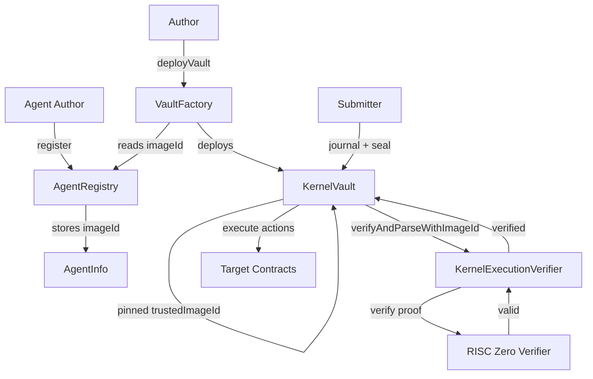
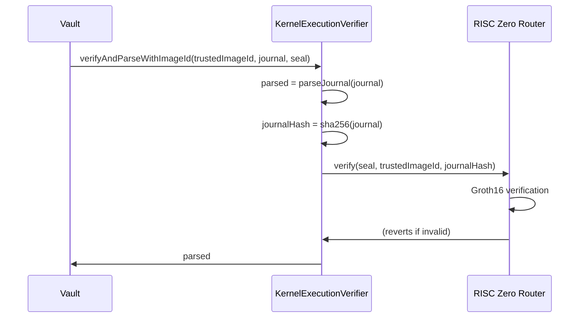

# On-Chain Contracts

This page lists every deployed contract, what it does, and the key functions you will interact with. For most workflows you will use `tal` CLI commands instead of calling contracts directly -- see the [Quickstart](/quickstart) and [Permissionless System](/onchain/permissionless-system) pages.

## Contract Summary

| Contract | Purpose |
|----------|---------|
| **AgentRegistry** | Permissionless registry of agents. Stores `imageId`, `agentCodeHash`, and metadata. |
| **VaultFactory** | CREATE2 factory that deploys vaults with a pinned `imageId`. |
| **KernelExecutionVerifier** | Stateless verifier -- validates Groth16 proofs via the RISC Zero Router. |
| **KernelVault** | Holds capital, verifies proofs, and atomically executes proven actions. |
| **HyperliquidAdapter** | Routes vault CALL actions to Hyperliquid perp order book (HyperEVM only). |

## Architecture

## Deployed Addresses

### Ethereum Mainnet

| Contract | Address |
|----------|---------|
| AgentRegistry | [`0x2BF56f889Ab5E535C3194bB2B356f10D6fa2FBEc`](https://etherscan.io/address/0x2BF56f889Ab5E535C3194bB2B356f10D6fa2FBEc) |
| VaultFactory | [`0x47E6EfFf516E8b899092ebEEF92fddCE579e9d39`](https://etherscan.io/address/0x47E6EfFf516E8b899092ebEEF92fddCE579e9d39) |
| KernelExecutionVerifier | [`0x5c0F88e27FADAb50EA82572950a616b4Cf4fd8B3`](https://etherscan.io/address/0x5c0F88e27FADAb50EA82572950a616b4Cf4fd8B3) |
| RISC Zero Verifier Router | [`0x8EaB2D97Dfce405A1692a21b3ff3A172d593D319`](https://etherscan.io/address/0x8EaB2D97Dfce405A1692a21b3ff3A172d593D319) |

### HyperEVM Mainnet (Chain ID: 999)

| Contract | Address |
|----------|---------|
| AgentRegistry | `0x47E6EfFf516E8b899092ebEEF92fddCE579e9d39` |
| VaultFactory | `0xd27A7470a34903b7e215EA8d07d9cd2d21238F83` |
| KernelExecutionVerifier | `0xD1478689f829c4B4F882eB8Ef7914C7874ddC707` |
| RISC Zero Verifier Router | `0x9f8d4D1f7AAf06aab1640abd565A731399862Bc8` |
| HyperliquidAdapter | `0x0Cb59d461a366d2377ebc7eD7E50F960bEa67dc9` |

See [Hyperliquid Integration](/onchain/hyperliquid-integration) for adapter details.

### Ethereum Sepolia (Testnet)

| Contract | Address |
|----------|---------|
| AgentRegistry | [`0xED27f8fbB7D576f02D516d01593eEfBaAfe4b168`](https://sepolia.etherscan.io/address/0xED27f8fbB7D576f02D516d01593eEfBaAfe4b168) |
| VaultFactory | [`0x580e55fDE87fFC1cF1B6a446d6DBf8068EB07b8C`](https://sepolia.etherscan.io/address/0x580e55fDE87fFC1cF1B6a446d6DBf8068EB07b8C) |
| KernelExecutionVerifier | [`0x1eB41537037fB771CBA8Cd088C7c806936325eB5`](https://sepolia.etherscan.io/address/0x1eB41537037fB771CBA8Cd088C7c806936325eB5) |
| RISC Zero Verifier Router | [`0x925d8331ddc0a1F0d96E68CF073DFE1d92b69187`](https://sepolia.etherscan.io/address/0x925d8331ddc0a1F0d96E68CF073DFE1d92b69187) |

## Key Functions

### AgentRegistry

| Function | Description |
|----------|-------------|
| `register(salt, imageId, agentCodeHash)` | Register a new agent. Returns deterministic `agentId = keccak256(author, salt)`. |
| `update(agentId, newImageId, newAgentCodeHash)` | Update agent config. Author-only. Does **not** affect existing vaults. |
| `deprecate(agentId)` | Mark agent as deprecated. Informational only -- existing vaults keep running. |
| `setSuccessor(agentId, successorId)` | Point depositors toward a newer agent version. |
| `setMetadataURI(agentId, uri)` | Set metadata URI (IPFS, HTTPS, or Arweave). |

### VaultFactory

| Function | Description |
|----------|-------------|
| `deployVault(agentId, asset, userSalt)` | Deploy a vault with pinned `imageId`. Author-only. |
| `computeVaultAddress(owner, agentId, asset, userSalt)` | Predict the vault address before deployment. |

### KernelExecutionVerifier

| Function | Description |
|----------|-------------|
| `verifyAndParseWithImageId(expectedImageId, journal, seal)` | Verify a Groth16 proof and parse the 209-byte journal. |

### KernelVault

| Function | Description |
|----------|-------------|
| `execute(journal, seal, agentOutput)` | Verify proof, validate nonce/agent/commitment, execute actions atomically. |

## Verification Flow

## Gas Costs

| Operation | Gas |
|-----------|-----|
| Agent registration | ~130,000 |
| Vault deployment | ~1,700,000 |
| Groth16 verification | ~300,000 |
| Journal parsing | ~20,000 |
| Action execution | Variable |
| Total `execute()` | ~400,000 - 500,000 |

## Related

- [Permissionless System](/onchain/permissionless-system) -- Agent lifecycle and vault deployment
- [Solidity Integration](/onchain/solidity-integration) -- Custom vaults and Foundry testing
- [Security Considerations](/onchain/security-considerations) -- Trust assumptions and attack vectors
