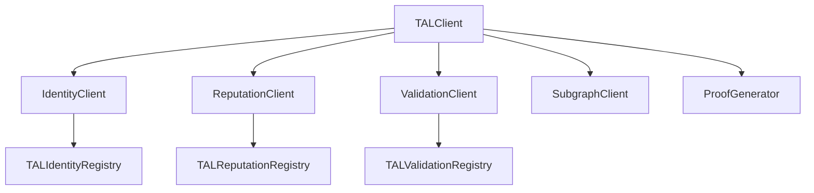

# SDK Overview

The **TAL TypeScript SDK** provides a complete client library for interacting with the Tokamak AI Layer smart contracts. It wraps low-level contract calls into a clean, typed API built on top of [viem](https://viem.sh).

## Architecture

The SDK follows a **facade pattern**: `TALClient` is the main entry point, delegating to specialized domain clients for each subsystem.



Each domain client handles its own contract interactions, while `TALClient` provides convenience methods that combine data across clients. For example, `TALClient.getAgent()` fetches identity data from `IdentityClient`, enriches it with reputation data from `ReputationClient`, and appends validation stats from `ValidationClient`.

## Installation

```bash
npm install @tokamak/tal-sdk
```

:::info Peer Dependency
The SDK requires `viem` as a peer dependency. If you do not already have it installed:
```bash
npm install viem
```
:::

## Configuration

Create a `TALClient` instance with a `TALClientConfig` object:

```typescript
import { TALClient } from '@tokamak/tal-sdk';
import { createWalletClient, custom, defineChain } from 'viem';

const thanosSepolia = defineChain({
  id: 111551119090,
  name: 'Thanos Sepolia',
  nativeCurrency: { name: 'TON', symbol: 'TON', decimals: 18 },
  rpcUrls: { default: { http: ['https://rpc.thanos-sepolia.tokamak.network'] } },
  blockExplorers: { default: { name: 'Explorer', url: 'https://explorer.thanos-sepolia.tokamak.network' } },
});

const walletClient = createWalletClient({
  chain: thanosSepolia,
  transport: custom(window.ethereum),
});

const tal = new TALClient({
  rpcUrl: 'https://rpc.thanos-sepolia.tokamak.network',
  walletClient,
});
```

### TALClientConfig

| Property | Type | Default | Description |
|----------|------|---------|-------------|
| `chainId` | `number` | `111551119090` | Chain ID (Thanos Sepolia) |
| `rpcUrl` | `string` | -- | JSON-RPC endpoint URL |
| `contracts` | `object` | Thanos Sepolia defaults | Override contract addresses |
| `contracts.identityRegistry` | `Address` | `0x3f89...A525` | TALIdentityRegistry address |
| `contracts.reputationRegistry` | `Address` | `0x0052...502b` | TALReputationRegistry address |
| `contracts.validationRegistry` | `Address` | `0x0944...32F3` | TALValidationRegistry address |
| `subgraphUrl` | `string` | -- | Subgraph endpoint (when available) |
| `ipfsGateway` | `string` | `https://ipfs.io/ipfs/` | IPFS gateway for metadata fetching |
| `cacheTimeout` | `number` | -- | Cache timeout in milliseconds |
| `walletClient` | `WalletClient` | -- | viem WalletClient for write operations |

:::tip Read-only Mode
You can omit `walletClient` if you only need read operations. Write methods will throw an error if called without a connected wallet.
:::

## Quick Start

```typescript
import { TALClient } from '@tokamak/tal-sdk';

// Read-only client (no wallet needed)
const tal = new TALClient({
  rpcUrl: 'https://rpc.thanos-sepolia.tokamak.network',
});

// Fetch an agent by ID
const agent = await tal.getAgent(1n);
console.log(agent.agentURI);       // ipfs://Qm...
console.log(agent.feedbackCount);   // 12
console.log(agent.validationCount); // 3

// Search for agents
const results = await tal.searchAgents({
  verifiedOperatorOnly: true,
  minReputation: 70,
  first: 10,
});

// Get protocol stats
const stats = await tal.getProtocolStats();
console.log(`Total agents: ${stats.totalAgents}`);
```

## Domain Clients

You can access domain clients directly for fine-grained control, or use the convenience methods on `TALClient`.

| Client | Access | Purpose | Details |
|--------|--------|---------|---------|
| **IdentityClient** | `tal.identity` | Agent registration, URI updates, operator management, wallet verification | [Identity Client](./identity-client) |
| **ReputationClient** | `tal.reputation` | Feedback submission, reputation queries, stake-weighted scoring | [Reputation & Validation](./reputation-and-validation) |
| **ValidationClient** | `tal.validation` | Validation requests, submission, dispute resolution | [Reputation & Validation](./reputation-and-validation) |
| **SubgraphClient** | `tal.subgraph` | Indexed queries (stubbed, awaiting deployment) | -- |
| **ProofGenerator** | `tal.proofGenerator` | ZK proof generation (stubbed, awaiting Sprint 3) | -- |

## Builder Pattern

The SDK includes a `RegistrationBuilder` for constructing ERC-8004 compliant registration files:

```typescript
const builder = tal.createRegistrationBuilder();

const registration = builder
  .setName('My AI Agent')
  .setDescription('A helpful assistant')
  .addService('A2A', 'https://agent.example.com/a2a')
  .addService('MCP', 'https://agent.example.com/mcp')
  .setSupportedTrust(['reputation', 'crypto-economic'])
  .build();
```

See the [Identity Client](./identity-client) page for the full builder API.

## Default Contract Addresses

The SDK ships with default addresses for Thanos Sepolia. Override them via the `contracts` config if deploying to a different network.

| Contract | Address |
|----------|---------|
| TALIdentityRegistry | `0x3f89CD27fD877827E7665A9883b3c0180E22A525` |
| TALReputationRegistry | `0x0052258E517835081c94c0B685409f2EfC4D502b` |
| TALValidationRegistry | `0x09447147C6E75a60A449f38532F06E19F5F632F3` |
| StakingIntegrationModule | `0xDc9d9A78676C600E7Ca55a8D0c63da9462Acfe30` |

## Next Steps

- [Identity Client](./identity-client) -- Register agents with the builder pattern
- [Reputation & Validation](./reputation-and-validation) -- Submit feedback and request validations
- [Types Reference](./types-reference) -- Complete type definitions
