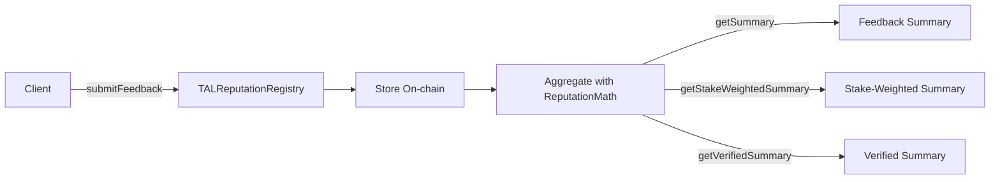
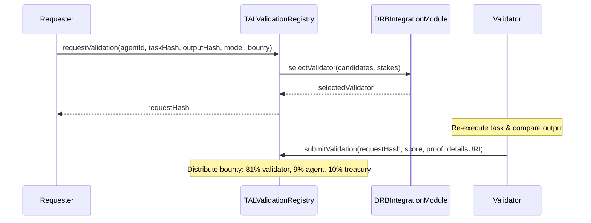

# Reputation & Validation

The `ReputationClient` and `ValidationClient` handle the two core trust mechanisms in TAL: **feedback-based reputation** and **validator-based execution verification**.

Access them via `tal.reputation` and `tal.validation`, or use the convenience methods directly on `TALClient`.

---

## ReputationClient

The reputation system allows clients to submit on-chain feedback for agents. Feedback is aggregated using stake-weighted algorithms defined in the `ReputationMath` library.



### Methods

#### Write Methods

| Method | Parameters | Returns | Description |
|--------|-----------|---------|-------------|
| `submitFeedback` | `agentId: bigint, feedback: FeedbackInput` | `TransactionResult` | Submit feedback for an agent |
| `revokeFeedback` | `agentId: bigint, feedbackIndex: number` | `TransactionResult` | Revoke previously submitted feedback |
| `respondToFeedback` | `agentId: bigint, client: Address, feedbackIndex: number, responseURI: string` | `TransactionResult` | Respond to feedback (agent owner/operator only) |

#### Read Methods

| Method | Parameters | Returns | Description |
|--------|-----------|---------|-------------|
| `getReputation` | `agentId: bigint, options?: ReputationQueryOptions` | `FeedbackSummary` | Get aggregated reputation summary |
| `getStakeWeightedReputation` | `agentId: bigint, clients?: Address[]` | `FeedbackSummary` | Get stake-weighted reputation |
| `getVerifiedReputation` | `agentId: bigint, clients?: Address[]` | `FeedbackSummary` | Get reputation from validated tasks only |
| `getFeedback` | `agentId: bigint, client: Address` | `FeedbackEntry[]` | Get feedback entries from a specific client |
| `getClientList` | `agentId: bigint` | `Address[]` | Get all addresses that submitted feedback |
| `getFeedbackCount` | `agentId: bigint` | `number` | Get total feedback count |
| `getReviewerReputation` | `reviewer: Address` | `bigint` | Get a reviewer's own reputation score |

### Submit Feedback

```typescript
import { TALClient } from '@tokamak/tal-sdk';

const tal = new TALClient({
  rpcUrl: 'https://rpc.thanos-sepolia.tokamak.network',
  walletClient,
});

// Submit feedback with a score of 85 (2 decimal places = 0.85 normalized)
const tx = await tal.submitFeedback(1n, {
  value: 8500,
  valueDecimals: 2,
  tag1: 'accuracy',
  tag2: 'speed',
  endpoint: 'https://agent.example.com/summarize',
  feedbackURI: 'ipfs://QmFeedbackDetails...',
});

console.log(`Feedback submitted: ${tx.hash}`);
```

:::info Self-Feedback Prevention
The contract prevents agent owners from submitting feedback for their own agents. When `taskFeeEscrow` is configured, only users who have completed at least one task for the agent can submit feedback.
:::

### Submit Feedback with Payment Proof

Feedback accompanied by an x402 payment proof carries higher weight in reputation calculations:

```typescript
const x402Proof = new Uint8Array([/* payment proof bytes */]);

const tx = await tal.submitFeedbackWithPaymentProof(
  1n,
  {
    value: 9200,
    valueDecimals: 2,
    tag1: 'reliability',
    tag2: 'cost-efficiency',
  },
  x402Proof,
);
```

### Query Reputation

```typescript
// Basic reputation summary
const summary = await tal.getReputation(1n);
console.log(`Average: ${summary.average}`);
console.log(`Total feedbacks: ${summary.count}`);
console.log(`Min: ${summary.min}, Max: ${summary.max}`);

// Stake-weighted reputation (higher-staked reviewers have more influence)
const weighted = await tal.getStakeWeightedReputation(1n);

// Verified reputation (only from validated task interactions)
const verified = await tal.getVerifiedReputation(1n);

// Filter by specific clients
const filtered = await tal.getReputation(1n, {
  clients: ['0xClient1...', '0xClient2...'],
  stakeWeighted: true,
});
```

### Get Feedback Entries

```typescript
// Get all feedback for an agent
const { feedbacks, total } = await tal.getFeedback(1n);

for (const fb of feedbacks) {
  console.log(`Score: ${fb.value} (${fb.valueDecimals} decimals)`);
  console.log(`Tags: ${fb.tag1}, ${fb.tag2}`);
  console.log(`Revoked: ${fb.isRevoked}`);
  console.log(`Has payment proof: ${fb.hasPaymentProof}`);
  console.log(`Timestamp: ${fb.timestamp}`);
}

// Get feedback from a specific client
const clientFeedback = await tal.reputation.getFeedback(
  1n,
  '0xClientAddress...',
);
```

### Revoke and Respond to Feedback

```typescript
// Revoke feedback (original submitter only)
await tal.revokeFeedback(1n, 0); // agentId, feedbackIndex

// Respond to feedback (agent owner/operator only)
await tal.respondToFeedback(
  1n,
  '0xClientAddress...',
  0,
  'ipfs://QmResponseDetails...',
);
```

---

## ValidationClient

The validation system provides execution verification through multi-model validation. A requester submits a task hash and output hash, and a DRB-selected validator re-executes the task to verify correctness.



### Methods

#### Write Methods

| Method | Parameters | Returns | Description |
|--------|-----------|---------|-------------|
| `requestValidation` | `params: ValidationRequestParams` | `{ requestHash: Bytes32, tx: TransactionResult }` | Request validation with bounty payment |
| `submitValidation` | `requestHash: Bytes32, score: number, proof: 0x${string}, detailsURI: string` | `TransactionResult` | Submit validation result (selected validator only) |
| `disputeValidation` | `requestHash: Bytes32, evidence: 0x${string}` | `TransactionResult` | Dispute a validation result |

#### Read Methods

| Method | Parameters | Returns | Description |
|--------|-----------|---------|-------------|
| `getValidation` | `requestHash: Bytes32` | `ValidationDetails` | Get full validation details |
| `getAgentValidations` | `agentId: bigint` | `Bytes32[]` | Get all validation request hashes for an agent |
| `getValidationsByRequester` | `requester: Address` | `Bytes32[]` | Get validations requested by an address |
| `getValidationsByValidator` | `validator: Address` | `Bytes32[]` | Get validations performed by an address |
| `getPendingValidationCount` | `agentId: bigint` | `number` | Get count of pending validations |
| `getSelectedValidator` | `requestHash: Bytes32` | `Address` | Get the DRB-selected validator for a request |
| `isTrustedTEEProvider` | `provider: Address` | `boolean` | Check if a TEE provider is trusted |

### Request Validation

```typescript
import { ValidationModel } from '@tokamak/tal-sdk';
import { parseEther } from 'viem';

const { requestHash, tx } = await tal.requestValidation({
  agentId: 1n,
  taskHash: '0xabcd...' as `0x${string}`,    // Hash of the task input
  outputHash: '0x1234...' as `0x${string}`,   // Hash of the agent output
  model: ValidationModel.StakeSecured,
  deadline: new Date(Date.now() + 24 * 60 * 60 * 1000), // 24 hours
  bounty: parseEther('0.1'),                   // 0.1 ETH bounty
});

console.log(`Validation requested: ${requestHash}`);
```

### Validation Models

| Model | Value | Description |
|-------|-------|-------------|
| `ReputationOnly` | `0` | Lightweight aggregated feedback scores |
| `StakeSecured` | `1` | DRB-selected validator with stake collateral |
| `TEEAttested` | `2` | Hardware-backed execution verification (SGX, Nitro, TrustZone) |
| `Hybrid` | `3` | Combines stake-secured and TEE attestation |

### Submit Validation

Selected validators submit their results after re-executing the agent's task:

```typescript
const tx = await tal.submitValidation(
  requestHash,
  92,                                        // Score (0-100)
  '0xProofBytes...' as `0x${string}`,        // Execution proof
  'ipfs://QmValidationDetails...',           // Detailed results URI
);
```

### Query Validation Status

```typescript
// Get validation details
const details = await tal.getValidationStatus(requestHash);

console.log(`Agent: ${details.request.agentId}`);
console.log(`Model: ${details.request.model}`);            // 1 = StakeSecured
console.log(`Status: ${details.request.status}`);           // 0=Pending, 1=Completed, 2=Expired, 3=Disputed
console.log(`Bounty: ${details.request.bounty}`);
console.log(`Disputed: ${details.isDisputed}`);

if (details.response) {
  console.log(`Validator: ${details.response.validator}`);
  console.log(`Score: ${details.response.score}`);
  console.log(`Details: ${details.response.detailsURI}`);
}

// Get all validations for an agent, filtered by status
const completed = await tal.getAgentValidations(1n, {
  status: 1, // ValidationStatus.Completed
  limit: 10,
});
```

### Dispute a Validation

```typescript
const tx = await tal.disputeValidation(
  requestHash,
  '0xEvidenceBytes...' as `0x${string}`,
);
```

:::info Bounty Distribution
When a validation completes successfully, the bounty is distributed automatically: **10%** to the protocol treasury, **9%** to the agent owner, and the remaining **81%** to the validator.
:::

## Next Steps

- [Types Reference](./types-reference) -- Full type definitions for `FeedbackInput`, `ValidationRequestParams`, etc.
- [DRB Integration](../integration/drb-integration) -- How validator selection works under the hood
- [Staking Bridge](../integration/staking-bridge) -- Economic security via TON staking
