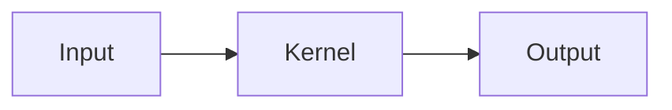

# Execution Kernel Docs

Documentation for the [Execution Kernel](https://github.com/tokamak-network/Tokamak-AI-Layer/tree/master/execution-kernel) - a consensus-critical, deterministic agent execution framework for RISC Zero zkVM.

Built with [Docusaurus](https://docusaurus.io/).

## Local Development

### Prerequisites

- Node.js 18+ and npm

### Installation

```bash
npm install
```

### Start Development Server

```bash
npm run start
```

This starts a local development server at `http://localhost:3000`. Most changes are reflected live without restart.

### Build

```bash
npm run build
```

Generates static content in the `build/` directory for deployment.

### Preview Build

```bash
npm run serve
```

Serves the built website locally to preview before deployment.

## Adding/Editing Pages

### File Structure

Documentation pages are in the `docs/` directory:

```
docs/
├── intro.md                      # Landing page
├── architecture/                 # Architecture docs
│   ├── overview.md
│   ├── trust-model.md
│   └── cryptographic-chain.md
├── getting-started/              # Getting started guides
├── kernel/                       # Kernel core docs
├── sdk/                          # SDK documentation
├── guest-program/                # Guest program docs
├── agent-pack/                   # Agent Pack docs
├── onchain/                      # On-chain integration
└── reference/                    # Reference docs
```

### Page Frontmatter

Every page needs frontmatter:

```yaml
---
title: Page Title
sidebar_position: 1
---
```

### Sidebar Configuration

Edit `sidebars.ts` to modify navigation structure.

### Adding New Pages

1. Create a `.md` file in the appropriate directory
2. Add frontmatter with title and sidebar position
3. Add the page to `sidebars.ts` if needed

## Features

- **Mermaid Diagrams**: Use mermaid code blocks for diagrams
- **Code Highlighting**: Supports Rust, TypeScript, Solidity, TOML, JSON, Bash
- **Dark Mode**: Enabled by default with toggle
- **Admonitions**: Use `:::note`, `:::warning`, `:::tip` for callouts

### Mermaid Example

````markdown

````

### Admonition Example

```markdown
:::warning
This is a warning message.
:::
```

## Deployment

### GitHub Pages (Automatic)

Pushing to `main` triggers automatic deployment via GitHub Actions.

See `.github/workflows/deploy-docs.yml` for the workflow configuration.

### Manual Deployment

```bash
# Build the site
npm run build

# Deploy to GitHub Pages
GIT_USER=<username> npm run deploy
```

## Custom Domain

To use a custom domain:

1. Update `url` in `docusaurus.config.ts`
2. Update `baseUrl` to `/` if using root domain
3. Add a `CNAME` file to `static/` with your domain
4. Configure DNS to point to GitHub Pages

## Configuration

Main configuration is in `docusaurus.config.ts`:

- `title`, `tagline` - Site metadata
- `url`, `baseUrl` - Deployment URLs
- `themeConfig` - Navbar, footer, colors
- `presets` - Docs and theme configuration

## Contributing

1. Fork the repository
2. Create a feature branch
3. Make your changes
4. Submit a pull request

### Documentation Style

- Use clear, concise language
- Include code examples where helpful
- Add diagrams for complex concepts
- Link related pages
- Keep frontmatter minimal

## Resources

- [Execution Kernel Repository](https://github.com/tokamak-network/Tokamak-AI-Layer/tree/master/execution-kernel)
- [Docusaurus Documentation](https://docusaurus.io/docs)
- [RISC Zero Documentation](https://docs.risczero.com/)

## License

This documentation is part of the Execution Kernel project by Tokamak Network and is licensed under Apache 2.0.
