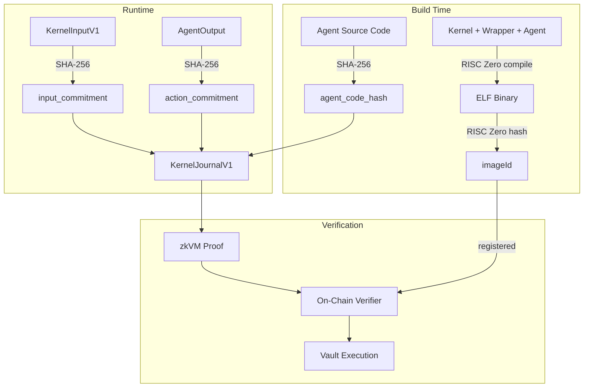
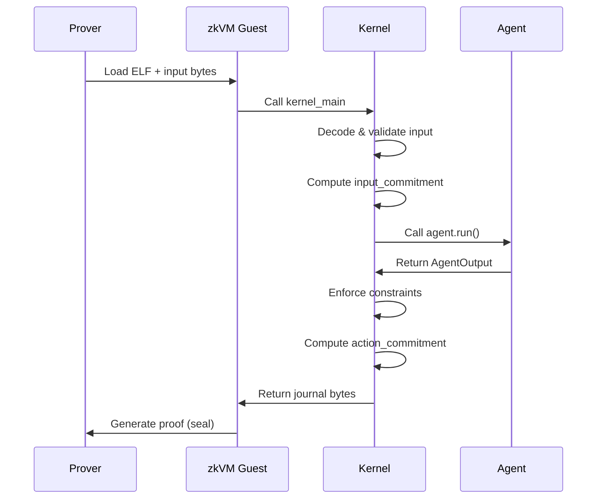
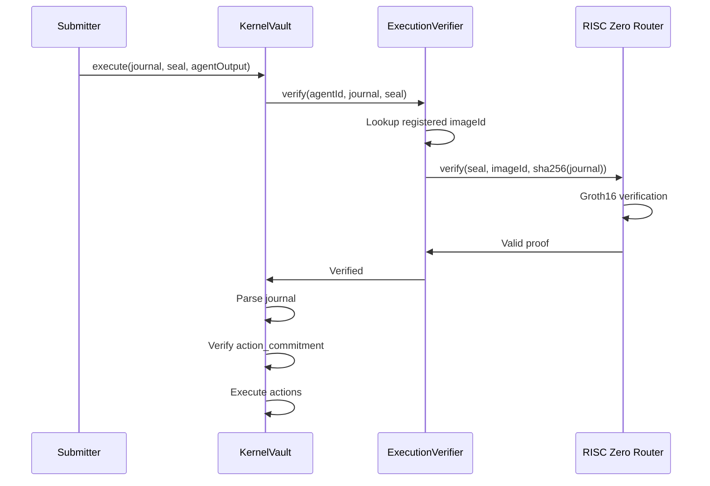

# Cryptographic Chain

The security of the Execution Kernel rests on a chain of cryptographic commitments that link source code to on-chain verification. This document traces each link in that chain.

## Overview



## Build-Time Commitments

### Agent Code Hash

The `agent_code_hash` is a SHA-256 hash of the agent's source files, computed at build time by `build.rs`. The script collects all `.rs` files in `src/`, sorts them for deterministic ordering, then feeds each filename and its contents into a SHA-256 hasher. The resulting hash is embedded as a constant (`AGENT_CODE_HASH`) in the compiled binary.

See the [scaffold `build.rs` template](https://github.com/tokamak-network/Tokamak-AI-Layer/blob/master/execution-kernel/crates/agent-pack/src/scaffold.rs) for the full implementation.

**Properties**:
- Changes when source code changes
- Deterministic given same source files
- Independent of build environment

### ImageId

The `imageId` is computed by RISC Zero from the compiled ELF binary. The `risc0-methods/build.rs` calls `risc0_build::embed_methods()`, which generates two constants: `ZKVM_GUEST_ELF` (the binary) and `ZKVM_GUEST_ID` (the imageId).

**Properties**:
- Unique hash of the entire guest binary
- Changes if kernel, wrapper, agent, or dependencies change
- Deterministic with reproducible builds (Docker)

## Runtime Commitments

### Input Commitment

The `input_commitment` is the SHA-256 hash of the raw encoded `KernelInputV1` bytes. This commits to:
- Protocol and kernel versions
- Agent identity (agent_id, agent_code_hash)
- Constraint set hash
- Input root
- Execution nonce
- Opaque agent inputs

### Action Commitment

The `action_commitment` is the SHA-256 hash of the canonicalized (sorted), encoded `AgentOutput`. For successful executions, this commits to exactly what actions the agent produced.

For failed executions (constraint violations), a well-known constant is used:

```
EMPTY_OUTPUT_COMMITMENT = SHA-256([0x00, 0x00, 0x00, 0x00])
                        = df3f619804a92fdb4057192dc43dd748ea778adc52bc498ce80524c014b81119
```

## Journal Structure

The `KernelJournalV1` binds all commitments together:

```
Offset │ Field                 │ Type            │ Size
───────┼───────────────────────┼─────────────────┼──────
0      │ protocol_version      │ u32             │ 4
4      │ kernel_version        │ u32             │ 4
8      │ agent_id              │ [u8; 32]        │ 32
40     │ agent_code_hash       │ [u8; 32]        │ 32
72     │ constraint_set_hash   │ [u8; 32]        │ 32
104    │ input_root            │ [u8; 32]        │ 32
136    │ execution_nonce       │ u64             │ 8
144    │ input_commitment      │ [u8; 32]        │ 32
176    │ action_commitment     │ [u8; 32]        │ 32
208    │ execution_status      │ ExecutionStatus │ 1
```

**Total size**: 209 bytes (fixed)

## Verification Flow

### Off-Chain (Prover)



### On-Chain (Verifier)



## Cryptographic Guarantees

### What the Proof Guarantees

Given a valid proof (seal) and journal:

1. **Execution happened**: The zkVM guest with the registered imageId executed
2. **Input was committed**: The `input_commitment` matches `SHA-256(input_bytes)`
3. **Output was committed**: The `action_commitment` matches `SHA-256(agent_output_bytes)`
4. **Agent was bound**: The `agent_code_hash` in the journal matches the embedded constant
5. **Constraints were enforced**: The constraint engine ran on the agent's output

### What the Proof Does NOT Guarantee

1. **Correct inputs**: The proof doesn't verify that inputs reflect reality
2. **Economic outcomes**: The proof doesn't guarantee profitable trades
3. **Timeliness**: The proof doesn't guarantee when execution happened
4. **Target safety**: The `action.target` field is not validated by constraints

## Hash Functions

All hashing uses **SHA-256** for consistency:

| Use Case | Algorithm |
|----------|-----------|
| agent_code_hash | SHA-256 |
| input_commitment | SHA-256 |
| action_commitment | SHA-256 |
| constraint_set_hash | SHA-256 |
| imageId | RISC Zero (based on Poseidon) |

The imageId uses RISC Zero's internal hashing (Poseidon-based) for zkVM compatibility.

## Reproducible Builds

For deterministic imageId computation:

```bash
# Use Docker for reproducible builds
RISC0_USE_DOCKER=1 cargo build --release -p risc0-methods
```

This ensures:
- Same source code produces same ELF
- Same ELF produces same imageId
- Independent verification is possible

The Agent Pack format captures all these commitments for offline verification.
