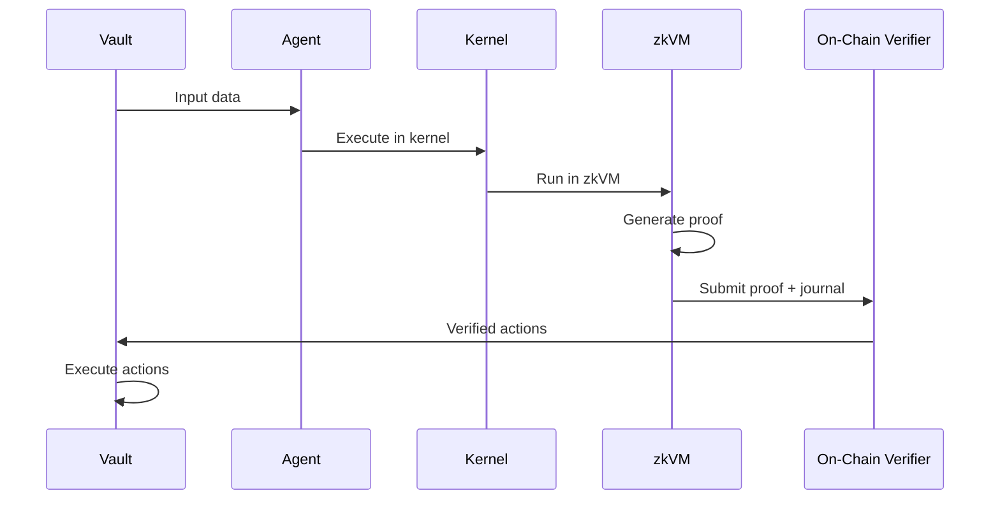
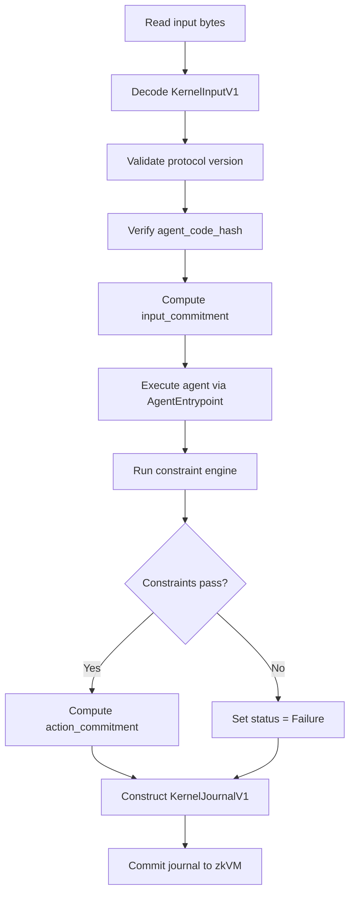

# Architecture Overview

The Execution Kernel is the consensus-critical component that defines what constitutes a valid agent execution. It runs inside a RISC Zero zkVM, producing cryptographic proofs that bind an agent's decisions to verifiable commitments.

## The Role of the Execution Kernel

In the broader protocol, capital is held in on-chain vaults. These vaults delegate decision-making to agents—programs that analyze market conditions and produce actions like deposits, withdrawals, or trades.

The execution kernel solves the trust problem by acting as a **verifiable sandbox**:



The vault can verify this proof on-chain and execute the actions with cryptographic certainty that they came from a legitimate execution.

## Crate Organization

The repository separates concerns into distinct layers:

```
crates/
├── protocol/                    # Core protocol types
│   ├── kernel-core/             # Types, deterministic codec, SHA-256 hashing
│   └── constraints/             # Constraint engine with action validation
├── sdk/
│   └── kernel-sdk/              # Agent development SDK (macros, builders, testing)
├── runtime/                     # zkVM execution
│   └── kernel-guest/            # Agent-agnostic kernel execution logic
├── agents/
│   ├── example-yield-agent/         # Reference yield agent
│   │   ├── agent/                   # Agent logic + kernel binding
│   │   └── risc0-methods/           # RISC Zero build + zkvm-guest/
│   └── defi-yield-farmer/           # DeFi yield farming agent
│       ├── agent/                   # Agent logic + kernel binding
│       └── risc0-methods/           # RISC Zero build + zkvm-guest-defi/
├── tools/
│   └── cargo-agent/             # cargo agent CLI subcommand
├── agent-pack/                  # Agent Pack CLI tool
└── testing/
    ├── kernel-host-tests/       # Unit test suite
    └── e2e-tests/               # End-to-end zkVM proof tests
```

### Protocol Layer

**kernel-core** provides the canonical data structures: `KernelInputV1`, `KernelJournalV1`, `ActionV1`, and `AgentOutput`. It implements the deterministic binary codec used to serialize these structures. This codec is consensus-critical—every implementation must encode and decode data identically.

**constraints** implements the constraint engine that validates agent outputs. When an agent produces actions, the constraint engine checks that they conform to protocol rules.

### SDK Layer

**kernel-sdk** provides utilities for agent developers. It includes:
- `agent_input!` macro for declarative input parsing
- `agent_entrypoint!` macro for kernel binding (eliminates the need for a separate binding crate)
- `CallBuilder` and `erc20` helpers for action construction
- `TestHarness`, `ContextBuilder`, and hex helpers for testing
- Math and byte manipulation helpers

### Runtime Layer

**kernel-guest** is the core execution logic. It defines the `AgentEntrypoint` trait and the `kernel_main_with_agent` function that orchestrates execution. This is the canonical, agent-agnostic runtime.

### Agents Layer

Each agent is a self-contained directory under `crates/agents/` with two sub-crates: `agent/` (core logic + kernel binding via `agent_entrypoint!` macro) and `risc0-methods/` (RISC Zero build crate exporting `ZKVM_GUEST_ELF` and `ZKVM_GUEST_ID`).

**example-yield-agent** is the reference yield farming agent.

**defi-yield-farmer** is a DeFi yield farming agent with multi-protocol strategy support.

### Tools

**cargo-agent** provides the `cargo agent` CLI subcommand for scaffolding, building, testing, and packaging agents.

## Execution Flow



1. Read input from zkVM environment
2. Decode and validate `KernelInputV1`
3. Verify protocol version and agent code hash
4. Compute input commitment (SHA-256)
5. Execute agent via `AgentEntrypoint::run()`
6. Enforce constraints (mandatory, unskippable)
7. Construct canonical journal (Success or Failure)
8. Commit journal or abort on hard error

## Why Agent-Agnostic?

The kernel is deliberately designed to have no knowledge of specific agents:

1. **Independent development**: Agent developers work independently without modifying kernel code
2. **Minimal attack surface**: Keeping agent-specific logic out makes the kernel easier to audit
3. **Clean upgrades**: Kernel and agent changes can happen independently

The mechanism is Rust's trait system:

```rust
pub trait AgentEntrypoint {
    fn code_hash(&self) -> [u8; 32];
    fn run(&self, ctx: &AgentContext, opaque_inputs: &[u8]) -> AgentOutput;
}
```

Any type implementing this trait can be passed to `kernel_main_with_agent`. The `agent_entrypoint!` macro generates this implementation automatically from any `agent_main` function.

## Key Design Principles

### Determinism Requirements

The kernel runs in a zkVM, requiring perfect determinism:

- No floating-point arithmetic
- No randomness or time-dependent operations
- No hash maps or unordered collections
- Manual binary encoding instead of serde
- Explicit bounds on all loops and allocations
- Checked arithmetic to handle overflow consistently

### Failure Handling

**Soft failures** occur when an agent produces output that violates constraints. The kernel produces a journal with `execution_status = Failure`. This is still a valid proof.

**Hard failures** occur when something is fundamentally wrong: malformed input, unsupported protocol version, or agent_code_hash mismatch. The kernel panics, aborting proof generation entirely.

This distinction ensures that constraint violations are provable and verifiable on-chain, while bugs or attacks result in no valid proof being produced.
