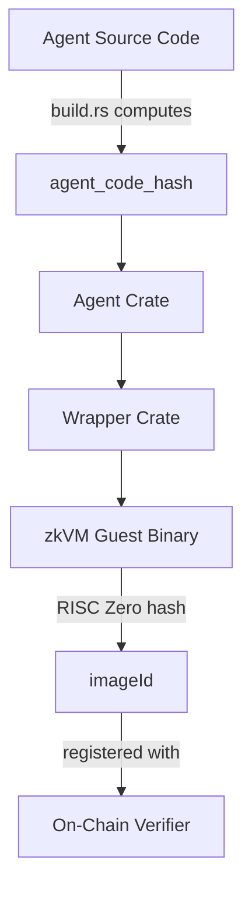

# Trust Model

The Execution Kernel operates under a **malicious host assumption**, meaning the kernel assumes the environment running it may be adversarial. This document explains the security model and how cryptographic guarantees protect against various attack vectors.

## Security Properties

### No Custody Transfer

Agents never have custody of funds. They produce instructions that the vault executes. If an agent is buggy or malicious, the worst it can do is:

- Produce invalid instructions (which fail constraint checks)
- Produce valid instructions that the capital allocator didn't intend (a governance/configuration problem)

### Verifiable Execution

Every claim is backed by cryptographic proof. The proof covers:

- Input parsing
- Agent logic execution
- Constraint checking
- Output encoding

There's no trusted intermediary who could lie about what happened.

### Deterministic Replay

Given the input bytes and the imageId, anyone can re-execute the computation and verify they get the same result. The zkVM proves that standard computation happened correctly.

### Atomic Commitment

The journal commits to both inputs and outputs atomically. You can't have a valid proof that commits to different inputs than were actually used, or different outputs than were actually produced.

## Attack Vectors and Defenses

### Input Forgery Attempts

**Attack**: Attacker provides crafted inputs hoping to trigger unexpected behavior.

**Defense**: All inputs are cryptographically committed via SHA-256. The `input_commitment` in the journal binds the proof to specific inputs.

```rust
input_commitment = SHA-256(encoded_kernel_input_v1)
```

### Agent Substitution Attacks

**Attack**: Attacker attempts to run a different agent than expected.

**Defense**: The `agent_code_hash` binding prevents unauthorized agents. The kernel verifies:

```rust
if agent.code_hash() != input.agent_code_hash {
    panic!("AgentCodeHashMismatch");
}
```

### Constraint Bypass Attempts

**Attack**: Attacker attempts to skip constraint validation.

**Defense**: Constraint checking is mandatory and unskippable. It's hardcoded in the kernel flow:

```rust
// This always runs - there's no way to skip it
let result = enforce_constraints(&input, &agent_output);
```

### Non-Determinism Exploitation

**Attack**: Attacker exploits non-deterministic behavior to generate inconsistent proofs.

**Defense**: Strict deterministic execution requirements:

- No floating-point operations
- No randomness or time dependencies
- No unordered iteration (HashMap, HashSet forbidden)
- Bounded memory and computation

### Protocol Version Confusion

**Attack**: Attacker submits proof from an incompatible protocol version.

**Defense**: Explicit version validation on all inputs:

```rust
if input.protocol_version != PROTOCOL_VERSION {
    return Err(CodecError::InvalidVersion {
        expected: PROTOCOL_VERSION,
        actual: input.protocol_version
    });
}
```

### Encoding Malleability

**Attack**: Multiple valid encodings for the same logical value could allow proof manipulation.

**Defense**: Exact payload lengths with trailing bytes rejected:

```rust
if cursor != bytes.len() {
    return Err(CodecError::InvalidLength);
}
```

### Replay Attacks

**Attack**: Resubmitting a valid proof to execute the same actions multiple times.

**Defense**: The `execution_nonce` ensures each proof can only be used once:

```rust
require(
    journal.executionNonce == lastExecutionNonce + 1,
    "Invalid nonce"
);
lastExecutionNonce = journal.executionNonce;
```

## ImageId and Agent Binding

A critical security property is that **one imageId corresponds to exactly one agent**:



The imageId is a cryptographic hash of the compiled zkVM guest binary. This binary includes:

- Kernel code
- Wrapper code
- Agent code

If any of these components change, the imageId changes.

### Verification Chain

1. **Agent source code** → compiled into agent crate → **agent_code_hash** embedded at build time
2. **Agent crate + wrapper + kernel** → compiled into zkVM guest → **imageId** computed from ELF
3. **imageId** registered on-chain with verifier contract
4. **Proof** ties together: execution inputs → agent decisions → journal containing agent_code_hash
5. **On-chain verification** confirms proof matches registered imageId

## Constraint System Trust Model

The constraint engine operates with these trust assumptions:

### What Constraints Can Enforce

- Maximum position sizes
- Maximum leverage
- Maximum drawdown
- Cooldown periods between executions
- Asset whitelists
- Action count limits

### What Constraints Cannot Enforce

- **Target validation**: The `action.target` field is NOT validated (P0.3 limitation)
- **Economic outcomes**: Constraints cannot guarantee profitable trades
- **External state**: Constraints operate on declared state, not live chain state

:::warning Security Note
Executor contracts are responsible for validating the `target` field. If an executor allows arbitrary calls based on `target`, constraints do not prevent malicious call targets.
:::

## On-Chain Trust Assumptions

The on-chain verification trusts:

1. **RISC Zero Verifier**: The Groth16 verification is mathematically sound
2. **KernelExecutionVerifier**: The imageId registration is correct
3. **KernelVault**: The vault correctly parses journals and executes actions

### Verifier Contract Security

```solidity
function verify(
    bytes32 agentId,
    bytes calldata journal,
    bytes calldata seal
) external view returns (bool) {
    bytes32 registeredImageId = registeredImageIds[agentId];
    require(registeredImageId != bytes32(0), "Agent not registered");

    // Verify the proof using RISC Zero verifier
    return riscZeroVerifier.verify(seal, registeredImageId, sha256(journal));
}
```

The security of this flow depends on:

- Correct imageId registration (admin responsibility)
- Sound RISC Zero proof verification
- Correct journal parsing
