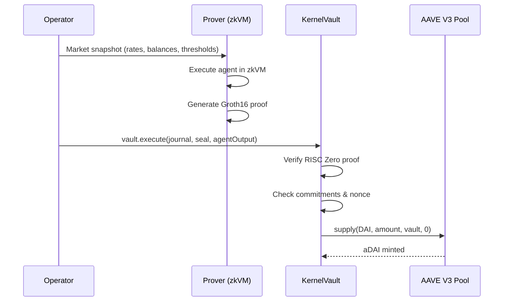

# DeFi Yield Farming Agent

A verifiable yield farming agent that manages capital allocation on AAVE V3 lending pools. The agent runs inside the RISC Zero zkVM Execution Kernel, producing cryptographic proofs that every supply/withdraw decision was computed correctly before settling on-chain.

## Overview

The DeFi Yield Farmer is the first production-grade agent targeting real DeFi protocols. It receives market state (rates, balances, thresholds) from the vault operator, evaluates whether to deploy or withdraw capital from AAVE, and outputs `CALL` actions that the vault executes atomically.



## Strategy Logic

The agent operates in three modes, selected by the `action_flag` byte in the input:

### Evaluate Mode (flag = 0)

The default mode. The agent compares the current AAVE supply rate against a minimum threshold and decides:

| Condition | Action |
|-----------|--------|
| `supply_rate >= min_rate` AND vault has idle capital | **Supply** up to `target_utilization` % of total capital |
| `supply_rate < min_rate` AND capital is supplied | **Withdraw** all supplied capital |
| Otherwise | **No-op** (no actions emitted) |

**Target utilization** controls how much of the vault's total capital (idle + supplied) should be deployed. For example, with 80% target and 1M total capital, the agent targets 800K supplied.

### Force Supply Mode (flag = 1)

Operator override. Supplies all available vault balance regardless of rate conditions. Useful for manual position entry.

### Force Withdraw Mode (flag = 2)

Operator override. Withdraws all supplied capital regardless of rate conditions. Useful for emergency exits or rebalancing.

## Input Format

The agent uses the `agent_input!` macro for declarative input parsing:

```rust
use kernel_sdk::prelude::*;

kernel_sdk::agent_input! {
    struct MarketInput {
        lending_pool: [u8; 20],
        asset_token: [u8; 20],
        vault_balance: u64,
        supplied_amount: u64,
        supply_rate_bps: u32,
        min_supply_rate_bps: u32,
        target_utilization_bps: u32,
        action_flag: u8,
    }
}
// MarketInput::ENCODED_SIZE == 69
```

All integers use **little-endian** encoding. Addresses are raw 20-byte values (no padding).

### Basis Points

Rates and percentages use **basis points** (bps): 1 bps = 0.01%, so 10,000 bps = 100%.

| Value | Meaning |
|-------|---------|
| 100   | 1.00%   |
| 500   | 5.00%   |
| 8000  | 80.00%  |
| 10000 | 100.00% |

## Output Actions

The agent uses `CallBuilder` and `erc20` helpers to construct ABI-encoded actions targeting the AAVE V3 Pool:

### Supply Action

```rust
use kernel_sdk::actions::{CallBuilder, erc20};

// Approve AAVE pool to spend tokens
let approve = erc20::approve(&input.asset_token, &input.lending_pool, supply_amount);

// Call supply(address asset, uint256 amount, address onBehalfOf, uint16 referralCode)
let supply = CallBuilder::new(input.lending_pool)
    .selector(0x617ba037)
    .param_address(&input.asset_token)
    .param_u256_from_u64(supply_amount)
    .param_address(&[0u8; 20])  // onBehalfOf = address(0), vault is msg.sender
    .param_u16(0)                // referralCode = 0
    .build();
```

### Withdraw Action

```rust
// Call withdraw(address asset, uint256 amount, address to)
let withdraw = CallBuilder::new(input.lending_pool)
    .selector(0x69328dec)
    .param_address(&input.asset_token)
    .param_u256_from_u64(withdraw_amount)
    .param_address(&[0u8; 20])  // to = address(0), funds return to vault
    .build();
```

## AAVE V3 Sepolia Addresses

| Contract | Address |
|----------|---------|
| AAVE V3 Pool | [`0x6Ae43d3271ff6888e7Fc43Fd7321a503ff738951`](https://sepolia.etherscan.io/address/0x6Ae43d3271ff6888e7Fc43Fd7321a503ff738951) |
| DAI | [`0xFF34B3d4Aee8ddCd6F9AFFFB6Fe49bD371b8a357`](https://sepolia.etherscan.io/address/0xFF34B3d4Aee8ddCd6F9AFFFB6Fe49bD371b8a357) |
| USDC | [`0x94a9D9AC8a22534E3FaCa9F4e7F2E2cf85d5E4C8`](https://sepolia.etherscan.io/address/0x94a9D9AC8a22534E3FaCa9F4e7F2E2cf85d5E4C8) |
| WETH | [`0xC558DBdd856501FCd9aaF1E62eae57A9F0629a3c`](https://sepolia.etherscan.io/address/0xC558DBdd856501FCd9aaF1E62eae57A9F0629a3c) |

Source: [bgd-labs/aave-address-book](https://github.com/bgd-labs/aave-address-book)

## Determinism Guarantees

The agent is designed for consensus-critical execution inside RISC Zero zkVM:

- **No floating point**: All math uses integer basis-point arithmetic
- **No randomness**: Identical inputs always produce identical outputs
- **Saturating arithmetic**: Overflow returns `u64::MAX` instead of panicking
- **Bounded execution**: Single input parse, single strategy evaluation, bounded output
- **`no_std`**: No standard library dependencies that could break determinism

## Running Tests

### Unit Tests

```bash
cargo agent test defi-yield-farmer
```

14 tests covering all strategy branches, edge cases, ABI encoding, and determinism.

### Integration Tests

```bash
cargo test -p kernel-host-tests -- defi_yield_farmer
```

8 kernel-level tests verifying the full execution pipeline: input encoding, kernel execution, journal construction, commitment verification, and code hash validation.

## Deployment

:::tip Placeholder variables
Shell variables like `$AGENT_REGISTRY`, `$VAULT_FACTORY`, and `$PRIVATE_KEY` are placeholders. See [Deployed Contracts](/onchain/verifier-overview#deployed-contracts-sepolia) for actual contract addresses.
:::

### Prerequisites

1. Contracts deployed: `AgentRegistry`, `VaultFactory`, `KernelExecutionVerifier`
2. RISC Zero toolchain: `cargo risczero install`
3. Funded Sepolia wallet with ETH for gas

### Step 1: Build the zkVM Guest

```bash
cargo agent build defi-yield-farmer
```

This compiles the agent into a RISC Zero guest binary and generates the `IMAGE_ID`.

### Step 2: Register the Agent

```bash
source contracts/.env

SALT=$(cast keccak "defi-yield-farmer-v1")
IMAGE_ID=<from step 1>
CODE_HASH=0x903b91318b8f29adc9a7acc5a67bc4d69491fc410d55aabfd216d7f4aed453b4

cast send $AGENT_REGISTRY \
  "register(bytes32,bytes32,bytes32)(bytes32)" \
  $SALT $IMAGE_ID $CODE_HASH \
  --private-key $PRIVATE_KEY --rpc-url $RPC_URL
```

### Step 3: Deploy a Vault

```bash
AGENT_ID=<from step 2>
DAI=0xFF34B3d4Aee8ddCd6F9AFFFB6Fe49bD371b8a357
USER_SALT=$(cast keccak "defi-yield-vault-v1")

cast send $VAULT_FACTORY \
  "deployVault(bytes32,address,bytes32)(address)" \
  $AGENT_ID $DAI $USER_SALT \
  --private-key $PRIVATE_KEY --rpc-url $RPC_URL
```

### Step 4: Fund the Vault

The vault operator deposits DAI tokens:

```bash
# Approve vault to spend DAI
cast send $DAI "approve(address,uint256)" $VAULT_ADDRESS $(cast max-uint) \
  --private-key $PRIVATE_KEY --rpc-url $RPC_URL

# Deposit DAI
cast send $VAULT_ADDRESS "depositERC20Tokens(uint256)" 1000000000000000000 \
  --private-key $PRIVATE_KEY --rpc-url $RPC_URL
```

### Step 5: Execute

Build the kernel input, generate a proof, and submit:

```bash
# The operator builds opaque input (69 bytes) with current market state
# Then generates a RISC Zero proof and submits to the vault
cast send $VAULT_ADDRESS \
  "execute(bytes,bytes,bytes)" \
  $JOURNAL $SEAL $AGENT_OUTPUT \
  --private-key $PRIVATE_KEY --rpc-url $RPC_URL
```

See the [shell deployment script](https://github.com/tokamak-network/Tokamak-AI-Layer/blob/master/execution-kernel/contracts/script/deploy-defi-yield-agent.sh) for a complete automated deployment.

## Architecture

```
┌─────────────────────────────────────────────────┐
│                  Vault Operator                  │
│  Reads AAVE rates, builds 69-byte input packet  │
└────────────────────┬────────────────────────────┘
                     │
                     ▼
┌─────────────────────────────────────────────────┐
│              RISC Zero zkVM Prover               │
│                                                  │
│  ┌─────────────┐  ┌──────────────────────────┐  │
│  │ Kernel Guest │──│ defi-yield-farmer agent  │  │
│  │ (sandbox)    │  │ parse → evaluate → encode│  │
│  └─────────────┘  └──────────────────────────┘  │
│                                                  │
│  Output: journal (209 bytes) + seal (proof)      │
└────────────────────┬────────────────────────────┘
                     │
                     ▼
┌─────────────────────────────────────────────────┐
│              KernelVault (on-chain)               │
│                                                  │
│  1. Verify RISC Zero proof                       │
│  2. Check agent ID + nonce                       │
│  3. Verify action commitment                     │
│  4. Execute CALL actions → AAVE V3 Pool          │
└─────────────────────────────────────────────────┘
```

## Key Files

| File | Description |
|------|-------------|
| `crates/agents/defi-yield-farmer/agent/src/lib.rs` | Agent implementation (strategy, parsing, ABI encoding) |
| `crates/agents/defi-yield-farmer/agent/build.rs` | Generates `AGENT_CODE_HASH` at compile time |
| `crates/agents/defi-yield-farmer/risc0-methods/` | RISC Zero guest build (ELF + IMAGE_ID) |
| `crates/testing/kernel-host-tests/src/lib.rs` | Integration tests |
| `contracts/script/DeployDefiYieldAgent.s.sol` | Forge deployment script |
| `contracts/script/deploy-defi-yield-agent.sh` | Shell deployment script |

## Related

- [Writing an Agent](/sdk/writing-an-agent) - Full agent development guide
- [Constraints and Commitments](/sdk/constraints-and-commitments) - Constraint enforcement rules
- [Verifier Overview](/onchain/verifier-overview) - On-chain contract architecture
- [Agent Pack Format](/agent-pack/format) - Packaging agents for distribution
- [Golden Path Demo](/integration/golden-path) - End-to-end walkthrough
