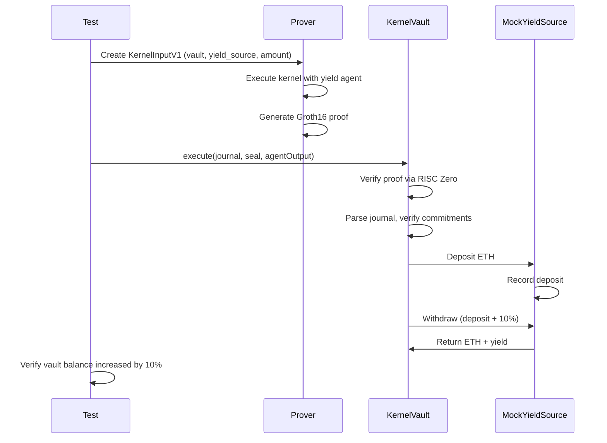

# Run an Example

This guide walks through running the example yield agent, from local testing to full on-chain execution.

## The Yield Agent

The `example-yield-agent` is a reference implementation that demonstrates a complete agent lifecycle:

1. Deposits ETH into a yield source
2. Withdraws ETH plus yield

```rust
// Simplified yield agent logic
pub fn agent_main(ctx: &AgentContext, opaque_inputs: &[u8]) -> AgentOutput {
    // Parse 48 bytes: vault (20) + yield_source (20) + amount (8)
    let vault_address = &opaque_inputs[0..20];
    let yield_source = &opaque_inputs[20..40];
    let amount = u64::from_le_bytes(opaque_inputs[40..48].try_into().unwrap());

    // Create deposit and withdraw actions
    let deposit = call_action(yield_source, amount, &deposit_calldata);
    let withdraw = call_action(yield_source, 0, &withdraw_calldata);

    AgentOutput {
        actions: vec![deposit, withdraw]
    }
}
```

## Unit Tests (No zkVM)

Run the agent logic without proof generation:

```bash
cargo test -p example-yield-agent
```

This tests:
- Input parsing
- Action construction
- Code hash consistency

## Integration Tests (Kernel Execution)

Run the agent through the kernel without zkVM:

```bash
cargo test -p kernel-host-tests -- --nocapture
```

This tests:
- Kernel input/output encoding
- Constraint enforcement
- Journal construction

## E2E Proof Tests (Off-Chain)

Generate actual zkVM proofs:

```bash
# Install RISC Zero toolchain first
cargo risczero install

# Run E2E proof tests
cargo test -p e2e-tests --features risc0-e2e -- --nocapture
```

Test cases include:

| Test | Description |
|------|-------------|
| `test_e2e_success_with_yield_agent` | Happy path with valid input |
| `test_e2e_agent_code_hash_mismatch` | Security test - wrong code hash |
| `test_e2e_empty_output_invalid_input_size` | Invalid input handling |
| `test_e2e_determinism` | Same input produces same output |

:::note
Proof generation is computationally intensive. These tests can take several minutes.
:::

## Full On-Chain E2E Test

Execute the complete flow with on-chain verification on Sepolia.

### Prerequisites

1. **Sepolia ETH**: Fund both the vault and yield source contracts
2. **Environment variables**: Set RPC URL and private key

### Fund the Contracts

```bash
# Set your RPC URL
export RPC_URL="https://eth-sepolia.g.alchemy.com/v2/YOUR_KEY"
export PRIVATE_KEY="0x..."

# Contract addresses
export VAULT_ADDRESS=0xAdeDA97D2D07C7f2e332fD58F40Eb4f7F0192be7
export MOCK_YIELD_ADDRESS=0x7B35E3F2e810170f146d31b00262b9D7138F9b39

# Check current balances
cast balance $VAULT_ADDRESS --rpc-url $RPC_URL
cast balance $MOCK_YIELD_ADDRESS --rpc-url $RPC_URL

# Fund the vault (needs ETH to transfer)
cast send $VAULT_ADDRESS --value 0.5ether \
    --private-key $PRIVATE_KEY --rpc-url $RPC_URL

# Fund MockYieldSource (needs ETH to pay 10% yield)
cast send $MOCK_YIELD_ADDRESS --value 1ether \
    --private-key $PRIVATE_KEY --rpc-url $RPC_URL
```

### Check Vault State

```bash
# Get current execution nonce
cast call $VAULT_ADDRESS "lastExecutionNonce()(uint64)" --rpc-url $RPC_URL
```

### Run the Test

```bash
# Set execution parameters
export EXECUTION_NONCE=1  # Must be lastExecutionNonce + 1
export TRANSFER_AMOUNT=10000000000000000  # 0.01 ETH in wei

# Run the on-chain E2E test
cargo test --release -p e2e-tests --features phase3-e2e \
    test_full_e2e_yield_execution -- --ignored --nocapture
```

### Expected Output

```
=== Initial State ===
Vault address: 0xAdeDA97D2D07C7f2e332fD58F40Eb4f7F0192be7
MockYieldSource address: 0x7B35E3F2e810170f146d31b00262b9D7138F9b39
Initial nonce: 1
Initial vault balance: 1010000000000000000 wei
Agent ID: 0x0000000000000000000000000000000000000000000000000000000000000001
Transfer amount: 100000000000000000 wei

=== Generating zkVM Proof ===
Proof generated and verified!

=== Submitting Transaction ===
Journal length: 209 bytes
Seal length: 260 bytes
Agent output length: 348 bytes
Transaction sent: 0x376a678...
Transaction confirmed in block: Some(10141050)
Gas used: 403945

=== Verifying Results ===
Final nonce: 2
Final vault balance: 1020000000000000000 wei
MockYieldSource deposits[vault]: 0 wei

=== E2E Test Passed! ===
Yield earned: 10000000000000000 wei (10%)
```

## Understanding the Flow



## Troubleshooting

### "execution reverted: Invalid proof"

Check that the IMAGE_ID is registered:

```bash
export VERIFIER_ADDRESS=0x9Ef5bAB590AFdE8036D57b89ccD2947D4E3b1EFA
export AGENT_ID=0x0000000000000000000000000000000000000000000000000000000000000001

cast call $VERIFIER_ADDRESS "registeredImageIds(bytes32)(bytes32)" \
    $AGENT_ID --rpc-url $RPC_URL
```

### "execution reverted: Invalid nonce"

Check the current nonce and increment:

```bash
cast call $VAULT_ADDRESS "lastExecutionNonce()(uint64)" --rpc-url $RPC_URL
```

Use `lastExecutionNonce + 1` as your `EXECUTION_NONCE`.

### "execution reverted: Insufficient balance"

Ensure both contracts have sufficient ETH:

- **Vault**: Needs enough for the transfer amount
- **MockYieldSource**: Needs enough for transfer + 10% yield

## Next Steps

After running the example:

1. [Understand the SDK](/sdk/overview)
2. [Write your own agent](/sdk/writing-an-agent)
3. [Deploy to production](/agent-pack/format)
