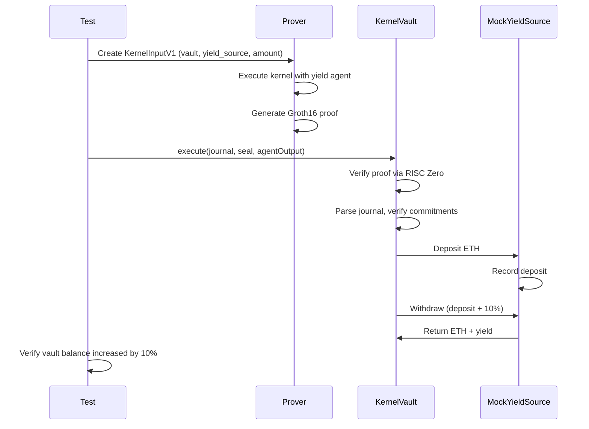

# Run an Example

This guide walks through running the example yield agent, from local testing to full on-chain execution.

## The Yield Agent

The `example-yield-agent` demonstrates a complete agent lifecycle using the modern SDK APIs:

```rust
use kernel_sdk::prelude::*;
use kernel_sdk::actions::CallBuilder;

kernel_sdk::agent_input! {
    struct YieldInput {
        vault_address: [u8; 20],
        mock_yield_address: [u8; 20],
        transfer_amount: u64,
    }
}

pub extern "Rust" fn agent_main(_ctx: &AgentContext, opaque_inputs: &[u8]) -> AgentOutput {
    let input = match YieldInput::decode(opaque_inputs) {
        Some(i) => i,
        None => return AgentOutput { actions: Vec::new() },
    };

    // Deposit ETH to yield source
    let deposit = CallBuilder::new(input.mock_yield_address)
        .value(input.transfer_amount as u128)
        .build();

    // Withdraw from yield source
    let withdraw = CallBuilder::new(input.mock_yield_address)
        .selector(0x51cff8d9) // withdraw(address)
        .param_address(&input.vault_address)
        .build();

    AgentOutput {
        actions: vec![deposit, withdraw],
    }
}

kernel_sdk::agent_entrypoint!(agent_main);
```

## Unit Tests (No zkVM)

Run the agent logic without proof generation:

```bash
cargo agent test example-yield-agent
```

This tests:
- Input parsing via `agent_input!`
- Action construction with `CallBuilder`
- Code hash consistency

## Integration Tests (Kernel Execution)

Run the agent through the kernel without zkVM:

```bash
cargo test -p kernel-host-tests -- --nocapture
```

This tests:
- Kernel input/output encoding
- Constraint enforcement
- Journal construction

## E2E Proof Tests (Off-Chain)

Generate actual zkVM proofs:

```bash
# Install RISC Zero toolchain first
cargo risczero install

# Run E2E proof tests
cargo test -p e2e-tests --features risc0-e2e -- --nocapture
```

Test cases include:

| Test | Description |
|------|-------------|
| `test_e2e_success_with_yield_agent` | Happy path with valid input |
| `test_e2e_agent_code_hash_mismatch` | Security test - wrong code hash |
| `test_e2e_empty_output_invalid_input_size` | Invalid input handling |
| `test_e2e_determinism` | Same input produces same output |

:::note
Proof generation is computationally intensive. These tests can take several minutes.
:::

## Full On-Chain E2E Test

Execute the complete flow with on-chain verification on Sepolia.

### Prerequisites

1. **Sepolia ETH**: Fund both the vault and yield source contracts
2. **Environment variables**: Set RPC URL and private key

### Fund the Contracts

```bash
export RPC_URL="https://eth-sepolia.g.alchemy.com/v2/YOUR_KEY"
export PRIVATE_KEY="0x..."

export VAULT_ADDRESS=0xAdeDA97D2D07C7f2e810170f146d31b00262b9D7138F9b39
export MOCK_YIELD_ADDRESS=0x7B35E3F2e810170f146d31b00262b9D7138F9b39

cast send $VAULT_ADDRESS --value 0.5ether \
    --private-key $PRIVATE_KEY --rpc-url $RPC_URL

cast send $MOCK_YIELD_ADDRESS --value 1ether \
    --private-key $PRIVATE_KEY --rpc-url $RPC_URL
```

### Run the Test

```bash
export EXECUTION_NONCE=1
export TRANSFER_AMOUNT=10000000000000000  # 0.01 ETH in wei

cargo test --release -p e2e-tests --features phase3-e2e \
    test_full_e2e_yield_execution -- --ignored --nocapture
```

### Understanding the Flow



## Next Steps

After running the example:

1. [Understand the SDK](/sdk/overview)
2. [Write your own agent](/sdk/writing-an-agent)
3. [Deploy to production](/agent-pack/format)
