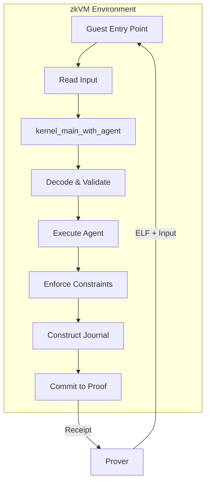

# Guest Program Overview

The guest program is the code that runs inside the RISC Zero zkVM. It orchestrates kernel execution and commits results to the proof.

## Architecture



## Components

### kernel-guest

The `kernel-guest` crate contains the agent-agnostic kernel logic:

```rust
pub trait AgentEntrypoint {
    fn code_hash(&self) -> [u8; 32];
    fn run(&self, ctx: &AgentContext, opaque_inputs: &[u8]) -> AgentOutput;
}

pub fn kernel_main_with_agent<A: AgentEntrypoint>(
    input_bytes: &[u8],
    agent: &A,
) -> Result<Vec<u8>, KernelError>;
```

### Kernel Binding via `agent_entrypoint!`

The `agent_entrypoint!` macro generates the `AgentEntrypoint` implementation and kernel binding directly in your agent crate, eliminating the need for a separate binding crate:

```rust
// In your agent's lib.rs
pub fn agent_main(ctx: &AgentContext, opaque_inputs: &[u8]) -> AgentOutput {
    // ... agent logic ...
}

kernel_sdk::agent_entrypoint!(agent_main);
```

This macro generates:
- `__KernelAgentWrapper` — a struct implementing `AgentEntrypoint`
- `kernel_main(input_bytes)` — calls `kernel_main_with_agent` without constraints
- `kernel_main_with_constraints(input_bytes, cs)` — calls with custom constraints
- `KernelError` re-export from `kernel_guest`

### zkVM Guest

The zkVM guest is the actual entry point compiled for RISC-V:

```rust
#![no_main]

risc0_zkvm::guest::entry!(main);

fn main() {
    use risc0_zkvm::guest::env;

    // Read input from zkVM environment
    let input_bytes: Vec<u8> = env::read();

    // Execute kernel with agent (uses generated kernel_main)
    match my_agent::kernel_main(&input_bytes) {
        Ok(journal_bytes) => {
            // Commit journal to proof
            env::commit_slice(&journal_bytes);
        }
        Err(error) => {
            // Abort proof generation
            panic!("Kernel execution failed: {:?}", error);
        }
    }
}
```

## Execution Flow

### 1. Input Reading

```rust
let input_bytes: Vec<u8> = env::read();
```

The prover provides input bytes to the zkVM environment. The guest reads them using `env::read()`.

### 2. Input Decoding

```rust
let input = KernelInputV1::decode(&input_bytes)?;
```

The kernel decodes and validates the input structure, checking:
- Protocol version matches
- Kernel version matches
- Input size within limits
- No trailing bytes

### 3. Agent Code Hash Verification

```rust
if agent.code_hash() != input.agent_code_hash {
    return Err(KernelError::AgentCodeHashMismatch);
}
```

This prevents agent substitution attacks.

### 4. Input Commitment

```rust
let input_commitment = sha256(&input_bytes);
```

The commitment is computed over the raw input bytes.

### 5. Agent Execution

```rust
let ctx = AgentContext::from_input(&input);
let agent_output = agent.run(&ctx, &input.opaque_agent_inputs);
```

The agent receives context and opaque inputs, returns actions.

### 6. Constraint Enforcement

```rust
let validated = enforce_constraints(&input, &agent_output)?;
```

Constraints are enforced unconditionally. Violations set status to Failure.

### 7. Journal Construction

```rust
let journal = KernelJournalV1 {
    protocol_version: input.protocol_version,
    kernel_version: input.kernel_version,
    agent_id: input.agent_id,
    agent_code_hash: input.agent_code_hash,
    constraint_set_hash: input.constraint_set_hash,
    input_root: input.input_root,
    execution_nonce: input.execution_nonce,
    input_commitment,
    action_commitment,
    execution_status,
};
```

### 8. Journal Commit

```rust
env::commit_slice(&journal.encode()?);
```

The journal is committed to the proof, becoming publicly verifiable.

## Error Handling

### Soft Failures (Constraint Violations)

When constraints are violated:
- `execution_status = Failure`
- `action_commitment = EMPTY_OUTPUT_COMMITMENT`
- Journal is committed normally
- Valid proof is produced

### Hard Failures

When fundamental errors occur:
- Agent code hash mismatch
- Invalid protocol version
- Malformed input
- Kernel panics
- Proof generation aborts
- No valid proof produced

```rust
pub enum KernelError {
    CodecError(CodecError),
    AgentCodeHashMismatch,
    ConstraintViolation(ViolationReason),
}
```

## Determinism Requirements

The guest program must be deterministic:

| Requirement | Reason |
|-------------|--------|
| No floating-point | Hardware differences cause divergence |
| No randomness | Must be reproducible |
| No time/date | Non-deterministic |
| No HashMap/HashSet | Iteration order varies |
| Bounded loops | Prevent infinite execution |
| Bounded memory | Prevent resource exhaustion |

## zkVM Environment

The RISC Zero zkVM provides:

| API | Purpose |
|-----|---------|
| `env::read()` | Read input from prover |
| `env::commit()` | Commit value to journal |
| `env::commit_slice()` | Commit bytes to journal |
| `env::cycle_count()` | Get current cycle count |

The guest cannot:
- Access filesystem
- Make network requests
- Get current time
- Use system calls

## Related

- [Transcript and Hashing](/guest-program/transcript-and-hashing) - Commitment details
- [RISC0 Build Pipeline](/guest-program/risc0-build-pipeline) - Building the guest
- [Architecture Overview](/architecture/overview) - System design
