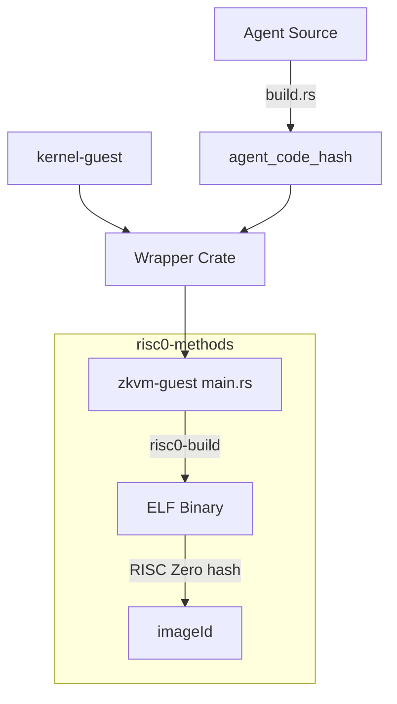
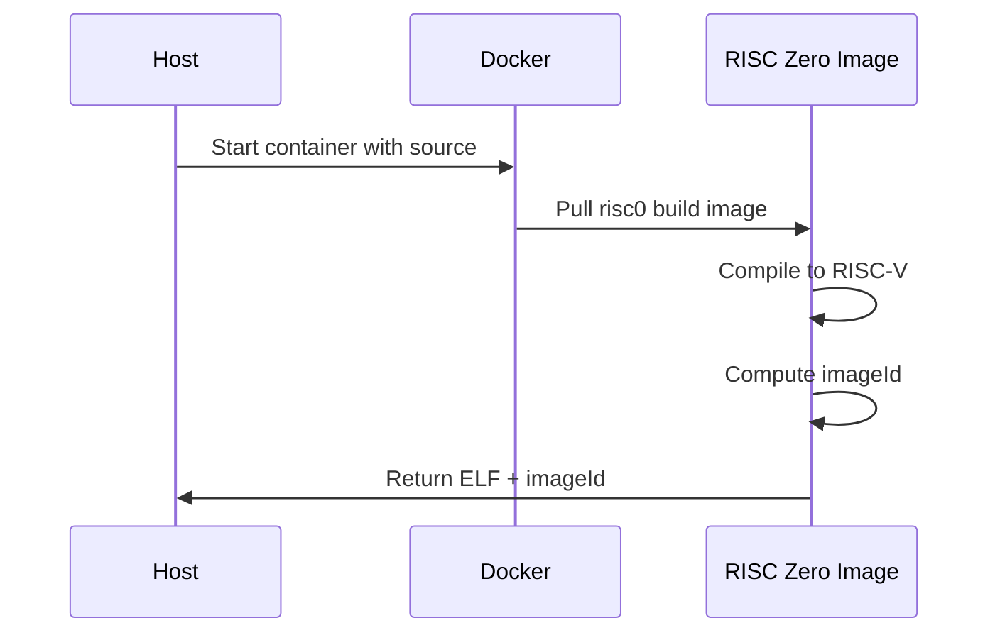

# RISC0 Build Pipeline

This document explains how the zkVM guest is built and how critical artifacts (ELF binary, imageId) are generated.

## Build Overview



## Crate Structure

```
crates/runtime/risc0-methods/
├── Cargo.toml
├── build.rs              # Invokes risc0-build
├── src/
│   └── lib.rs            # Exports ELF and IMAGE_ID
└── zkvm-guest/
    ├── Cargo.toml        # Guest-specific dependencies
    └── src/
        └── main.rs       # zkVM entry point
```

## Build Process

### 1. Agent Code Hash Generation

In the agent crate's `build.rs`:

```rust
// Hash source files
let mut hasher = Sha256::new();
for path in source_files {
    hasher.update(file_name);
    hasher.update(file_contents);
}

// Generate constant
let hash = hasher.finalize();
// Writes: pub const AGENT_CODE_HASH: [u8; 32] = [...]
```

### 2. Wrapper Compilation

The wrapper crate links the agent to the kernel:

```rust
pub struct YieldAgentWrapper;

impl AgentEntrypoint for YieldAgentWrapper {
    fn code_hash(&self) -> [u8; 32] {
        example_yield_agent::AGENT_CODE_HASH  // From step 1
    }
    // ...
}
```

### 3. zkVM Guest Compilation

The `risc0-methods/build.rs`:

```rust
fn main() {
    risc0_build::embed_methods();
}
```

This:
1. Compiles `zkvm-guest/` for RISC-V target
2. Produces an ELF binary
3. Computes the imageId from the ELF
4. Generates Rust constants

### 4. Artifact Export

In `risc0-methods/src/lib.rs`:

```rust
include!(concat!(env!("OUT_DIR"), "/methods.rs"));

// This makes available:
// pub const ZKVM_GUEST_ELF: &[u8] = ...;
// pub const ZKVM_GUEST_ID: [u32; 8] = ...;
```

## Key Artifacts

### ELF Binary

The compiled zkVM guest:
- Target: `riscv32im-risc0-zkvm-elf`
- Contains: kernel + wrapper + agent code
- Location: `target/riscv-guest/.../zkvm-guest`
- Used by: Prover to execute guest

### imageId

The unique identifier of the guest:
- Computed by: RISC Zero from ELF hash
- Format: `[u32; 8]` (256 bits)
- Used by: On-chain verification
- Changes when: Any code in ELF changes

## Reproducible Builds

For deterministic imageId:

```bash
RISC0_USE_DOCKER=1 cargo build --release --features risc0
```

### Why Reproducibility Matters

Without Docker:
- Different compilers produce different binaries
- Different binaries have different imageIds
- Verification fails with wrong imageId

With Docker:
- Same source always produces same ELF
- Same ELF has same imageId
- Independent verification is possible

### Docker Build Process



## Build Configuration

### Guest Cargo.toml

```toml
[package]
name = "zkvm-guest"
version = "0.1.0"
edition = "2021"

[dependencies]
risc0-zkvm = { version = "1.0", default-features = false, features = ["guest"] }
kernel-guest-binding-yield = { path = "../../agents/wrappers/kernel-guest-binding-yield" }
kernel-core = { path = "../../protocol/kernel-core" }

[profile.release]
opt-level = 3
lto = true
```

### Methods Cargo.toml

```toml
[package]
name = "risc0-methods"
version = "0.1.0"
edition = "2021"

[build-dependencies]
risc0-build = "1.0"

[dependencies]
# Only needed if feature-gated
risc0-zkvm = { version = "1.0", optional = true }

[features]
risc0 = ["risc0-zkvm"]
```

## Using the Artifacts

### In Prover Code

```rust
use risc0_methods::{ZKVM_GUEST_ELF, ZKVM_GUEST_ID};

// Set up environment
let env = ExecutorEnv::builder()
    .write(&input_bytes)
    .unwrap()
    .build()
    .unwrap();

// Generate proof
let prover = default_prover();
let prove_info = prover
    .prove_with_opts(env, ZKVM_GUEST_ELF, &ProverOpts::groth16())
    .unwrap();

// Verify locally
prove_info.receipt.verify(ZKVM_GUEST_ID).unwrap();
```

### For On-Chain Registration

```rust
// Convert imageId to bytes32
let image_id_bytes: [u8; 32] = {
    let mut bytes = [0u8; 32];
    for (i, word) in ZKVM_GUEST_ID.iter().enumerate() {
        bytes[i*4..(i+1)*4].copy_from_slice(&word.to_le_bytes());
    }
    bytes
};

// Register on-chain
// cast send $VERIFIER "registerAgent(bytes32,bytes32)" $AGENT_ID $IMAGE_ID
```

## Troubleshooting

### "risc0 not found"

```bash
cargo install cargo-risczero
cargo risczero install
```

### imageId Changes Unexpectedly

Check for:
- Dependency version changes
- Compiler version changes
- Feature flag changes

Use reproducible builds:
```bash
RISC0_USE_DOCKER=1 cargo build --release --features risc0
```

### Build Out of Memory

```bash
CARGO_BUILD_JOBS=2 cargo build --release --features risc0
```

### Docker Build Fails

```bash
# Ensure Docker is running
docker info

# Pull the RISC Zero image manually
docker pull risczero/risc0-build:latest
```

## Related

- [Guest Overview](/guest-program/overview) - Execution flow
- [Agent Pack](/agent-pack/format) - Packaging artifacts
- [Prerequisites](/getting-started/prerequisites) - Toolchain setup
