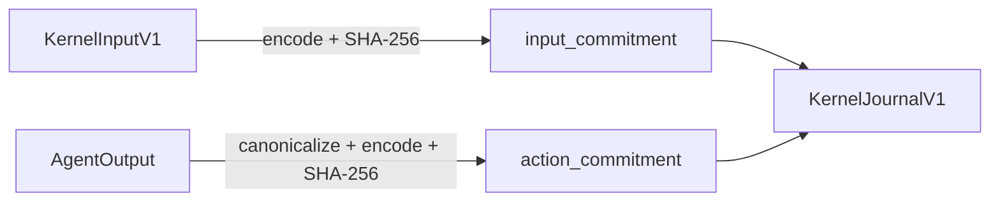

# Transcript and Hashing

This document explains how commitments are computed and how the cryptographic transcript works in the kernel.

## Commitment Overview

The kernel computes two primary commitments:



## Input Commitment

The input commitment binds the proof to specific inputs:

```rust
// 1. Encode the input
let input_bytes = input.encode()?;

// 2. Compute SHA-256
let input_commitment = sha256(&input_bytes);
```

### What's Committed

The input commitment covers:
- Protocol and kernel versions
- Agent identity (agent_id, agent_code_hash)
- Constraint set hash
- Input root
- Execution nonce
- Opaque agent inputs

Anyone with the original input can verify the commitment matches.

## Action Commitment

The action commitment binds the proof to specific outputs:

### On Success

```rust
// 1. Canonicalize (sort actions)
let sorted_output = agent_output.canonicalize();

// 2. Encode
let output_bytes = sorted_output.encode()?;

// 3. Compute SHA-256
let action_commitment = sha256(&output_bytes);
```

### On Failure

```rust
// Empty output for failures
let empty_output = AgentOutput { actions: vec![] };
let empty_bytes = empty_output.encode()?;  // [0x00, 0x00, 0x00, 0x00]
let action_commitment = sha256(&empty_bytes);

// = df3f619804a92fdb4057192dc43dd748ea778adc52bc498ce80524c014b81119
```

## Canonicalization

Actions are sorted before commitment to ensure determinism:

```rust
impl AgentOutput {
    fn canonicalize(&mut self) {
        self.actions.sort_by(|a, b| {
            // 1. Primary: action_type
            match a.action_type.cmp(&b.action_type) {
                Ordering::Equal => {}
                ord => return ord,
            }
            // 2. Secondary: target (lexicographic)
            match a.target.cmp(&b.target) {
                Ordering::Equal => {}
                ord => return ord,
            }
            // 3. Tertiary: payload (lexicographic)
            a.payload.cmp(&b.payload)
        });
    }
}
```

This ensures identical outputs regardless of action insertion order.

## Hash Function

All commitments use **SHA-256**:

```rust
use sha2::{Sha256, Digest};

fn sha256(data: &[u8]) -> [u8; 32] {
    let mut hasher = Sha256::new();
    hasher.update(data);
    hasher.finalize().into()
}
```

### Why SHA-256?

- Well-studied cryptographic hash
- Widely supported in smart contracts
- 256-bit output matches commitment size
- Available in `no_std` environments

## Binary Encoding

All encoding uses the canonical codec:

### Integers

```
u32: 4 bytes, little-endian
u64: 8 bytes, little-endian
```

### Fixed Arrays

```
[u8; 32]: 32 bytes, raw (no length prefix)
```

### Variable Arrays

```
Vec<u8>: [length: u32][data: bytes]
```

### Example: KernelInputV1

```
Offset │ Field                 │ Encoding
───────┼───────────────────────┼──────────
0      │ protocol_version      │ u32 LE
4      │ kernel_version        │ u32 LE
8      │ agent_id              │ 32 raw bytes
40     │ agent_code_hash       │ 32 raw bytes
72     │ constraint_set_hash   │ 32 raw bytes
104    │ input_root            │ 32 raw bytes
136    │ execution_nonce       │ u64 LE
144    │ opaque_agent_inputs   │ u32 LE length + data
```

## Verification Flow

### Off-Chain

The prover computes commitments inside the zkVM:

```rust
// In guest program
let input_commitment = sha256(&input_bytes);
// ... execute agent ...
let action_commitment = sha256(&output_bytes);

// Include in journal
let journal = KernelJournalV1 {
    input_commitment,
    action_commitment,
    // ...
};
```

### On-Chain

The verifier checks commitments:

```solidity
// In Solidity
function execute(
    bytes calldata journal,
    bytes calldata seal,
    bytes calldata agentOutput
) external {
    // Parse journal
    ParsedJournal memory parsed = KernelOutputParser.parse(journal);

    // Verify action commitment
    require(
        sha256(agentOutput) == parsed.actionCommitment,
        "Action commitment mismatch"
    );

    // Parse and execute actions...
}
```

## Commitment Properties

### Binding

Commitments cryptographically bind values:
- Given a commitment, finding different data that produces it is computationally infeasible
- This prevents tampering with inputs or outputs

### Hiding

Commitments hide the underlying data:
- The commitment reveals nothing about the input
- Only someone with the original data can verify

### Determinism

Same data always produces same commitment:
- Essential for verification
- Requires canonical encoding

## Empty Output Commitment

The well-known constant for failed executions:

```
EMPTY_OUTPUT_COMMITMENT = df3f619804a92fdb4057192dc43dd748ea778adc52bc498ce80524c014b81119
```

This is `SHA-256([0x00, 0x00, 0x00, 0x00])` - the encoding of an empty AgentOutput.

Contracts can easily detect failures:

```solidity
bytes32 constant EMPTY_OUTPUT_COMMITMENT =
    0xdf3f619804a92fdb4057192dc43dd748ea778adc52bc498ce80524c014b81119;

if (parsed.actionCommitment == EMPTY_OUTPUT_COMMITMENT) {
    // Execution failed - constraint violation
}
```

## Transcript Security

The commitment scheme ensures:

| Property | Guarantee |
|----------|-----------|
| **Input binding** | Proof is bound to specific inputs |
| **Output binding** | Proof is bound to specific outputs |
| **Replay protection** | Nonce prevents reuse |
| **Tamper resistance** | Changes invalidate commitments |

## Related

- [Input Format](/kernel/input-format) - Input structure details
- [Journal Format](/kernel/journal-format) - Output structure details
- [Cryptographic Chain](/architecture/cryptographic-chain) - Full security model
