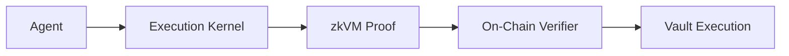

# Execution Kernel

The Execution Kernel is a **consensus-critical, deterministic agent execution framework** for RISC Zero zkVM. It enables verifiable DeFi ML agents that make capital allocation decisions with cryptographic proof of correct execution.

## Quick Navigation

| If you want to... | Start here |
|-------------------|------------|
| **Build an agent in 5 minutes** | [Quickstart](/quickstart) |
| **Understand how it works** | [Architecture Overview](/architecture/overview) |
| **Write a full agent** | [Writing an Agent](/sdk/writing-an-agent) |
| **Set up your dev environment** | [Prerequisites](/getting-started/prerequisites) |
| **Integrate with smart contracts** | [On-Chain Verification](/onchain/verifier-overview) |
| **Understand the binary formats** | [Input Format](/kernel/input-format) |
| **Package an agent for deployment** | [Agent Pack Format](/agent-pack/format) |
| **Audit or review the codebase** | [Repository Map](/reference/repo-map) |

## What is the Execution Kernel?

The Execution Kernel defines what constitutes a **valid agent execution** through zero-knowledge proofs. Capital is held in on-chain vaults that delegate decision-making to agents—programs that analyze market conditions and produce actions like deposits, withdrawals, or trades.



The kernel acts as a **verifiable sandbox**: an agent runs inside the kernel, which runs inside a zkVM. The zkVM produces a proof that:

- The agent executed correctly according to its own code
- The kernel enforced all protocol constraints
- The resulting actions are exactly what the agent decided

## Key Features

### Cryptographic Commitments

Every execution produces a journal containing:

- **Input commitment**: SHA-256 hash of all inputs
- **Action commitment**: SHA-256 hash of all outputs
- **Execution status**: Success or Failure

### Constraint Enforcement

The constraint engine validates agent outputs against safety rules:
- Position size limits
- Leverage bounds
- Asset whitelists
- Cooldown periods

## Quick Start

```bash
# Install the cargo agent CLI
cargo install --path crates/tools/cargo-agent

# Scaffold a new agent
cargo agent new my-agent --template yield

# Run tests
cargo agent test my-agent

# Build with zkVM support
cargo build --release --features risc0
```

## Protocol Constants

| Constant | Value | Description |
|----------|-------|-------------|
| `PROTOCOL_VERSION` | 1 | Wire format version |
| `KERNEL_VERSION` | 1 | Kernel semantics version |
| `MAX_AGENT_INPUT_BYTES` | 64,000 | Maximum input size |
| `MAX_AGENT_OUTPUT_BYTES` | 64,000 | Maximum output size |
| `MAX_ACTIONS_PER_OUTPUT` | 64 | Maximum actions per execution |
| `MAX_ACTION_PAYLOAD_BYTES` | 16,384 | Maximum payload per action |
| `HASH_FUNCTION` | SHA-256 | Commitment hash function |

:::tip Where in the code?
These constants are defined in [`kernel-core/src/lib.rs`](https://github.com/tokamak-network/Tokamak-AI-Layer/blob/master/execution-kernel/crates/protocol/kernel-core/src/lib.rs) and [`kernel-core/src/types.rs`](https://github.com/tokamak-network/Tokamak-AI-Layer/blob/master/execution-kernel/crates/protocol/kernel-core/src/types.rs).
:::

## On-Chain Deployment (Sepolia)

| Contract | Address |
|----------|---------|
| AgentRegistry | [`0xED27f8fbB7D576f02D516d01593eEfBaAfe4b168`](https://sepolia.etherscan.io/address/0xED27f8fbB7D576f02D516d01593eEfBaAfe4b168) |
| VaultFactory | [`0x580e55fDE87fFC1cF1B6a446d6DBf8068EB07b8C`](https://sepolia.etherscan.io/address/0x580e55fDE87fFC1cF1B6a446d6DBf8068EB07b8C) |
| KernelExecutionVerifier | [`0x1eB41537037fB771CBA8Cd088C7c806936325eB5`](https://sepolia.etherscan.io/address/0x1eB41537037fB771CBA8Cd088C7c806936325eB5) |
| RISC Zero Verifier Router | [`0x925d8331ddc0a1F0d96E68CF073DFE1d92b69187`](https://sepolia.etherscan.io/address/0x925d8331ddc0a1F0d96E68CF073DFE1d92b69187) |

Each agent is identified by its **imageId** — a unique hash of the compiled zkVM guest binary that identifies exactly which code will run. The imageId is registered on-chain so that proofs can only be verified against known, auditable agent binaries.

The system is **fully permissionless**: anyone can register agents via `AgentRegistry` and deploy vaults via `VaultFactory`. See [Permissionless System](/onchain/permissionless-system) for details.

## Related

- [Quickstart](/quickstart) - Build an agent in 5 minutes
- [Architecture Overview](/architecture/overview) - Understand the system design
- [Prerequisites](/getting-started/prerequisites) - Set up your development environment
- [Writing an Agent](/sdk/writing-an-agent) - Full agent development guide
- [Cryptographic Chain](/architecture/cryptographic-chain) - How imageId and commitments work
