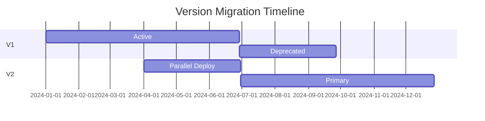

# Protocol and Kernel Versioning

The Execution Kernel uses explicit versioning to ensure compatibility and enable protocol upgrades.

## Version Types

### Protocol Version

The **protocol version** defines the wire format for encoding and decoding structures.

```rust
pub const PROTOCOL_VERSION: u32 = 1;
```

Changes to protocol version indicate:
- Breaking changes to binary encoding
- New or removed fields in structures
- Changed field ordering or sizes

### Kernel Version

The **kernel version** defines the execution semantics.

```rust
pub const KERNEL_VERSION: u32 = 1;
```

Changes to kernel version indicate:
- Changes to execution flow
- New constraint types
- Modified failure handling
- Updated commitment calculations

## Current Versions

| Constant | Value | Description |
|----------|-------|-------------|
| `PROTOCOL_VERSION` | 1 | Wire format version |
| `KERNEL_VERSION` | 1 | Kernel semantics version |

## Version Validation

Both input and journal structures include version fields that are validated during decoding:

```rust
impl KernelInputV1 {
    pub fn decode(bytes: &[u8]) -> Result<Self, CodecError> {
        // ...
        if protocol_version != PROTOCOL_VERSION {
            return Err(CodecError::InvalidVersion {
                expected: PROTOCOL_VERSION,
                actual: protocol_version,
            });
        }
        if kernel_version != KERNEL_VERSION {
            return Err(CodecError::InvalidVersion {
                expected: KERNEL_VERSION,
                actual: kernel_version,
            });
        }
        // ...
    }
}
```

## On-Chain Version Checking

Smart contracts validate versions from the journal:

```solidity
function execute(bytes calldata journal, bytes calldata seal, bytes calldata agentOutput) external {
    KernelOutputParser.ParsedJournal memory parsed = KernelOutputParser.parse(journal);

    require(parsed.protocolVersion == PROTOCOL_VERSION, "Unsupported protocol version");
    require(parsed.kernelVersion == KERNEL_VERSION, "Unsupported kernel version");

    // Continue with verification and execution...
}
```

## SDK Version

The SDK also has its own version for API compatibility:

```rust
pub const SDK_VERSION_MAJOR: u8 = 0;
pub const SDK_VERSION_MINOR: u8 = 1;
pub const SDK_VERSION_PATCH: u8 = 0;

/// Encoded as (major << 16) | (minor << 8) | patch
pub const SDK_VERSION: u32 = 0x00_01_00;

pub const MIN_KERNEL_VERSION: u32 = 1;
pub const MAX_KERNEL_VERSION: u32 = 1;

pub fn is_kernel_version_supported(version: u32) -> bool {
    version >= MIN_KERNEL_VERSION && version <= MAX_KERNEL_VERSION
}
```

## Upgrade Path

### Backwards-Compatible Changes

Changes that don't require version bumps:
- Bug fixes (behavior changes within spec)
- Performance improvements
- New optional fields with defaults

### Breaking Changes

Changes requiring version bumps:
- New required fields
- Changed encoding format
- Modified execution semantics
- New constraint types

### Migration Strategy

When upgrading versions:

1. **Deploy new contracts** with new version support
2. **Register new imageIds** for new kernel versions
3. **Deprecate old versions** by removing from contract
4. **Transition period** allows both versions temporarily



## ImageId and Versioning

The imageId implicitly captures versions because:

1. Kernel version is compiled into the binary
2. Protocol version is embedded in encoding logic
3. Any version change results in a different imageId

This means:
- Old imageIds continue working (if registered)
- New imageIds must be registered for new versions
- On-chain contracts can reject old imageIds

## Best Practices

### For Agent Developers

```rust
// Always check versions in agent_main
pub fn agent_main(ctx: &AgentContext, opaque_inputs: &[u8]) -> AgentOutput {
    if !ctx.is_kernel_v1() {
        // Return empty output for unsupported versions
        return AgentOutput { actions: Vec::new() };
    }
    // ...
}
```

### For Protocol Developers

1. **Bump conservatively** - Only bump versions for true breaking changes
2. **Document changes** - Maintain a changelog for each version
3. **Test migrations** - Ensure smooth transition between versions
4. **Support transition periods** - Allow both old and new versions temporarily

## Related

- [Input Format](/kernel/input-format) - Structure with version fields
- [Journal Format](/kernel/journal-format) - Output structure with version fields
- [Changelog](/reference/changelog) - Version history
