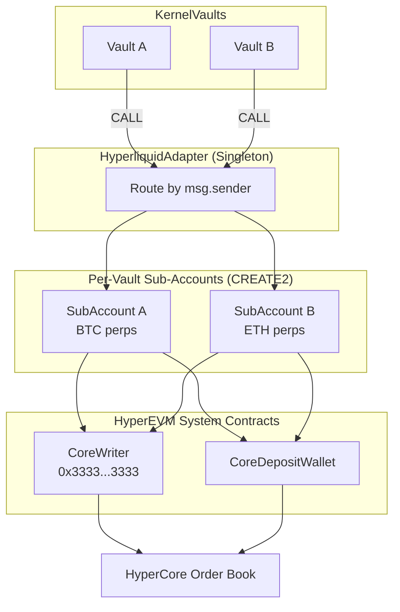

# Hyperliquid Integration

The `HyperliquidAdapter` is a singleton contract deployed on HyperEVM that routes KernelVault CALL actions to Hyperliquid's HyperCore perpetual futures order system. It enables zkVM-verified agents to trade perpetual futures with cryptographic proof of correct execution.

## Architecture

Hyperliquid operates as its own L1 chain with two layers:

- **HyperCore** — The off-chain order book engine (accessed via REST API at `api.hyperliquid.xyz`)
- **HyperEVM** — An EVM-compatible execution layer (Chain ID **999** mainnet, **998** testnet)

The adapter bridges these layers by routing EVM CALL actions to HyperCore via system contracts.



Each vault gets its own `TradingSubAccount` deployed via CREATE2, ensuring **position isolation** — HyperCore positions are per-address, so each vault trades under its own HyperCore identity.

## Deployed Contracts (HyperEVM Mainnet)

| Contract | Address |
|----------|---------|
| HyperliquidAdapter | `0x2e5A60066826551eE71aa3115E236ccE289975E4` |
| USDC (HyperEVM) | `0xb88339CB7199b77E23DB6E890353E22632Ba630f` |
| CoreWriter (System) | `0x3333333333333333333333333333333333333333` |

| System Address | Description |
|----------------|-------------|
| CoreDepositWallet | Queried via Hyperliquid `spotMeta` API (varies per deployment) |
| Perp Position Precompile | `0x0000000000000000000000000000000000000800` |

## Contract Interface

### Registration

#### registerVault

```solidity
function registerVault(address vault, uint32 perpAsset)
    external returns (address subAccount)
```

Registers a vault and deploys its `TradingSubAccount` via CREATE2. Must be called by the vault owner. The vault must have been deployed by the `VaultFactory`.

| Parameter | Type | Description |
|-----------|------|-------------|
| `vault` | `address` | The KernelVault address to register |
| `perpAsset` | `uint32` | Hyperliquid perp asset index (`0` = BTC, `1` = ETH, etc.) |

**Returns:** The deployed `TradingSubAccount` address.

**Access control:** Only the vault owner can register. Reverts with `NotVaultOwner()` if caller is not the vault owner, `VaultNotDeployedByFactory()` if the vault was not deployed by VaultFactory, or `VaultAlreadyRegistered()` if already registered.

### Margin Management

#### depositMargin

```solidity
function depositMargin(uint256 amount) external
```

Deposits USDC from the calling vault into its sub-account's HyperCore perp margin without placing an order. Used to seed the sub-account with initial margin.

| Parameter | Type | Description |
|-----------|------|-------------|
| `amount` | `uint256` | USDC amount to deposit (6-decimal raw units) |

**Access control:** Callable only by a registered vault. The vault must have approved USDC to the adapter.

### Trading Functions

These functions have fixed selectors that the perp-trader zkVM agent emits as CALL actions:

#### openPosition

```solidity
function openPosition(
    bool isBuy,
    uint256 marginAmount,
    uint256 orderSize,
    uint256 limitPrice
) external
```

Opens a perpetual position on Hyperliquid. Pulls USDC margin from the vault, deposits it to HyperCore, and places a GTC (good-til-canceled) limit order.

| Parameter | Type | Description |
|-----------|------|-------------|
| `isBuy` | `bool` | `true` for long, `false` for short |
| `marginAmount` | `uint256` | USDC margin to deposit (raw 6-decimal units, must fit `uint64`) |
| `orderSize` | `uint256` | Position size in base asset units (szDecimals-scaled, must fit `uint64`) |
| `limitPrice` | `uint256` | Limit price in 1e8 scaled units (must fit `uint64`) |

**Selector:** `0x04ba41cb`

:::warning
Order execution on Hyperliquid is **asynchronous**. The `CoreWriter.sendRawAction()` call does not revert on HyperCore-level failures — the order may be rejected by the order book after the EVM transaction finalizes.
:::

#### closePosition

```solidity
function closePosition() external
```

Closes the full position for the calling vault's perpetual asset. Reads the current position via the perp position precompile (`0x0800`) and places a reduce-only IOC (immediate-or-cancel) order at an extreme price.

**Selector:** `0xc393d0e3`

#### withdrawToVault

```solidity
function withdrawToVault() external
```

Withdraws all USDC from the vault's sub-account back to the vault. Called after a position is closed and funds have returned from HyperCore to the sub-account's EVM balance.

**Selector:** `0x84f22721`

### View Functions

#### getSubAccount

```solidity
function getSubAccount(address vault) external view returns (address)
```

Returns the `TradingSubAccount` address for a registered vault, or `address(0)` if not registered.

#### isRegistered

```solidity
function isRegistered(address vault) external view returns (bool)
```

Returns `true` if the vault has been registered with the adapter.

#### getVaultConfig

```solidity
function getVaultConfig(address vault)
    external view returns (VaultConfig memory)
```

Returns the full configuration for a registered vault:

```solidity
struct VaultConfig {
    address subAccount;  // The deployed TradingSubAccount
    uint32 perpAsset;    // The Hyperliquid perp asset index
}
```

#### computeSubAccountAddress

```solidity
function computeSubAccountAddress(address vault, uint32 perpAsset)
    external view returns (address)
```

Computes the deterministic sub-account address for a vault before registration. Useful for pre-computing addresses for front-end display or configuration.

## Usage Flow

### 1. Register Vault with Adapter

After deploying a vault via `VaultFactory`, the vault owner registers it with the adapter:

```bash
# Register vault for BTC perps (asset index 0)
cast send $ADAPTER \
    "registerVault(address,uint32)" \
    $VAULT_ADDRESS 0 \
    --rpc-url https://rpc.hyperliquid.xyz/evm \
    --private-key $PRIVATE_KEY \
    --legacy
```

### 2. Deposit USDC into Vault

```bash
# Approve USDC to vault
cast send $USDC "approve(address,uint256)" $VAULT_ADDRESS 1000000000 \
    --rpc-url https://rpc.hyperliquid.xyz/evm \
    --private-key $PRIVATE_KEY \
    --legacy

# Deposit 1000 USDC into vault
cast send $VAULT_ADDRESS "deposit(uint256)" 1000000000 \
    --rpc-url https://rpc.hyperliquid.xyz/evm \
    --private-key $PRIVATE_KEY \
    --legacy
```

### 3. Seed Sub-Account Margin (Optional)

Before the agent runs, you can pre-deposit margin so the sub-account has equity visible on HyperCore:

```bash
# Approve USDC from vault to adapter
cast send $VAULT_ADDRESS \
    "approveERC20(address,address,uint256)" \
    $USDC $ADAPTER 500000000 \
    --rpc-url https://rpc.hyperliquid.xyz/evm \
    --private-key $PRIVATE_KEY \
    --legacy

# Deposit 500 USDC margin to sub-account
cast send $ADAPTER "depositMargin(uint256)" 500000000 \
    --rpc-url https://rpc.hyperliquid.xyz/evm \
    --private-key $PRIVATE_KEY \
    --legacy
```

### 4. Agent Execution (zkVM-Verified)

The agent runs inside the zkVM and produces CALL actions targeting the adapter. The host submits the proof to the vault:

```bash
cargo run -p perp-trader-host --features full -- \
    --vault $VAULT_ADDRESS \
    --rpc https://rpc.hyperliquid.xyz/evm \
    --pk env:PRIVATE_KEY \
    --oracle-key env:ORACLE_KEY \
    --bundle ./crates/agents/perp-trader/bundle \
    --hl-url https://api.hyperliquid.xyz \
    --sub-account $SUB_ACCOUNT \
    --exchange-contract $ADAPTER \
    --usdc-address $USDC
```

The vault verifies the proof, then executes the agent's actions which route through the adapter:

```
Vault.execute() → CALL adapter.openPosition(...)
                → Adapter pulls USDC from vault to sub-account
                → Sub-account deposits margin to HyperCore
                → Sub-account places order via CoreWriter
```

### 5. Close Position and Withdraw

When the agent decides to close, it emits `closePosition()` and `withdrawToVault()` actions:

```
Vault.execute() → CALL adapter.closePosition()
                → Sub-account reads position via precompile
                → Sub-account places reduce-only IOC order

# After HyperCore settles and funds return to sub-account EVM balance:

Vault.execute() → CALL adapter.withdrawToVault()
                → Sub-account transfers USDC back to vault
```

## TradingSubAccount Details

Each sub-account is an isolated contract deployed per-vault via CREATE2. It interacts directly with HyperEVM system contracts.

### System Contract Interaction

| Contract | Address | Purpose |
|----------|---------|---------|
| CoreWriter | `0x3333333333333333333333333333333333333333` | Submit orders to HyperCore |
| CoreDepositWallet | Deployment-specific | Deposit USDC from EVM to HyperCore margin |
| Perp Position Precompile | `0x0000000000000000000000000000000000000800` | Read position state from HyperCore |

### CoreWriter Encoding

Orders are packed into a binary format for `CoreWriter.sendRawAction()`:

```
[0x01 version][3-byte action ID big-endian][abi.encode(asset, isBuy, px, sz, reduceOnly, tif, cloid)]
```

- Action ID `1` = limit order
- TIF `2` = GTC (good-til-canceled), used for opening positions
- TIF `3` = IOC (immediate-or-cancel), used for closing positions

### Position Reading

The sub-account reads its HyperCore position via a precompile staticcall:

```solidity
(bool success, bytes memory result) = 0x0800.staticcall(
    abi.encode(address(this), uint16(perpAsset))
);
// Returns: (int64 szi, uint32 leverage, uint64 entryNtl)
```

- `szi > 0` → long position
- `szi < 0` → short position
- `szi == 0` → no position

## Security Considerations

### Access Control

- Only the **vault owner** can call `registerVault()`
- Only **registered vaults** can call `openPosition()`, `closePosition()`, `withdrawToVault()`, and `depositMargin()`
- Only the **adapter** can call execution functions on `TradingSubAccount`
- All state-changing functions are protected by `ReentrancyGuard`

### Asynchronous Settlement

CoreWriter does **not revert** on HyperCore-level failures. An order may be rejected by the order book (insufficient margin, price out of range, etc.) without the EVM transaction reverting. Agents should check position state on subsequent executions to verify orders were filled.

### HyperEVM Gas

HyperEVM does not support EIP-1559 gas pricing. Always use the `--legacy` flag with `forge` and `cast` commands. The block gas limit is 3M, which affects contract deployment (deploy vaults via factory `cast send`, not forge scripts).

### USDC Bridging

USDC on HyperEVM is bridged from Arbitrum One:

1. Hold native USDC on Arbitrum One (`0xaf88d065e77c8cC2239327C5EDb3A432268e5831`)
2. Send to the Hyperliquid bridge: `0x2df1c51e09aecf9cacb7bc98cb1742757f163df7` on Arbitrum
3. Funds arrive on Hyperliquid within ~1 minute (minimum 5 USDC)
4. Transfer from HyperCore to HyperEVM via the Hyperliquid UI or API

## Related

- [Verifier Overview](/onchain/verifier-overview) — Core contract architecture and deployed addresses
- [Permissionless System](/onchain/permissionless-system) — Agent registration and vault deployment
- [Security Considerations](/onchain/security-considerations) — Trust model and attack vectors
