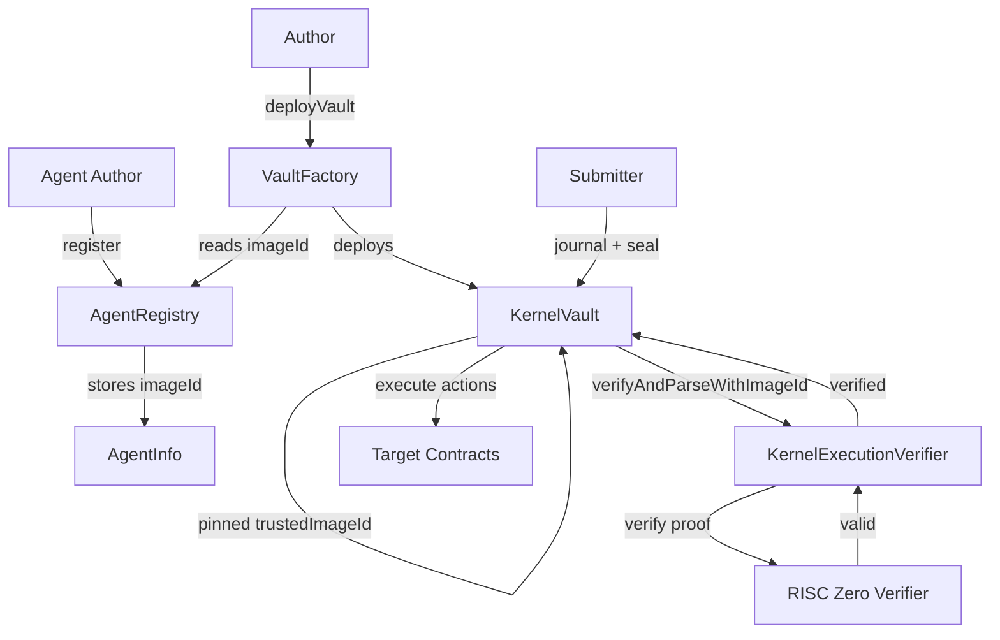
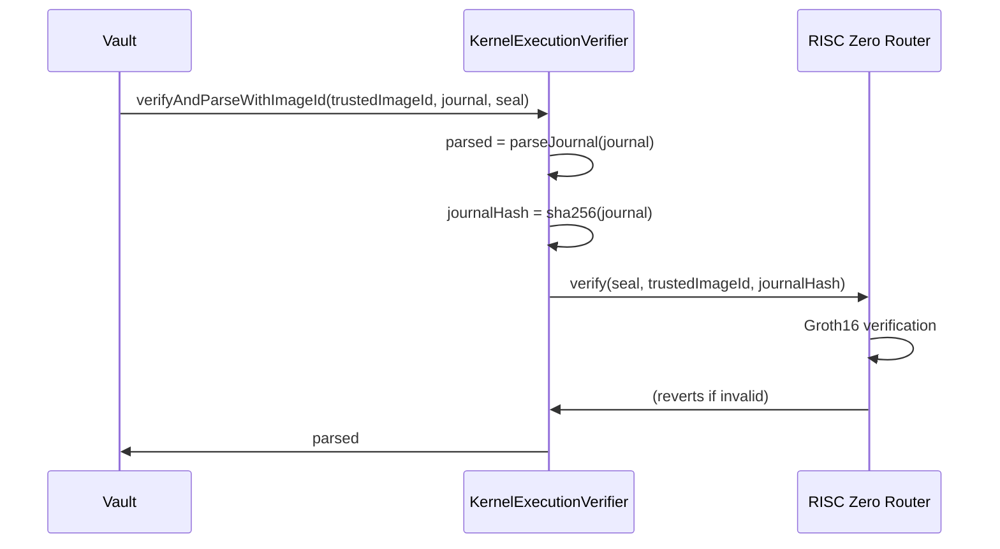

# On-Chain Verifier Overview

The `KernelExecutionVerifier` contract validates zkVM proofs on-chain. Combined with `AgentRegistry` and `VaultFactory`, it enables fully permissionless agent execution. This page covers the contract architecture and key functions. For integration examples (custom vaults, Foundry tests, `cast` commands), see [Solidity Integration](/onchain/solidity-integration).

## Architecture



## Deployed Contracts

### Ethereum Mainnet

| Contract | Address |
|----------|---------|
| AgentRegistry | [`0xFa0AAEe4482C7901653855F591B832E7E8a20727`](https://etherscan.io/address/0xFa0AAEe4482C7901653855F591B832E7E8a20727) |
| VaultFactory | [`0x9cF9828Fd6253Df7C9497fd06Fa531E0CCc1d822`](https://etherscan.io/address/0x9cF9828Fd6253Df7C9497fd06Fa531E0CCc1d822) |
| KernelExecutionVerifier | [`0xAf58D2191772bcFFB3260F5140E995ec79e4d88B`](https://etherscan.io/address/0xAf58D2191772bcFFB3260F5140E995ec79e4d88B) |
| RISC Zero Verifier Router | [`0x8EaB2D97Dfce405A1692a21b3ff3A172d593D319`](https://etherscan.io/address/0x8EaB2D97Dfce405A1692a21b3ff3A172d593D319) |

### HyperEVM Mainnet (Chain ID: 999)

| Contract | Address |
|----------|---------|
| AgentRegistry | `0xAf58D2191772bcFFB3260F5140E995ec79e4d88B` |
| VaultFactory | `0xc7Fc0dD5f1B03E3De0C313eE0D3b06Cb2Dc017BB` |
| KernelExecutionVerifier | `0xDc9d9A78676C600E7Ca55a8D0c63da9462Acfe30` |
| RISC Zero Verifier Router | `0x9f8d4D1f7AAf06aab1640abd565A731399862Bc8` |
| HyperliquidAdapter | `0xE6130FF36F1eEf239a910F025004954Ee2E37632` |

See [Hyperliquid Integration](/onchain/hyperliquid-integration) for details on the adapter and sub-account architecture.

### Ethereum Sepolia (Testnet)

| Contract | Address |
|----------|---------|
| AgentRegistry | [`0xED27f8fbB7D576f02D516d01593eEfBaAfe4b168`](https://sepolia.etherscan.io/address/0xED27f8fbB7D576f02D516d01593eEfBaAfe4b168) |
| VaultFactory | [`0x580e55fDE87fFC1cF1B6a446d6DBf8068EB07b8C`](https://sepolia.etherscan.io/address/0x580e55fDE87fFC1cF1B6a446d6DBf8068EB07b8C) |
| KernelExecutionVerifier | [`0x1eB41537037fB771CBA8Cd088C7c806936325eB5`](https://sepolia.etherscan.io/address/0x1eB41537037fB771CBA8Cd088C7c806936325eB5) |
| RISC Zero Verifier Router | [`0x925d8331ddc0a1F0d96E68CF073DFE1d92b69187`](https://sepolia.etherscan.io/address/0x925d8331ddc0a1F0d96E68CF073DFE1d92b69187) |

## AgentRegistry

Permissionless registry for agent registration with deterministic IDs.

### Key Functions

#### register

```solidity
function register(
    bytes32 salt,
    bytes32 imageId,
    bytes32 agentCodeHash,
    string calldata metadataURI
) external returns (bytes32 agentId)
```

Registers a new agent. The `agentId` is computed deterministically:

```solidity
agentId = keccak256(abi.encodePacked(msg.sender, salt))
```

#### update

```solidity
function update(
    bytes32 agentId,
    bytes32 newImageId,
    bytes32 newAgentCodeHash,
    string calldata newMetadataURI
) external
```

Updates an agent's configuration. Only the original author can call this.

:::warning
Updating the registry does NOT affect existing vaults. Vaults pin their imageId at deployment time.
:::

## VaultFactory

CREATE2 factory for deploying vaults with pinned imageId.

### Key Functions

#### deployVault

```solidity
function deployVault(
    bytes32 agentId,
    address asset,
    bytes32 userSalt
) external returns (address vault)
```

Deploys a new vault with the imageId pinned from the registry at deployment time. Only the agent author can deploy vaults for their agent.

#### computeVaultAddress

```solidity
function computeVaultAddress(
    address owner,
    bytes32 agentId,
    address asset,
    bytes32 userSalt
) external view returns (address vault, bytes32 salt)
```

Computes the deterministic vault address before deployment.

## KernelExecutionVerifier

Stateless verifier that validates zkVM proofs with caller-provided imageId.

### Key Functions

#### verifyAndParseWithImageId

```solidity
function verifyAndParseWithImageId(
    bytes32 expectedImageId,
    bytes calldata journal,
    bytes calldata seal
) external view returns (ParsedJournal memory)
```

Verifies a proof and parses the journal:

1. Validates expectedImageId is not zero
2. Parses the 209-byte journal
3. Computes journal hash: `sha256(journal)`
4. Calls RISC Zero verifier with seal, imageId, and journal hash
5. Returns parsed journal if valid

### Verification Flow



## KernelVault

The vault holds capital and executes agent actions after verification.

### State Variables

```solidity
// Verifier contract reference
IKernelExecutionVerifier public immutable verifier;

// Pinned imageId (immutable after deployment)
bytes32 public immutable trustedImageId;

// Bound agent
bytes32 public immutable agentId;

// Replay protection
uint64 public lastExecutionNonce;
```

### execute Function

```solidity
function execute(
    bytes calldata journal,
    bytes calldata seal,
    bytes calldata agentOutput
) external
```

1. Calls `verifier.verifyAndParseWithImageId(trustedImageId, journal, seal)`
2. Validates execution status is Success
3. Validates nonce is greater than lastExecutionNonce (with gap limit)
4. Validates agentId matches bound agent
5. Verifies action commitment matches `sha256(agentOutput)`
6. Parses and executes actions atomically
7. Updates lastExecutionNonce

### Action Execution

```solidity
function _executeAction(Action memory action) internal {
    if (action.actionType == ACTION_TYPE_CALL) {
        _executeCall(action);
    } else if (action.actionType == ACTION_TYPE_TRANSFER_ERC20) {
        _executeTransferERC20(action);
    } else {
        revert UnknownActionType(action.actionType);
    }
}
```

## Complete Flow Example

### 1. Register Agent

```bash
# Get imageId from your RISC Zero build
export IMAGE_ID=0x1234...
export CODE_HASH=0xabcd...

# Register via cast
cast send $AGENT_REGISTRY \
    "register(bytes32,bytes32,bytes32,string)" \
    0x0000000000000000000000000000000000000000000000000000000000000001 \
    $IMAGE_ID $CODE_HASH "ipfs://QmMetadata" \
    --private-key $PRIVATE_KEY --rpc-url $RPC_URL
```

### 2. Deploy Vault

```bash
export AGENT_ID=<returned from register>

# Deploy vault for USDC
cast send $VAULT_FACTORY \
    "deployVault(bytes32,address,bytes32)" \
    $AGENT_ID $USDC_ADDRESS 0x0 \
    --private-key $PRIVATE_KEY --rpc-url $RPC_URL
```

### 3. Execute with Proof

```bash
# Submit proof to vault
cast send $VAULT_ADDRESS \
    "execute(bytes,bytes,bytes)" \
    $JOURNAL $SEAL $AGENT_OUTPUT \
    --private-key $PRIVATE_KEY --rpc-url $RPC_URL
```

## Gas Costs

Typical gas consumption:

| Operation | Gas |
|-----------|-----|
| Agent registration | ~130,000 |
| Vault deployment | ~1,700,000 |
| Groth16 verification | ~300,000 |
| Journal parsing | ~20,000 |
| Action execution | Variable |
| Total execute() | ~400,000 - 500,000 |

## Related

- [Permissionless System](/onchain/permissionless-system) - Detailed design and security model
- [Solidity Integration](/onchain/solidity-integration) - Integration details
- [Security Considerations](/onchain/security-considerations) - Trust assumptions
