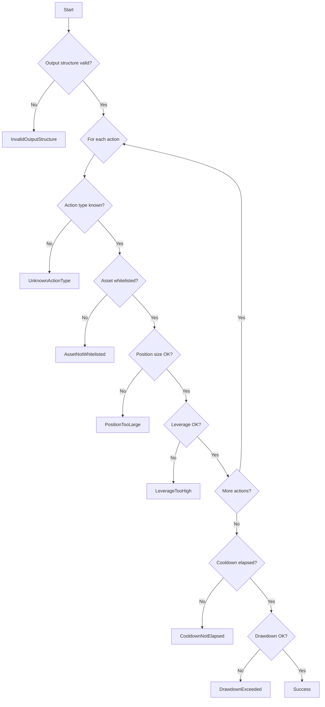

# Constraints and Commitments

The constraint system validates agent-proposed actions against economic safety rules. This document explains how constraints work and how commitments are computed.

## Constraint System Overview

Key properties of the constraint system:

1. **Unskippable**: Constraints are enforced after every agent execution
2. **Deterministic**: Same inputs always produce same validation results
3. **Provable**: Constraint violations result in a valid proof with Failure status
4. **Auditable**: Clear error codes identify which constraint was violated

## ConstraintSetV1

The constraint set defines economic safety parameters:

```rust
pub struct ConstraintSetV1 {
    pub version: u32,
    pub max_position_notional: u64,
    pub max_leverage_bps: u32,
    pub max_drawdown_bps: u32,
    pub cooldown_seconds: u32,
    pub max_actions_per_output: u32,
    pub allowed_asset_id: [u8; 32],
}
```

### Field Descriptions

| Field | Type | Description |
|-------|------|-------------|
| `version` | u32 | Must be 1 |
| `max_position_notional` | u64 | Maximum position size |
| `max_leverage_bps` | u32 | Maximum leverage in basis points (10000 = 1x) |
| `max_drawdown_bps` | u32 | Maximum drawdown in basis points |
| `cooldown_seconds` | u32 | Minimum seconds between executions |
| `max_actions_per_output` | u32 | Maximum actions per output (≤ 64) |
| `allowed_asset_id` | [u8; 32] | Single allowed asset ([0; 32] = all allowed) |

### Default Constraint Set

```rust
ConstraintSetV1 {
    version: 1,
    max_position_notional: u64::MAX,  // No position size limit
    max_leverage_bps: 100_000,        // 10x max leverage
    max_drawdown_bps: 10_000,         // 100% drawdown allowed (disabled)
    cooldown_seconds: 0,              // No cooldown
    max_actions_per_output: 64,       // Match protocol max
    allowed_asset_id: [0u8; 32],      // Zero = all assets allowed
}
```

## Constraint Evaluation Order

Constraints are evaluated in deterministic order:



Evaluation stops at the first violation.

## Violation Reason Codes

| Code | Name | Description |
|------|------|-------------|
| 0x01 | `InvalidOutputStructure` | Too many actions or payload too large |
| 0x02 | `UnknownActionType` | Action type not recognized |
| 0x03 | `AssetNotWhitelisted` | Asset not in allowed list |
| 0x04 | `PositionTooLarge` | Position exceeds size limit |
| 0x05 | `LeverageTooHigh` | Leverage exceeds limit |
| 0x06 | `DrawdownExceeded` | Portfolio drawdown too high |
| 0x07 | `CooldownNotElapsed` | Too soon since last execution |
| 0x08 | `InvalidStateSnapshot` | Snapshot malformed or invalid |
| 0x09 | `InvalidConstraintSet` | Constraint configuration invalid |
| 0x0A | `InvalidActionPayload` | Payload doesn't match schema |

## Failure Semantics

When a constraint is violated:

1. `execution_status` is set to `Failure` (0x02)
2. `action_commitment` is computed over empty AgentOutput
3. A valid `KernelJournalV1` is still produced
4. Proof is valid, but verifiers should reject state transitions

```rust
// On constraint failure
let empty_output = AgentOutput { actions: vec![] };
let empty_encoded = empty_output.encode()?;  // [0x00, 0x00, 0x00, 0x00]
let action_commitment = sha256(&empty_encoded);
// = df3f619804a92fdb4057192dc43dd748ea778adc52bc498ce80524c014b81119
```

## State Snapshot

For cooldown and drawdown constraints, a state snapshot is required:

```
Offset │ Field                │ Type   │ Size
───────┼──────────────────────┼────────┼──────
0      │ snapshot_version     │ u32    │ 4
4      │ last_execution_ts    │ u64    │ 8
12     │ current_ts           │ u64    │ 8
20     │ current_equity       │ u64    │ 8
28     │ peak_equity          │ u64    │ 8
```

The snapshot is decoded from the first 36 bytes of `opaque_agent_inputs`.

### Snapshot Rules

```
IF snapshot is missing AND (cooldown_seconds > 0 OR max_drawdown_bps < 10_000):
    Violation: InvalidStateSnapshot (0x08)
ELSE IF snapshot is missing:
    Snapshot is considered empty; global checks are skipped
```

## Commitment Computation

### Input Commitment

```rust
input_commitment = SHA-256(encoded_kernel_input_v1)
```

Computed over the entire encoded KernelInputV1 bytes.

### Action Commitment

```rust
// On success
action_commitment = SHA-256(encoded_agent_output)

// On failure
action_commitment = SHA-256([0x00, 0x00, 0x00, 0x00])
                  = df3f619804a92fdb4057192dc43dd748ea778adc52bc498ce80524c014b81119
```

### Canonicalization

Actions are sorted before encoding:

1. Primary: `action_type` (ascending)
2. Secondary: `target` (lexicographic)
3. Tertiary: `payload` (lexicographic)

This ensures identical outputs regardless of action order.

## Supported Action Types

For protocol v1, only on-chain executable action types are supported:

| Code | Name | Payload Size | Description |
|------|------|--------------|-------------|
| 0x00000002 | CALL | Variable (≥96 bytes) | Generic contract call |
| 0x00000003 | TRANSFER_ERC20 | 96 bytes | ERC20 token transfer |
| 0x00000004 | NO_OP | 0 bytes | No operation (skipped) |

Testing-only (not executable on-chain):

| Code | Name | Payload Size | Description |
|------|------|--------------|-------------|
| 0x00000001 | ECHO | Variable | Test/debug action |

Higher-level strategy concepts (e.g., "open position", "swap") are agent abstractions that must be compiled down to `CALL` or `TRANSFER_ERC20` actions.

### Payload Schemas

**CALL** (`ACTION_TYPE_CALL = 0x00000002`):

Payload is ABI-encoded as `abi.encode(uint256 value, bytes callData)`:

```
Offset │ Field         │ Type          │ Size
───────┼───────────────┼───────────────┼──────
0      │ value         │ uint256       │ 32
32     │ offset        │ uint256       │ 32 (always 64)
64     │ calldata_len  │ uint256       │ 32
96     │ calldata      │ bytes         │ variable (32-byte aligned)
```

Target format: bytes32 with EVM address left-padded (upper 12 bytes = 0x00, lower 20 bytes = address).

On-chain execution: `target.call{value: value}(callData)`

**TRANSFER_ERC20** (`ACTION_TYPE_TRANSFER_ERC20 = 0x00000003`):

Payload is ABI-encoded as `abi.encode(address token, address to, uint256 amount)`:

```
Offset │ Field         │ Type          │ Size
───────┼───────────────┼───────────────┼──────
0      │ token         │ address       │ 32 (left-padded)
32     │ to            │ address       │ 32 (left-padded)
64     │ amount        │ uint256       │ 32
```

Target: unused (set to zero).

On-chain execution: `IERC20(token).transfer(to, amount)`

**NO_OP** (`ACTION_TYPE_NO_OP = 0x00000004`):

Payload must be empty (0 bytes). Skipped during on-chain execution.

## Integration with Agent Development

### SDK vs Constraint Engine Responsibilities

| Responsibility | SDK | Constraint Engine |
|----------------|-----|-------------------|
| Payload encoding | ✅ Canonical constructors | - |
| Payload decoding | ✅ Structural validation | - |
| Direction validation | ❌ (debug assert only) | ✅ Enforced |
| Leverage bounds | ❌ | ✅ Enforced |
| Position size limits | ❌ | ✅ Enforced |
| Asset whitelist | ❌ | ✅ Enforced |
| Cooldown timing | ❌ | ✅ Enforced |
| Drawdown limits | ❌ | ✅ Enforced |

### Handling Constraint Failures in Agents

Since constraint checking is unskippable, agents should:

1. Understand the active constraint set
2. Avoid obviously invalid actions
3. Handle failure gracefully (empty output)

```rust
pub fn agent_main(ctx: &AgentContext, opaque_inputs: &[u8]) -> AgentOutput {
    // Parse inputs and check constraints are satisfiable
    let amount = parse_amount(opaque_inputs)?;

    // If we know constraints will fail, return empty
    if amount > KNOWN_MAX_POSITION {
        return AgentOutput { actions: Vec::new() };
    }

    // Proceed with action creation
    // ...
}
```

## Related

- [Input Format](/kernel/input-format) - Where constraint_set_hash comes from
- [Journal Format](/kernel/journal-format) - How execution status is reported
- [Testing](/sdk/testing) - Testing constraint behavior
