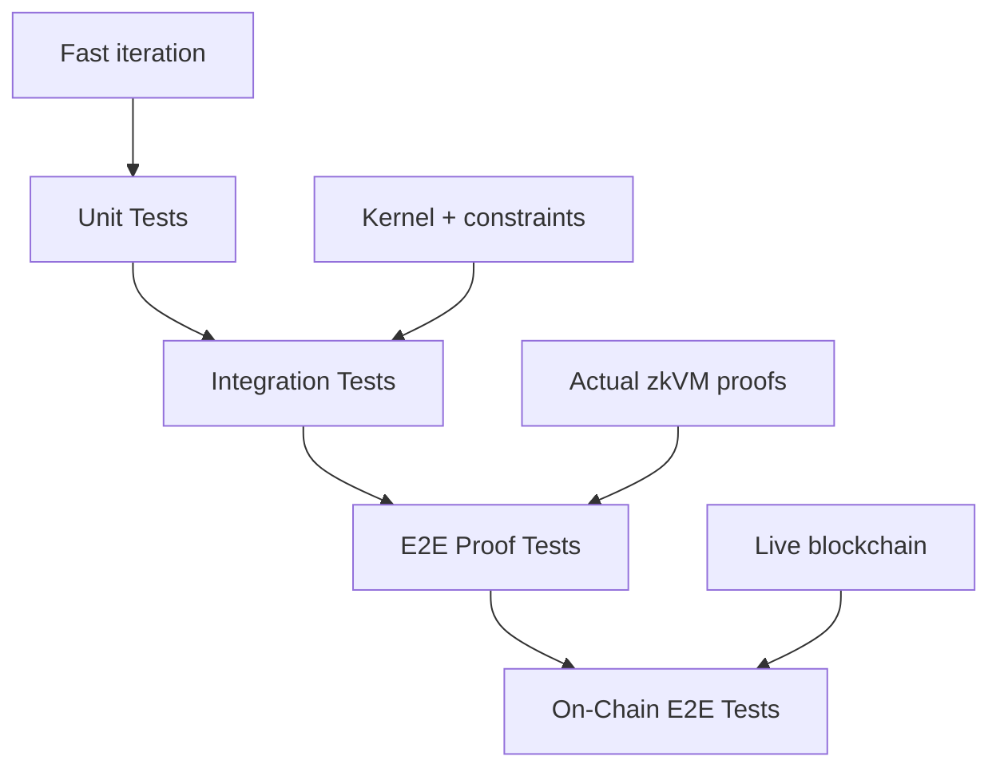

# Testing Agents

Testing happens at multiple levels, from fast unit tests to full on-chain E2E tests. The SDK provides `TestHarness`, `ContextBuilder`, and hex helpers to reduce boilerplate.

## Testing Levels



| Level | Speed | What It Tests |
|-------|-------|---------------|
| Unit Tests | Seconds | Agent logic only |
| Integration Tests | Seconds | Kernel + agent + constraints |
| E2E Proof Tests | Minutes | Full zkVM proof generation |
| On-Chain E2E | Minutes | Complete flow with blockchain |

## TestHarness

The `TestHarness` provides a fluent API for testing agents with minimal boilerplate:

```rust
use kernel_sdk::testing::*;
use kernel_sdk::prelude::*;

#[test]
fn test_my_agent() {
    let result = TestHarness::new()
        .agent_id(bytes32("0x42"))
        .input(my_input.encode())
        .execute(agent_main);

    result.assert_action_count(1);
    result.assert_action_type(0, ACTION_TYPE_CALL);
}
```

### Configuration Methods

| Method | Description | Default |
|--------|-------------|---------|
| `.agent_id([u8; 32])` | Set agent ID | `[0x42; 32]` |
| `.code_hash([u8; 32])` | Set agent code hash | `[0; 32]` |
| `.nonce(u64)` | Set execution nonce | `1` |
| `.input_root([u8; 32])` | Set input root | `[0; 32]` |
| `.input(impl AsRef<[u8]>)` | Set opaque input bytes | `[]` |

### Execution Methods

| Method | Returns | Tests |
|--------|---------|-------|
| `.execute(agent_fn)` | `TestResult` | Agent logic only |
| `.execute_kernel(kernel_fn)` | `KernelTestResult` | Full kernel pipeline |
| `.execute_kernel_with_constraints(fn, &cs)` | `KernelTestResult` | Kernel + custom constraints |

## Hex Helpers

Convert hex strings to byte arrays for test inputs:

```rust
use kernel_sdk::testing::*;

// 20-byte address
let pool = addr("0x1111111111111111111111111111111111111111");

// 32-byte ID
let id = bytes32("0x4242424242424242424242424242424242424242424242424242424242424242");

// Arbitrary bytes
let data = hex_bytes("0xDEADBEEF");
```

Short inputs are right-padded with zeros:

```rust
let a = addr("0xABCD");       // [0xAB, 0xCD, 0, 0, ..., 0] (20 bytes)
let b = bytes32("0xFF");      // [0xFF, 0, 0, ..., 0] (32 bytes)
```

## TestResult Assertions

For `TestHarness::execute()` (agent-level):

| Method | Description |
|--------|-------------|
| `assert_action_count(n)` | Exact number of actions |
| `assert_action_type(index, type)` | Action type at position |
| `assert_target(index, &[u8; 20])` | Action target address |
| `assert_payload(index, &[u8])` | Raw payload bytes |
| `assert_empty()` | No actions produced |
| `assert_deterministic(agent_fn)` | Re-runs and asserts identical output |

Inspectors:

| Method | Returns |
|--------|---------|
| `action_count()` | `usize` |
| `action(index)` | `&ActionV1` |
| `is_empty()` | `bool` |
| `actions_of_type(type)` | `Vec<&ActionV1>` |

## KernelTestResult Assertions

For `TestHarness::execute_kernel()` (kernel-level):

| Method | Description |
|--------|-------------|
| `assert_success()` | Execution status is Success |
| `assert_failure()` | Execution status is Failure |
| `assert_deterministic(kernel_fn)` | Re-runs and asserts identical journal |
| `assert_agent_id(&[u8; 32])` | Agent ID in journal matches |
| `assert_nonce(u64)` | Nonce in journal matches |

## ContextBuilder

For fine-grained control over the `AgentContext`:

```rust
use kernel_sdk::testing::ContextBuilder;

let ctx = ContextBuilder::new()
    .agent_id([0xAA; 32])
    .code_hash([0xBB; 32])
    .nonce(42)
    .input_root([0xCC; 32])
    .constraint_set_hash([0xDD; 32])
    .build();
```

Defaults: `protocol_version=1`, `kernel_version=1`, `agent_id=[0x42; 32]`, `nonce=1`.

## Unit Tests

Test `agent_main` directly using `TestHarness`:

```rust
#[cfg(test)]
mod tests {
    use super::*;
    use kernel_sdk::testing::*;

    #[test]
    fn test_supply_when_rate_above_threshold() {
        let mut input = Vec::with_capacity(MarketInput::ENCODED_SIZE);
        input.extend_from_slice(&[0x11; 20]); // lending_pool
        input.extend_from_slice(&[0x22; 20]); // asset_token
        input.extend_from_slice(&[0x33; 20]); // vault_address
        input.extend_from_slice(&1_000_000u64.to_le_bytes());
        input.extend_from_slice(&0u64.to_le_bytes());
        input.extend_from_slice(&500u32.to_le_bytes());   // rate above threshold
        input.extend_from_slice(&200u32.to_le_bytes());
        input.extend_from_slice(&8000u32.to_le_bytes());
        input.push(0); // evaluate

        let result = TestHarness::new()
            .input(input)
            .execute(agent_main);

        result.assert_action_count(1);
        result.assert_action_type(0, ACTION_TYPE_CALL);
    }

    #[test]
    fn test_invalid_input_returns_empty() {
        let result = TestHarness::new()
            .input(&[0u8; 10])
            .execute(agent_main);

        result.assert_empty();
    }

    #[test]
    fn test_determinism() {
        let result = TestHarness::new()
            .input(valid_input_bytes())
            .execute(agent_main);

        result.assert_deterministic(agent_main);
    }
}
```

Run unit tests:

```bash
cargo agent test my-agent
```

## Integration Tests

Test through the kernel using `execute_kernel`:

```rust
use my_agent::kernel_main;

#[test]
fn test_kernel_execution_success() {
    let result = TestHarness::new()
        .agent_id([0x42; 32])
        .input(valid_input_bytes())
        .execute_kernel(kernel_main);

    result.assert_success();
    result.assert_agent_id(&[0x42; 32]);
    result.assert_nonce(1);
}

#[test]
fn test_kernel_determinism() {
    let result = TestHarness::new()
        .input(valid_input_bytes())
        .execute_kernel(kernel_main);

    result.assert_deterministic(kernel_main);
}
```

Run integration tests:

```bash
cargo test -p kernel-host-tests
```

## Snapshot Testing

With the `std` feature, `TestResult` and `KernelTestResult` support snapshot testing:

```rust
#[test]
fn test_output_snapshot() {
    let result = TestHarness::new()
        .input(canonical_input())
        .execute(agent_main);

    result.assert_snapshot("defi_farmer_supply");
}
```

Snapshots are saved to `tests/snapshots/<name>.snap`. Update with:

```bash
BLESS=1 cargo test test_output_snapshot
```

## CI Integration

```yaml
jobs:
  test:
    runs-on: ubuntu-latest
    steps:
      - uses: actions/checkout@v4
      - name: Run unit tests
        run: cargo test
      - name: Run E2E proof tests
        if: ${{ matrix.risc0-enabled }}
        run: |
          cargo risczero install
          cargo test -p e2e-tests --features risc0-e2e -- --nocapture
```

## Related

- [`agent_input!` Macro](/sdk/agent-input-macro) - Declarative input parsing
- [CallBuilder & ERC20 Helpers](/sdk/call-builder) - Action construction
- [Constraints](/sdk/constraints-and-commitments) - Constraint system details
- [Run an Example](/getting-started/run-an-example) - Running the yield agent
