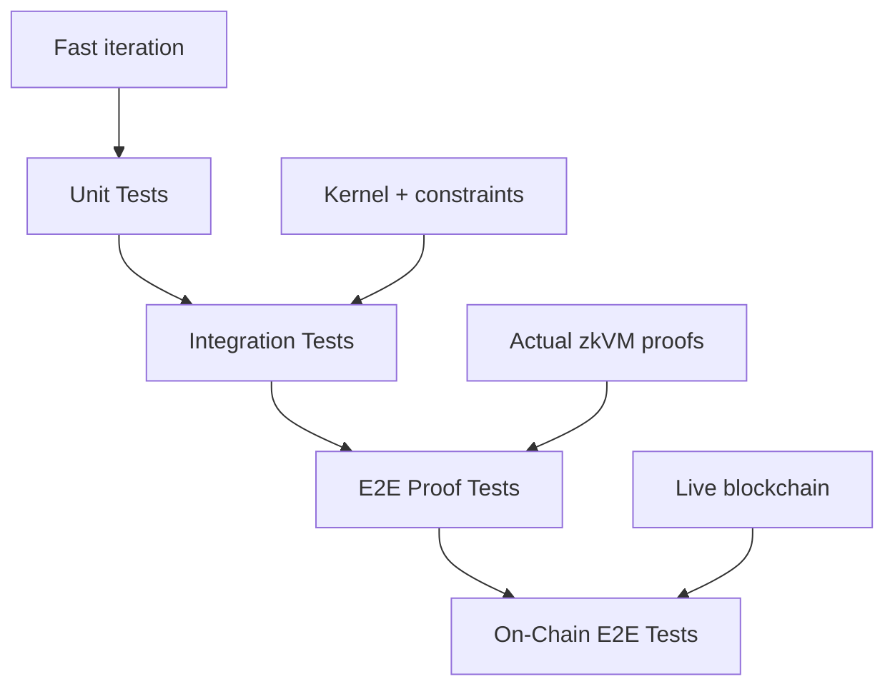

# Testing Agents

Testing happens at multiple levels, from fast unit tests to full on-chain E2E tests. This guide explains each level and how to use them effectively.

## Testing Levels



| Level | Speed | What It Tests |
|-------|-------|---------------|
| Unit Tests | Seconds | Agent logic only |
| Integration Tests | Seconds | Kernel + agent + constraints |
| E2E Proof Tests | Minutes | Full zkVM proof generation |
| On-Chain E2E | Minutes | Complete flow with blockchain |

## Unit Tests

Test `agent_main` directly without the kernel:

```rust
#[cfg(test)]
mod tests {
    use super::*;
    use kernel_sdk::prelude::*;

    fn make_test_context() -> AgentContext<'static> {
        static AGENT_ID: [u8; 32] = [0x01; 32];
        static CODE_HASH: [u8; 32] = [0x02; 32];
        static CONSTRAINT_HASH: [u8; 32] = [0x03; 32];
        static INPUT_ROOT: [u8; 32] = [0x04; 32];

        AgentContext {
            protocol_version: 1,
            kernel_version: 1,
            agent_id: &AGENT_ID,
            agent_code_hash: &CODE_HASH,
            constraint_set_hash: &CONSTRAINT_HASH,
            input_root: &INPUT_ROOT,
            execution_nonce: 1,
            opaque_inputs: &[],
        }
    }

    #[test]
    fn test_empty_input_returns_empty_output() {
        let ctx = make_test_context();
        let output = agent_main(&ctx, &[]);
        assert!(output.actions.is_empty());
    }

    #[test]
    fn test_valid_input_produces_action() {
        let ctx = make_test_context();
        let input = create_valid_input();
        let output = agent_main(&ctx, &input);
        assert_eq!(output.actions.len(), 1);
        assert_eq!(output.actions[0].action_type, ACTION_TYPE_CALL);
    }

    #[test]
    fn test_invalid_input_returns_empty() {
        let ctx = make_test_context();
        let invalid_input = &[0x00; 10];  // Too short
        let output = agent_main(&ctx, invalid_input);
        assert!(output.actions.is_empty());
    }
}
```

Run unit tests:

```bash
cargo test -p my-agent
```

## Integration Tests

Test the agent through the kernel (without zkVM):

```rust
#[cfg(test)]
mod integration_tests {
    use kernel_core::*;
    use kernel_guest_binding_myagent::kernel_main;

    #[test]
    fn test_kernel_execution_success() {
        let input = KernelInputV1 {
            protocol_version: PROTOCOL_VERSION,
            kernel_version: KERNEL_VERSION,
            agent_id: [0x01; 32],
            agent_code_hash: my_agent::AGENT_CODE_HASH,
            constraint_set_hash: [0x00; 32],
            input_root: [0x00; 32],
            execution_nonce: 1,
            opaque_agent_inputs: create_valid_input(),
        };

        let journal_bytes = kernel_main(&input.encode().unwrap()).unwrap();
        let journal = KernelJournalV1::decode(&journal_bytes).unwrap();

        assert_eq!(journal.execution_status, ExecutionStatus::Success);
    }

    #[test]
    fn test_agent_code_hash_mismatch_fails() {
        let input = KernelInputV1 {
            protocol_version: PROTOCOL_VERSION,
            kernel_version: KERNEL_VERSION,
            agent_id: [0x01; 32],
            agent_code_hash: [0x00; 32],  // Wrong hash!
            constraint_set_hash: [0x00; 32],
            input_root: [0x00; 32],
            execution_nonce: 1,
            opaque_agent_inputs: vec![],
        };

        let result = kernel_main(&input.encode().unwrap());
        assert!(result.is_err());
    }

    #[test]
    fn test_constraint_violation_produces_failure() {
        // Test with constraints that will fail
        let input = KernelInputV1 {
            // ... setup with constraint-violating output
        };

        let journal_bytes = kernel_main(&input.encode().unwrap()).unwrap();
        let journal = KernelJournalV1::decode(&journal_bytes).unwrap();

        assert_eq!(journal.execution_status, ExecutionStatus::Failure);
        assert_eq!(journal.action_commitment, EMPTY_OUTPUT_COMMITMENT);
    }
}
```

Run integration tests:

```bash
cargo test -p kernel-host-tests
```

## E2E Proof Tests

Generate actual zkVM proofs:

```rust
#[cfg(feature = "risc0-e2e")]
mod e2e_tests {
    use risc0_zkvm::{default_prover, ExecutorEnv, ProverOpts};
    use risc0_methods::{ZKVM_GUEST_ELF, ZKVM_GUEST_ID};
    use kernel_core::*;

    #[test]
    fn test_e2e_proof_generation() {
        let input = KernelInputV1 {
            protocol_version: PROTOCOL_VERSION,
            kernel_version: KERNEL_VERSION,
            agent_id: [0x01; 32],
            agent_code_hash: my_agent::AGENT_CODE_HASH,
            constraint_set_hash: [0x00; 32],
            input_root: [0x00; 32],
            execution_nonce: 1,
            opaque_agent_inputs: create_valid_input(),
        };

        let input_bytes = input.encode().unwrap();

        // Set up zkVM environment
        let env = ExecutorEnv::builder()
            .write(&input_bytes)
            .unwrap()
            .build()
            .unwrap();

        // Generate proof
        let prover = default_prover();
        let prove_info = prover
            .prove_with_opts(env, ZKVM_GUEST_ELF, &ProverOpts::groth16())
            .expect("proof generation failed");

        // Verify receipt
        prove_info.receipt.verify(ZKVM_GUEST_ID).unwrap();

        // Check journal
        let journal_bytes: Vec<u8> = prove_info.receipt.journal.decode().unwrap();
        let journal = KernelJournalV1::decode(&journal_bytes).unwrap();

        assert_eq!(journal.execution_status, ExecutionStatus::Success);
    }

    #[test]
    fn test_e2e_determinism() {
        let input = create_test_input();
        let input_bytes = input.encode().unwrap();

        // Run twice
        let journal1 = run_proof(&input_bytes);
        let journal2 = run_proof(&input_bytes);

        // Must be identical
        assert_eq!(journal1, journal2);
    }
}
```

Run E2E tests:

```bash
# Install RISC Zero toolchain first
cargo risczero install

# Run E2E proof tests
cargo test -p e2e-tests --features risc0-e2e -- --nocapture
```

:::note
Proof generation can take several minutes. Use `--nocapture` to see progress.
:::

## On-Chain E2E Tests

Test the complete flow on Sepolia testnet:

```bash
# Set environment variables
export VAULT_ADDRESS=0xAdeDA97D2D07C7f2e332fD58F40Eb4f7F0192be7
export MOCK_YIELD_ADDRESS=0x7B35E3F2e810170f146d31b00262b9D7138F9b39
export RPC_URL=https://eth-sepolia.g.alchemy.com/v2/YOUR_KEY
export PRIVATE_KEY=0x...
export EXECUTION_NONCE=1
export TRANSFER_AMOUNT=10000000000000000  # 0.01 ETH

# Run on-chain test
cargo test --release -p e2e-tests --features phase3-e2e \
    test_full_e2e_yield_execution -- --ignored --nocapture
```

## Test Patterns

### Testing Input Parsing

```rust
#[test]
fn test_input_parsing_edge_cases() {
    // Empty input
    assert!(parse_input(&[]).is_none());

    // Too short
    assert!(parse_input(&[0x00; 10]).is_none());

    // Exact size
    let valid = create_valid_input();
    assert!(parse_input(&valid).is_some());

    // Too long (may or may not be valid depending on agent)
    let mut long = valid.clone();
    long.extend_from_slice(&[0x00; 100]);
    // Agent-specific behavior
}
```

### Testing Action Construction

```rust
#[test]
fn test_call_action_payload_encoding() {
    let target = address_to_bytes32(&[0x01; 20]);
    let value: u128 = 1_000_000;
    let calldata = &[0xab, 0xcd, 0xef, 0x12];  // 4-byte selector

    let action = call_action(target, value, calldata);

    assert_eq!(action.action_type, ACTION_TYPE_CALL);
    // Payload: 32 (value) + 32 (offset) + 32 (length) + 32 (padded calldata)
    assert_eq!(action.payload.len(), 128);

    // Verify ABI encoding structure
    assert_eq!(action.payload[63], 64);  // Offset = 64
    assert_eq!(action.payload[95], 4);   // Length = 4
    assert_eq!(&action.payload[96..100], calldata);
}

#[test]
fn test_transfer_erc20_action_encoding() {
    let token = [0x11; 20];
    let recipient = [0x22; 20];
    let amount: u128 = 1_000_000;

    let action = transfer_erc20_action(&token, &recipient, amount);

    assert_eq!(action.action_type, ACTION_TYPE_TRANSFER_ERC20);
    assert_eq!(action.payload.len(), 96);  // 3 × 32 bytes

    // Verify token address (left-padded)
    assert_eq!(&action.payload[12..32], &token);
    // Verify recipient address (left-padded)
    assert_eq!(&action.payload[44..64], &recipient);
}
```

### Testing Constraint Behavior

```rust
#[test]
fn test_action_type_constraint() {
    let constraints = ConstraintSetV1::default();

    // CALL action should pass with valid ABI payload
    let target = address_to_bytes32(&[0x11; 20]);
    let call = call_action(target, 0, &[0xab, 0xcd, 0xef, 0x12]);
    assert!(check_constraints(&constraints, &[call]).is_ok());

    // NO_OP should pass with empty payload
    let noop = no_op_action();
    assert!(check_constraints(&constraints, &[noop]).is_ok());

    // Unknown action type should fail
    let unknown = ActionV1 {
        action_type: 0xFFFFFFFF,
        target: [0; 32],
        payload: vec![],
    };
    let result = check_constraints(&constraints, &[unknown]);
    assert_eq!(result, Err(ViolationReason::UnknownActionType));
}

#[test]
fn test_invalid_call_payload() {
    let constraints = ConstraintSetV1::default();
    let target = address_to_bytes32(&[0x11; 20]);

    // CALL with too-short payload should fail
    let invalid = ActionV1 {
        action_type: ACTION_TYPE_CALL,
        target,
        payload: vec![0u8; 64],  // Need at least 96 bytes
    };
    let result = check_constraints(&constraints, &[invalid]);
    assert_eq!(result, Err(ViolationReason::InvalidActionPayload));
}
```

## CI Integration

Add to your CI pipeline:

```yaml
jobs:
  test:
    runs-on: ubuntu-latest
    steps:
      - uses: actions/checkout@v4

      # Unit and integration tests (fast)
      - name: Run unit tests
        run: cargo test

      # E2E tests (only in environments with RISC Zero)
      - name: Run E2E proof tests
        if: ${{ matrix.risc0-enabled }}
        run: |
          cargo risczero install
          cargo test -p e2e-tests --features risc0-e2e -- --nocapture
```

## Debugging Tips

### Verbose Output

```bash
# See all test output
cargo test -- --nocapture

# Run specific test with output
cargo test test_name -- --nocapture
```

### Debug Logging in Agent

```rust
// Only in debug builds, compiled out in release
#[cfg(debug_assertions)]
eprintln!("Debug: processing input of length {}", input.len());
```

### Check Commitments

```rust
#[test]
fn test_commitment_matches() {
    let input = create_test_input();
    let input_bytes = input.encode().unwrap();
    let expected_commitment = sha256(&input_bytes);

    let journal = run_kernel(&input_bytes);

    assert_eq!(journal.input_commitment, expected_commitment);
}
```

## Related

- [Writing an Agent](/sdk/writing-an-agent) - Agent development guide
- [Constraints](/sdk/constraints-and-commitments) - Constraint system details
- [Run an Example](/getting-started/run-an-example) - Running the yield agent
